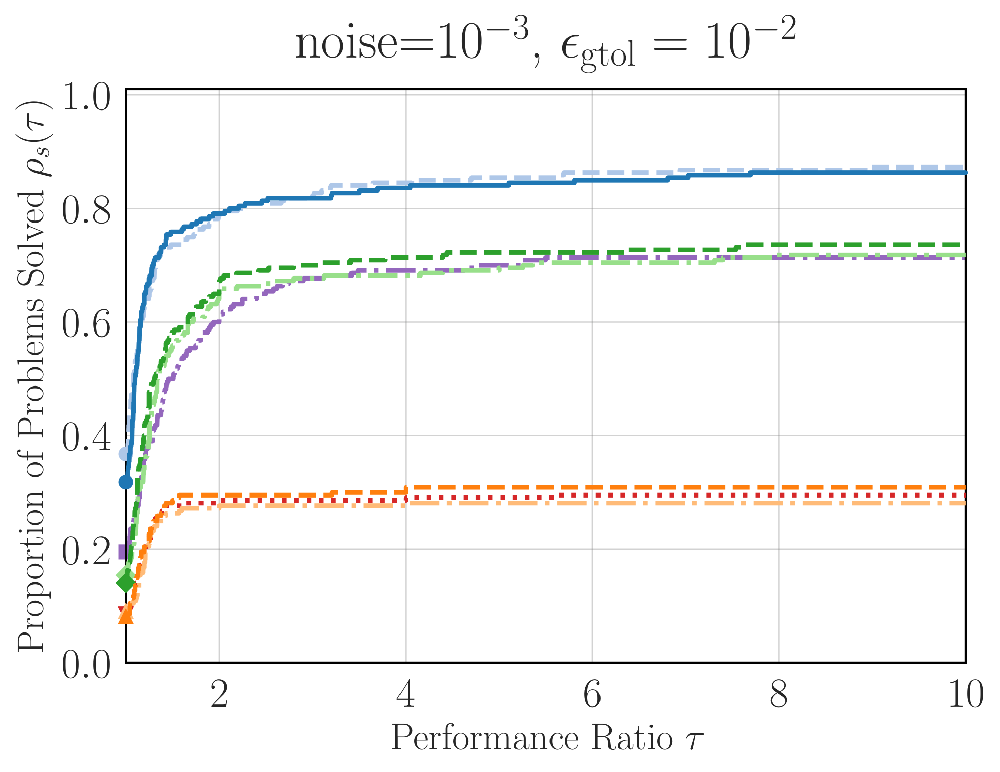
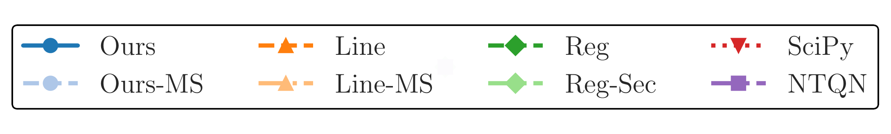

# QNLab

QNLab is a research repository containing the implementation of our paper "Practical Regularized Quasi-Newton Methods with Inexact Function Values." It also includes various quasi-Newton methods, specifically focusing on L-BFGS variants.

## Features

- **Noise-tolerant L-BFGS method:**
  We developed a noise-tolerant and practically fast L-BFGS method.

  
  

- **Quasi-Newton methods in pure Python:**
  We also provide implementations of various quasi-Newton methods in pure Python, which can be easily used and modified for research purposes.

- **Documents about Quasi-Newton Methods:**
  We have some documents about basic of quasi-Newton methods.
  See [doc/study/0_main.pdf](doc/study/0_main.pdf).

## Setup for Users

### Requirements

- Python 3.12+
- [uv](https://docs.astral.sh/uv/) CLI

### Install dependencies with uv

```bash
uv sync
```

## Setup for Developers

### Additional Requirements

- Git with submodule support
- PyCUTEst installed and configured (for running tests involving CUTEst problems)
  - https://github.com/abelsiqueira/linux-cutest
  - https://github.com/jfowkes/pycutest

### Pull git submodules

In `pytest`, we use some libraries bundled as git submodules.
You can explicitly pull the submodules using:

```bash
git submodule update --init --recursive
```

To clone the repository with submodules, use the following command:

```bash
git clone --recurse-submodules https://github.com/HirokiHamaguchi/qnlab.git
cd qnlab
```

### Run tests involving CUTEst problems

To run tests that involve CUTEst problems, ensure that CUTEst is properly installed and configured on your system.

To examine and generate cache files for CUTEst problems, you can run:

```bash
uv run data/CUTEst/check_CUTEst_problems.py
```

If it run successfully, you can now run tests involving CUTEst problems using:

```bash
uv run pytest
```

### Install git hooks

Install the pre-commit hook once per clone so that formatting, lint, type, and test checks run automatically before every commit:

```bash
uv run pre-commit install --hook-type pre-commit
```

## Documentation

This repository contains some study materials.

## References

The following is the list of repositories included in our repository as git submodules, or related projects that we would like to acknowledge.
Thanks to the developers of these projects.

### Included in Our Repository as Git Submodules

* [LBFGSpp](https://github.com/yixuan/LBFGSpp)
* [liblbfgs](https://github.com/chokkan/liblbfgs)
* [paper-regularized-qn-benchmark](https://github.com/dmsteck/paper-regularized-qn-benchmark)
* [noise-tolerant-bfgs](https://github.com/hjmshi/noise-tolerant-bfgs.git)

### Cubic Regularized (Quasi-)Newton Methods

* [ARNCG](https://github.com/miskcoo/ARNCG.git)
* [krylov-cubic-regularized-newton](https://github.com/amazon-science/krylov-cubic-regularized-newton.git)
* [super-newton](https://github.com/doikov/super-newton.git)

### Other L-BFGS Implementations and Related Resources

* [DirL-BFGS](https://github.com/ashkansl/DirL-BFGS)
* [mL-BFGS](https://github.com/yuehniu/mL-BFGS?tab=readme-ov-file)
* [py-owlqn](https://github.com/samson-wang/py-owlqn.git)
* [pylbfgs-dedupeio](https://github.com/dedupeio/pylbfgs)
* [pylbfgs-larsmans](https://github.com/larsmans/pylbfgs)
* [python_lbfgsb](https://github.com/avieira/python_lbfgsb)
* [self_scaled_algorithms_pinns](https://github.com/jorgeurban/self_scaled_algorithms_pinns.git)

### Benchmarks

* [Python_Benchmark_Test_Optimization_Function_Single_Objective](https://github.com/AxelThevenot/Python_Benchmark_Test_Optimization_Function_Single_Objective.git): A collection of benchmark test functions in Python.
* [opfunu](https://github.com/thieu1995/opfunu.git): A collection of Benchmark functions for numerical optimization problems

## License

This project is licensed under the MIT License. (`liblbfgs` is under the MIT License as well).

See the [LICENSE](LICENSE) file for details.
