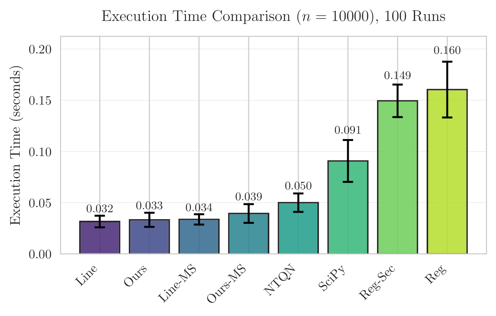
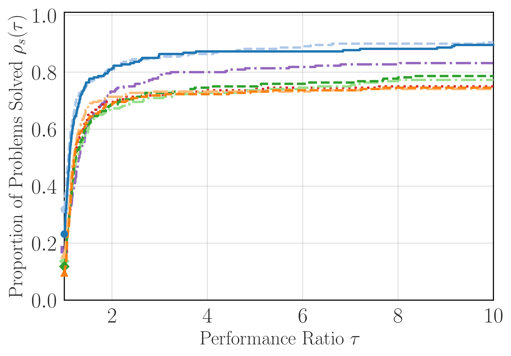
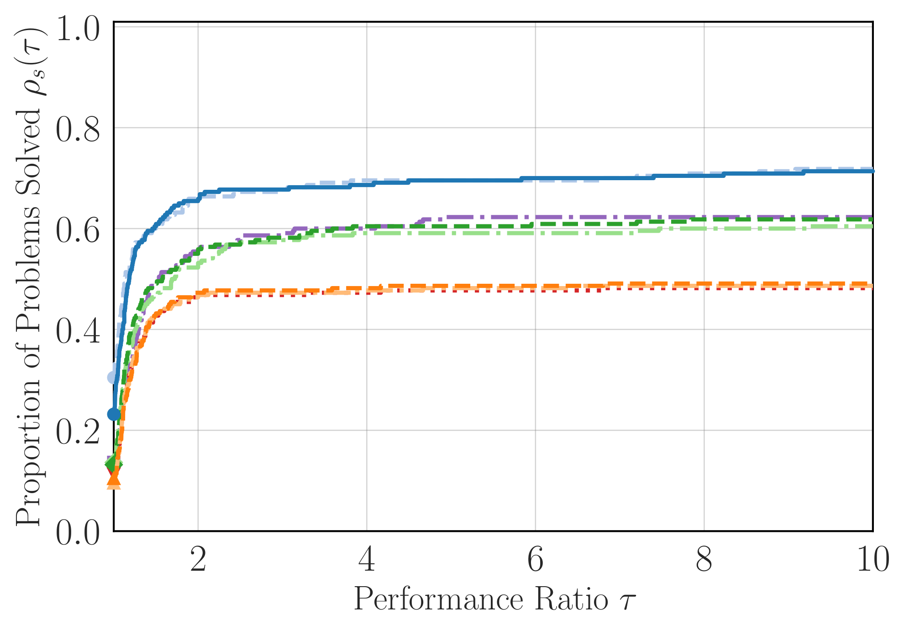

# ENH: consider a modern, noise-tolerant limited-memory quasi-Newton solver

Hello, SciPy maintainers.
I'm Hiroki Hamaguchi, a doctoral student majoring in numerical optimization.

I really appreciate your work on SciPy, and I would like to discuss about `scipy.optimize.minimize` and its L-BFGS-B implementation.

(This content is earlier mentioned in [SciPy Data 2026](https://scipydata.connpass.com/event/364718/) held in Japan.)

This issue has two related motivations:

1. In some problems, the current L-BFGS-B implementation has a relatively large wall-clock cost per iteration.
2. The line-search L-BFGS methods is a traditional approach, and I want to update SciPy with a modern quasi-Newton method that can be faster and more robust.

I therefore plan to propose adding a new, Python-based, limited-memory regularized quasi-Newton method as an additional `minimize` method.

In this issue, I would like to share the motivation, and then I would like to ask for your feedback on whether this is a reasonable direction for SciPy.

## Motivations

### A wall-clock overhead observation

The first motivation is a wall-clock overhead observation.

SciPy's current implementation is a C translation of L-BFGS-B, exposed through
Python by [`minimize(method="L-BFGS-B")`](https://docs.scipy.org/doc/scipy/reference/optimize.minimize-lbfgsb.html) ([current C source](https://github.com/scipy/scipy/blob/main/scipy/optimize/src/lbfgsb.c)).

I don't still have a complete diagnosis, but we observe a relatively high cost per iteration compared with several Python-based limited-memory methods.

The following experiment is Figure 3 of our [paper](https://arxiv.org/abs/2603.10642).
The plotted values are total solver time for the same iteration budget, so they also give a direct comparison of mean cost per iteration.
The paper's experiments were run on Windows 11 with an Intel Core i7-1360P CPU.

As you can see, the C-based L-BFGS-B is slower than several Python-based limited-memory methods.
I suspect that this issue is caused by a Python/C interface overhead since C implementations are usually fast. Still, after several attempts to reduce the overhead, we have not been able to remove it completely.
Some of these effects may be architecture-dependent and may be difficult to remove at the algorithm level.

[`notebooks/SciPy_issue.ipynb`](../../notebooks/SciPy_issue.ipynb) is a separate
reproduction and diagnosis notebook. See this notebook for more details.
I admit that the proposed method is now always faster then the current C implementation, but it tends to be faster on many problems.

This is one of the motivations for proposing a new solver.
A pure-Python implementation can be more easily optimized and maintained, and it can be faster than the current implementation in some cases.

### Recent progress in quasi-Newton methods

The second motivation is recent progress in quasi-Newton methods.

現状のL-BFGS-B法の実装は、非常に精緻で安定しており、その重要性に疑う余地はありません。
しかし、近年の研究では、定性的により良い手法がいくつも開発されており、SciPyの規模の大きさも考慮すると、それらに合わせてSciPyを更新することは、ユーザーにとって有益であると考えています。

我々が提案したいと考えている手法は the noise-tolerant regularized quasi-Newton method
(NTRQN) described in
[*Practical Regularized Quasi-Newton Methods with Inexact Function Values*](https://arxiv.org/abs/2603.10642).

これは我々の論文で提案した手法であり、この研究の究極的な目標の一つは、正にSciPyの改善に貢献することです。

なお、このissueなどが単なる宣伝目的ではないということは強調させてください。
もしこの提案がSciPyコミュニティに馴染まない場合、我々はこの提案に固執するつもりは全くなく、撤回します。

また、確かに我々の論文で提案した手法ではあるのですが、いくつかの要素は後述のように、数値最適化の分野でここ数十年の間に開発された既存手法を取り入れている部分も多く、このacademicな進展をベースにした提案になっています。

- **Regularized quasi-Newton directions:** compute a direction corresponding
  to $-(B_k+\mu_k I)^{-1}g_k$, following regularized Newton and limited-memory
  RQN work ([Ueda and Yamashita, 2014](https://doi.org/10.1007/s10589-014-9656-x);
  [Kanzow and Steck, 2023](https://doi.org/10.1007/s12532-023-00238-4)). Compared to linesearch L-BFGS, this approach can be more robust and faster.
- **Curvature safeguards independent of Wolfe success:** damped BFGS and
  cautious selection of stored pairs maintain usable, spectrally bounded
  limited-memory approximations.  This follows the cautious-update tradition
  ([Li and Fukushima, 2001](https://doi.org/10.1137/S1052623499354242)).
- **Optional modified secant information:** when function values are reliable, we can uses their interpolation information to improve the curvature model, following the modified-secant literature ([Zhang, Deng and Chen, 1999](https://doi.org/10.1023/A:1021898630001), [Yabe, Ogasawara and Yoshino, 2007](https://doi.org/10.1016/j.cam.2006.05.018)). Roughly speaking, it introduce the idea of the Dennis--Moré line search (used in the current L-BFGS-B) into the quasi-Newton model update itself.
- **Use function values only when they are informative:** a relaxed,
  non-monotone Armijo test keeps ordinary quasi-Newton behavior when sufficient
  progress is observable.  Otherwise, positive regularization is controlled
  by accumulated gradient norms, following the Objective-Function-Free
  Optimization (OFFO)/AdaGrad-Norm line of work
  ([Gratton, Jerad and Toint, 2024](https://doi.org/10.1080/10556788.2023.2296431)).

## Benchmarking

[CUTEst](https://doi.org/10.1007/s10589-014-9687-3) is a standard collection and
testing environment for optimization problems.
We conducted tests on 220 unconstrained problems at 64- and 32-bit precision.
Memory was $m=10$ and the maximum iteration count was 15,000.

The primary figures use Dolan--Moré [performance profiles](https://doi.org/10.1007/s101070100263).  For problem $p$ and solver $s$, the ratio is

$$
r_{p,s}=\frac{n_{p,s}}{\min_{s'} n_{p,s'}},
$$

where $n_{p,s}$ is the number of oracle calls required to reach the stated
gradient tolerance (and is infinite on failure).
At $\tau=1$, the height is the fraction of problems on which a solver was best.  At larger $\tau$, the height is the fraction solved within $\tau$ times the best solver's oracle count.
The final height therefore indicates robustness/coverage.

| 64-bit, $\|g\|_\infty\le10^{-5}$ | 32-bit, $\|g\|_\infty\le10^{-3}$ |
| :---: | :---: |
|  |  |

All 564 available per-problem traces, including wall-clock plots, are collected in
[`cutest_individual_results.pdf`](cutest_individual_results.pdf).
The document is reproducibly generated from the original plots by [`generate_issue_assets.py`](generate_issue_assets.py).

To the best of our knowledge, these experiments place the proposed variants
among the fastest and most robust methods tested, in both oracle calls and
per-iteration cost.  That statement is limited to the reported benchmark,
settings and competitors; quasi-Newton performance is problem-dependent, and
there are problems on which L-BFGS-B is faster or more accurate.

## Box Constraints (-B of L-BFGS-B)

The method can be extended to box constraints, which is necessary for a full L-BFGS-B replacement.

A working prototype, [`qnlab/solver/qn_ntrqnb.py`](../../qnlab/solver/qn_ntrqnb.py), combines the regularized compact L-BFGS model with a generalized Cauchy point.

However, I do not currently plan to include the box-constrained variant.
It adds substantial implementation and maintenance cost (since it would require C implementation).
Box support could be considered later if there is sufficient user and maintainer interest.

## For SciPy Maintainers

Thank you for reading this issue.
I would particularly appreciate feedback on the following points:

1. Do you think that a new, Python-based, limited-memory regularized quasi-Newton method is a reasonable addition to SciPy's `minimize`?
2. If so, do you have any suggestions for the API, naming, or other design considerations?

I swear that I will follow the SciPy development guidelines and best practices, and I will be responsive to feedback from the maintainers.
I am quite willing to answer any questions and to make any changes that the maintainers request.
I am prepared to do the implementation, tests, documentation, benchmarks and follow-up maintenance if required.

Thank you for considering the proposal.
