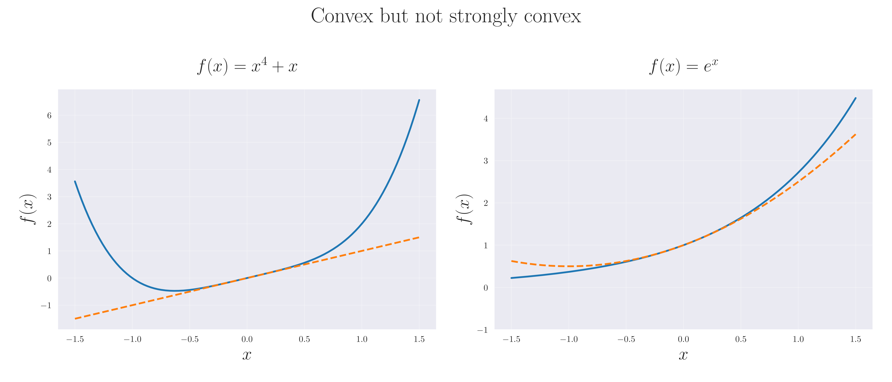
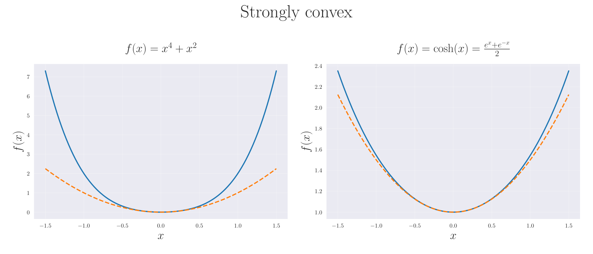
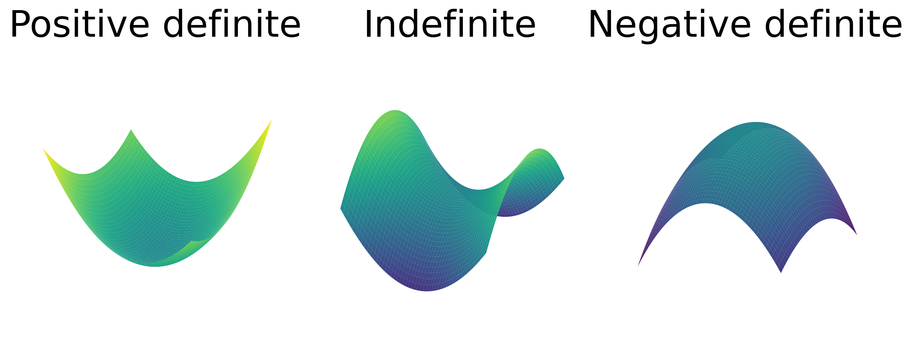

## 連続最適化の基本概念

数理最適化の中心的な意義の一つは、与えられた定量的な指標を最適化する決定変数を求めることである。
そのような指標の例としては制御の安定性、運用の効率性、予測誤差など、さまざまな現象やシステムの品質を定量化したものが挙げられる。
これらの指標は通常、決定変数を実数に写像する目的関数としてモデル化される。

本章では、目的関数を $C^2$ 級の関数 $f \colon \mathbb{R}^n \to \mathbb{R}$ とし、また $n$ を決定変数の次元と定める。 この時、次の無制約最適化問題を考える:

```math
\begin{equation*}
\underset{x \in \mathbb{R}^n}{\text{minimize}} \quad f(x).
\end{equation*}
```

本節では、この最適化問題に関する基本的な定義と性質をまとめる。

### 凸性と強凸性

凸性(convexity)と強凸性(strong convexity)は最適化理論の基本概念である。
$f$ は $C^2$ 級と仮定する。
関数 $f$ が凸あるいは強凸であることは、任意の $x,y \in \mathbb{R}^n$ について次の定義が成り立つこととそれぞれ同値である:

```math
\begin{align*}
\text{(convex)} \quad
f(y) & \ge f(x)+\nabla f(x)^\top (y-x),                                  \\
\text{($\mu$-strongly convex)} \quad
f(y) & \ge f(x)+\nabla f(x)^\top (y-x)+\frac{\mu}{2}\lVert y-x \rVert^2,
\end{align*}
```

ただし、 $\mu>0$ は定数である。
強凸性は、凸性に加えて目的関数が一様に正の曲率を持つことを意味する。
凸関数と強凸関数の例を Fig. 1 に示した。



(Fig. 1 凸関数と強凸関数の例。 破線は $x=0$ における二次近似を示す。 上の2つの関数は凸であるが強凸ではない。 下の2つの関数は強凸であり、強凸性の定義を満たす $\mu>0$ が存在する。)

### Positive Definiteness of the Hessian

次に、凸性および強凸性がヘッセ行列 $\nabla^2 f(x)$ の正定値性とどのように関係するかを示す。
$A$ を $\mathbb{R}^{n \times n}$ の対称行列とする。行列 $A$ が正定値(positive definite)・負定値(negative definite) (または半正定値(positive semi-definite)・半負定値(negative semi-definite))であるとは、次の条件で定義される:

```math
\begin{align*}
\text{(positive definite)} \quad      & v^\top A v > 0 \quad \forall v \in \mathbb{R}^n \setminus \lbrace 0 \rbrace, \\
\text{(positive semi-definite)} \quad & v^\top A v \ge 0 \quad \forall v \in \mathbb{R}^n,                 \\
\text{(negative definite)} \quad      & v^\top A v < 0 \quad \forall v \in \mathbb{R}^n \setminus \lbrace 0 \rbrace, \\
\text{(negative semi-definite)} \quad & v^\top A v \le 0 \quad \forall v \in \mathbb{R}^n.
\end{align*}
```

正定値でも負定値でもない行列は不定値(indefinite)と呼ぶ。
行列 $A,B \in \mathbb{R}^{n \times n}$ に対して、$A \succeq B$ は $A-B$ が半正定値であることを表す。
特に $B$ が零行列のときは $A \succeq 0$ と書く。
同様に、$\preceq$ は半負定値に対して定義する。
$\mu \geq 0$ に対し、$A \succeq \mu I$ はすべての $v \in \mathbb{R}^n$ について $v^\top A v \ge \mu \lVert v \rVert^2$ と同値である。
これは $A$ のすべての固有値が少なくとも $\mu$ であることを意味し、さらに作用素ノルムについて $\lVert A \rVert \geq \mu$ であることを導く。

凸性および強凸性とヘッセ行列の正定値性との関係は次のとおりである。

**Proposition 1**

$f \colon \mathbb{R}^n \to \mathbb{R}$ を $C^2$ 級とする。このとき
- $f$ が凸であることと、任意の $x \in \mathbb{R}^n$ で $\nabla^2 f(x)\succeq0$ が成り立つことは同値である。
- $f$ が $\mu$-強凸であることと、任意の $x \in \mathbb{R}^n$ で $\nabla^2 f(x)\succeq\mu I$ が成り立つことは同値である。

<details>
<summary>Proof</summary>

まず $\mu>0$ とし、任意の $x \in \mathbb{R}^n$ に対して $\nabla^2 f(x)\succeq \mu I$ が成り立つと仮定する。
微分積分学の基本定理より、任意の $x,y \in \mathbb{R}^n$ について次が成り立つ:

```math
\begin{equation*}
f(y)
= f(x)+\nabla f(x)^\top (y-x)
+\frac{1}{2} \int_0^1 (y-x)^\top \nabla^2 f(x+t(y-x))(y-x) \mathrm{d}t.
\end{equation*}
```

また、仮定 $\nabla^2 f(x)\succeq \mu I$ から次が得られる:

```math
\begin{equation*}
\int_0^1 (y-x)^\top \nabla^2 f(x+t(y-x))(y-x) \mathrm{d}t
\ge \int_0^1 \mu\lVert y-x \rVert^2 \mathrm{d}t
= \mu\lVert y-x \rVert^2.
\end{equation*}
```

以上の結果を合わせると、$\mu$-強凸性の定義が導かれる。
逆に、$f$ が $\mu$-強凸であると仮定する。
任意の $x \in \mathbb{R}^n, \ v \in \mathbb{R}^n$ および $t>0$ に対し、$y=x \pm tv$ とおくと次を得る:

```math
\begin{equation*}
\begin{cases}
f(x + tv)\ge f(x) + t\nabla f(x)^\top v+\frac{\mu}{2}t^2\lVert v \rVert^2, \\
f(x - tv)\ge f(x) - t\nabla f(x)^\top v+\frac{\mu}{2}t^2\lVert v \rVert^2.
\end{cases}
\end{equation*}
```

テイラーの定理より、ある $s_\pm \in (0,1)$ が存在して次が成り立つ:

```math
\begin{equation*}
\begin{cases}
f(x + tv) = f(x) + t\nabla f(x)^\top v + \frac{1}{2} t^2 v^\top \nabla^2 f(x + s_+ t v) v, \\
f(x - tv) = f(x) - t\nabla f(x)^\top v + \frac{1}{2} t^2 v^\top \nabla^2 f(x - s_- t v) v.
\end{cases}
\end{equation*}
```

これらの結果を合わせると次を得る:

```math
\begin{equation*}
v^\top \frac{\nabla^2 f(x+ s_+ t v) + \nabla^2 f(x - s_- t v)}{2} v \ge \mu \lVert v \rVert^2.
\end{equation*}
```

$t \to 0$ とし、$f$ が $C^2$ 級という仮定による $\nabla^2 f$ の連続性を用いると次を得る:

```math
\begin{equation*}
v^\top \nabla^2 f(x) v \ge \mu \lVert v \rVert^2.
\end{equation*}
```

$v \in \mathbb{R}^n$ は任意なので、$\nabla^2 f(x)\succeq \mu I$ を得る。
上記の議論で $\mu=0$ とすれば、同様に凸の場合も示される。
\myQED

</details>

ヘッセ行列が正定値・不定値・負定値である二次関数を Fig. 2 に示す。正定値性と凸性の対応関係を視覚的に確認できる。



(Fig. 2 二次モデル $f(x)=\frac{1}{2}(x - x_k)^\top H (x - x_k) + \nabla f(x_k)^\top (x - x_k) + f(x_k)$ を2次元空間で示したもの。 ヘッセ行列 $H$ が (左)正定値、(中央)不定値、(右)負定値の場合を示す。)

### $L$-平滑性

最後に、関数の $L$-平滑性 ($L$-smoothness)を導入する。
関数 $f$ が $L$-平滑であるとは、ある定数 $L>0$ が存在して

```math
\begin{equation*}
\lVert \nabla f(x)-\nabla f(y) \rVert \le L\lVert x-y \rVert
\end{equation*}
```

が任意の $x,y$ について成り立つことと同値である。

次の命題は、$L$-平滑性がヘッセ行列の上界で特徴づけられることを示す。

**Proposition 2**

$f \colon \mathbb{R}^n \to \mathbb{R}$ を $C^2$ 級とする。このとき $f$ が $L$-平滑であることと、任意の $x \in \mathbb{R}^n$ で $\nabla^2 f(x)\preceq L I$ が成り立つことは同値である。

<details>
<summary>Proof</summary>

$f$ は $C^2$ 級なので、微分積分学の基本定理より任意の $x,y \in \mathbb{R}^n$ について次が成り立つ:

```math
\begin{equation*}
\nabla f(y) - \nabla f(x)
= \int_0^1 \nabla^2 f(x+t(y-x))(y-x) \mathrm{d}t.
\end{equation*}
```

任意の $x \in \mathbb{R}^n$ で $\nabla^2 f(x)\preceq L I$ と仮定する。
このとき $\lVert \nabla^2 f(x) \rVert \le L$ が成り立つので、

```math
\begin{align*}
\lVert \nabla f(y) - \nabla f(x) \rVert
& = \lVert \int_0^1 \nabla^2 f(x+t(y-x))(y-x) \mathrm{d}t \rVert   &  & (\text{previous equation})   \\
& \le \int_0^1 \lVert \nabla^2 f(x+t(y-x))(y-x) \rVert \mathrm{d}t &  & (\text{triangle inequality}) \\
& \le \int_0^1 L\lVert y-x \rVert \mathrm{d}t                      &  & (\text{by assumption})       \\
& = L\lVert y-x \rVert,
\end{align*}
```

つまり、 $f$ の $L$-平滑性が示された。
逆に、$f$ が $L$-平滑であるとすると、任意の $x \in \mathbb{R}^n$ と $v \in \mathbb{R}^n$ に対して次が成り立つ:

```math
\begin{equation*}
\lVert \nabla f(x+tv)-\nabla f(x) \rVert \le L\lVert tv \rVert = Lt\lVert v \rVert.
\end{equation*}
```

さらにテイラーの定理より次が成り立つ:

```math
\begin{equation*}
\nabla f(x+tv)-\nabla f(x) = t \nabla^2 f(x) v + r(t),
\end{equation*}
```

ただし、$r(t)$ は $t \to 0$ のとき $\lVert r(t) \rVert/t \to 0$ を満たす。そして、これは次のように書き換えられる:

```math
\begin{equation*}
\nabla^2 f(x) v = \lim_{t \to 0} \frac{\nabla f(x+tv)-\nabla f(x) -r(t)}{t} = \lim_{t \to 0} \frac{\nabla f(x+tv)-\nabla f(x)}{t}.
\end{equation*}
```

$v$ との内積を取ると次が得られる:

```math
\begin{align*}
v^\top \nabla^2 f(x) v & = \lim_{t \to 0} \left(\frac{\nabla f(x+tv)-\nabla f(x)}{t}\right)^\top v                                                         \\
& \leq \lim_{t \to 0} \frac{\lVert \nabla f(x+tv)-\nabla f(x) \rVert}{t} \lVert v \rVert &  & (\text{Cauchy--Schwarz inequality})   \\
& \leq \lim_{t \to 0} \frac{L\lVert tv \rVert}{t} \lVert v \rVert                        &  & (\text{by $L$-smoothness definition}) \\
& = L \lVert v \rVert^2.
\end{align*}
```

$v \in \mathbb{R}^n$ は任意なので、$\nabla^2 f(x)\preceq L I$ を得る。
\myQED

</details>

#### Baillon--Haddad Theorem

$L$-smooth 関数の有用な性質の一つが次の Baillon--Haddad 定理である。
ここでは $C^1$ の微分可能性だけを仮定する点に注意する。

**Proposition 3** (Baillon--Haddad theorem)

$f \colon \mathbb{R}^n \to \mathbb{R}$ を $C^1$ 級とする。$f$ が $L$-smooth かつ凸であれば、任意の $x,y \in \mathbb{R}^n$ に対して $\nabla f$ は $1/L$-cocoercive であり、すなわち

```math
\begin{equation*}
(\nabla f(x)-\nabla f(y))^\top (x-y) \ge \frac{1}{L} \lVert \nabla f(x)-\nabla f(y) \rVert^2
\end{equation*}
```

が任意の $x,y \in \mathbb{R}^n$ について成り立つ。

証明は他の文献に譲る~\citep{bauschkeBaillonHaddadTheoremRevisited2009}~\citep[Proposition 12.60]{rockafellarVariationalAnalysis1998}。

この定理の帰結として、最適化アルゴリズムが生成する列 $\lbrace x_k \rbrace$ に対し、次を定義すると:

```math
\begin{equation*}
s_k \mathrel{\vcenter{:}}= x_{k+1}-x_k, \quad y_k \mathrel{\vcenter{:}}= \nabla f(x_{k+1}) - \nabla f(x_k)
\end{equation*}
```

Baillon--Haddad 定理を $x=x_{k+1}$、$y=x_k$ に適用して次を得る:

```math
\begin{equation*}
s_k^\top y_k \ge \frac{1}{L} \lVert y_k \rVert^2.
\end{equation*}
```

この不等式は BFGS や L-BFGS などの更新公式の解析で用いられることがある。

#### ヘッセ行列の固有値のバウンド

$L$-smoothness と $\mu$-強凸性を組み合わせると、ヘッセ行列の固有値に対するバウンドも得られる。

**Proposition 4**

$f \colon \mathbb{R}^n \to \mathbb{R}$ を $C^2$ 級とする。
$f$ が $L$-smooth かつ $\mu$-強凸であれば、任意の $x \in \mathbb{R}^n$ に対してヘッセ行列 $\nabla^2 f(x)$ の固有値は区間 $[\mu, L]$ に含まれる。

<details>
<summary>Proof</summary>

\cref{prop:convexity-hessian,prop:smoothness-hessian} より次が成り立つ:

```math
\begin{equation*}
\mu I \preceq \nabla^2 f(x) \preceq L I.
\end{equation*}
```

これより $\nabla^2 f(x)$ の固有値が区間 $[\mu, L]$ に含まれることが直ちに従う。
\myQED

</details>

Proposition 4 で示したように、$L$-smoothness と $\mu$-強凸性はそれぞれヘッセ行列の固有値に上界と下界を与える。

