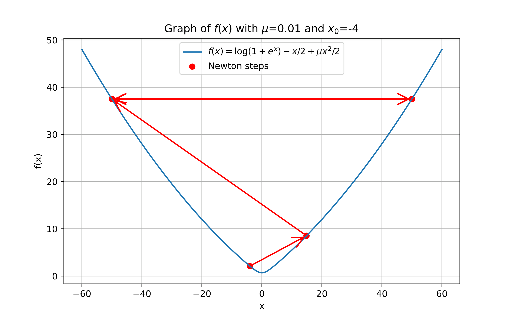

## ニュートン法

### ニュートン法のアルゴリズム

本小節では、無制約最適化問題に対する基本的な最適化アルゴリズムであるニュートン法の概要を示す。
ニュートン法は、初期点 $x_0$ から出発し、現在点を逐次更新して列 $\lbrace x_k \rbrace_{k=0}^\infty$ を生成する代表的な反復アルゴリズムである。

$f$ は $C^2$ 級で強凸であると仮定し、このときヘッセ行列 $\nabla^2 f(x)$ は任意の $x \in \mathbb{R}^n$ で正定値となり可逆である。
$k$ 回目の反復点 $x_k$ における勾配 $g_k \mathrel{\vcenter{:}}= \nabla f(x_k)$ とヘッセ行列 $\nabla^2 f(x_k)$ を用いると、ニュートン法の基本手続きは次の更新を反復的に行うことである。

```math
\begin{equation*}
x_{k+1} \gets x_k - \alpha_k \nabla^2 f(x_k)^{-1} g_k
\end{equation*}
```

ここで $\alpha_k > 0$ は線形探索によって定められるステップサイズである。
この更新則の導出は次のとおりである。
$x_k$ まわりの $f$ の二次のテイラー近似は次式で与えられる。

```math
\begin{equation*}
m^*_{k}(x) \mathrel{\vcenter{:}}= f(x_k) + g_k^\top (x - x_k) + \frac{1}{2} (x - x_k)^\top \nabla^2 f(x_k) (x - x_k).
\end{equation*}
```

このモデルの勾配は次式である。

```math
\begin{equation*}
\nabla m^*_k(x) = g_k + \nabla^2 f(x_k)(x - x_k).
\end{equation*}
```

仮定よりこの二次モデルは強凸であるため、点 $x^* \in \mathbb{R}^n$ が $m^*_k$ の最小点であることと $\nabla m^*_k(x) = 0$ が成り立つことは同値である。したがって、この方程式を解くと次を得る。

```math
\begin{equation*}
\underset{x \in \mathbb{R}^n}{\mathrm{arg \ min}} \ m^*_{k}(x) = x_k -\left(\nabla^2 f(x_k)\right)^{-1} g_k.
\end{equation*}
```

この選択は自然に見えるが、後で見るように一般には大域収束を保証しない。
そこで、関数値の十分な減少を確保するため、線形探索で定めるステップサイズ $\alpha_k > 0$ を導入する。
これがニュートン法の基本手続きである。

更新方向 $d_k \mathrel{\vcenter{:}}= -\nabla^2 f(x_k)^{-1} g_k$ はニュートン方向と呼ばれる。ヘッセ行列が正定値であれば、次式より降下方向である。

```math
\begin{equation*}
g_k^\top d_k = -g_k^\top \nabla^2 f(x_k)^{-1} g_k < 0.
\end{equation*}
```

$f$ が非凸であり、ヘッセ行列 $\nabla^2 f(x_k)$ が負定値または不定値である場合、関数値の減少は保証されず、ニュートン法は収束しないことがある。
したがって、ニュートン法の適用ではヘッセ行列の正定値性の確認が重要である。
このような場合への一つの対処法として修正ニュートン法 \citep[Sec. 3.4]{nocedal1999numerical} がある。

### 収束に関する性質

次に、ニュートン法に対する標準的な収束定理を示す。

#### 大域収束

まず、一般的な大域収束の結果

```math
\begin{equation*}
\lim_{k \to \infty} \lVert g_k \rVert = 0
\end{equation*}
```

を線形探索付きの手法に対して述べ、その後にニュートン法への適用を説明する。
次の形の一般的な反復法を考える。

```math
\begin{equation*}
x_{k+1} \gets x_k + \alpha_k d_k,
\end{equation*}
```

ここで $d_k$ は $g_k^\top d_k < 0$ を満たす降下方向であり、$\alpha_k > 0$ は線形探索で決定されるステップサイズである。
ステップサイズ $\alpha_k$ は Wolfe 条件 \citep[Sec. 3.1]{nocedal1999numerical} により次のように定める。

```math
\begin{align*}
f(x_k + \alpha_k d_k) & \leq f(x_k) + c_1 \alpha_k g_k^\top d_k, \\
g_{k+1}^\top d_k      & \geq c_2 g_k^\top d_k,
\end{align*}
```

ここで $0 < c_1 < c_2 < 1$ は定数である。
また、方向 $d_k$ と負の勾配 $-g_k$ のなす角を $\theta_k \in [0, \pi]$ とし、次式を満たすように定める。

```math
\begin{equation*}
\cos \theta_k = \frac{-g_k^\top d_k}{\lVert g_k \rVert\lVert d_k \rVert}.
\end{equation*}
```

次の定理は古典的結果の簡略版である。

**Theorem 1** ({\cite[Theorem 3.2]{nocedal1999numerical}})

$f$ は $C^1$ 級であり $\mathbb{R}^n$ 上で下に有界で、かつ $L$-平滑であるとする。
次の反復法を考える。

```math
\begin{equation*}
x_{k+1} \gets x_k + \alpha_k d_k,
\end{equation*}
```

初期点 $x_0 \in \mathbb{R}^n$ から開始し、ステップサイズ $\alpha_k$ は Wolfe 条件で定められるとする。
角 $\theta_k$ に対して、ある正の定数 $\delta$ が存在して
$\cos \theta_k \geq \delta > 0$ がすべての $k$ で成り立つならば、
この反復法は次を満たす列 $\lbrace x_k \rbrace$ を生成する。

```math
\begin{equation*}
\lim_{k \to \infty} \lVert g_k \rVert = 0.
\end{equation*}
```

<details>
<summary>Proof</summary>

Wolfe 条件より次が成り立つ。

```math
\begin{equation*}
(g_{k+1} - g_k)^\top d_k
= g_{k+1}^\top d_k - g_k^\top d_k
\geq (c_2 - 1) g_k^\top d_k,
\end{equation*}
```

また

```math
\begin{align*}
(g_{k+1} - g_k)^\top d_k                      & \leq
\lVert g_{k+1} - g_k \rVert \lVert d_k \rVert &                                                      & \text{(Cauchy--Schwarz inequality)}                           \\
& \leq L \lVert x_{k+1} - x_k \rVert \lVert d_k \rVert &                                     & \text{($L$-smoothness)} \\
& = \alpha_k L \lVert d_k \rVert^2.
\end{align*}
```

これらを組み合わせると次を得る。

```math
\begin{equation*}
\alpha_k \geq \frac{c_2 - 1}{L} \frac{g_k^\top d_k}{\lVert d_k \rVert^2},
\end{equation*}
```

よって

```math
\begin{align*}
f(x_{k+1}) & \leq f(x_k) + c_1 \alpha_k g_k^\top d_k                                          &  & \text{(Wolfe condition)}          \\
& \leq f(x_k) - c_1 \frac{1 - c_2}{L} \frac{(g_k^\top d_k)^2}{\lVert d_k \rVert^2} &  & \text{(previous inequality)}      \\
& = f(x_k) - c_1 \frac{1 - c_2}{L} \cos^2 \theta_k \lVert g_k \rVert^2.            &  & \text{(definition of $\theta_k$)}
\end{align*}
```

この式を $k$ 以下のすべての添字について和を取ると次を得る。

```math
\begin{equation*}
f(x_{k+1}) \leq f(x_0) - c_1 \frac{1 - c_2}{L} \sum_{j=0}^k \cos^2 \theta_j \lVert g_j \rVert^2.
\end{equation*}
```

$f$ は下に有界なので、$f(x_0) - f(x_{k+1})$ はすべての $k$ である正の定数より小さい。
したがって、極限を取ることで Zoutendijk 条件が得られる。

```math
\begin{equation*}
\sum_{k=0}^\infty \cos^2 \theta_k \lVert g_k \rVert^2 < \infty.
\end{equation*}
```

この条件は次を含意する。

```math
\begin{equation*}
\cos^2 \theta_k \lVert g_k \rVert^2 \to 0.
\end{equation*}
```

$\cos \theta_k \geq \delta > 0$ がすべての $k$ で成り立つという仮定と合わせると、直ちに次が従う。

```math
\begin{equation*}
\lim_{k \to \infty} \lVert g_k \rVert = 0,
\end{equation*}
```

これで証明が完了する。

</details>

ニュートン法は $d_k = -\nabla^2 f(x_k)^{-1} g_k$ とした Theorem 1 の特別な場合なので、$f$ の適切な条件のもとでこの結果を適用できる。
特に $f$ が $L$-平滑かつ $\mu$-強凸であれば、任意の $k$ について次が成り立つ。

```math
\begin{equation*}
\cos \theta_k
= \frac{g_k^\top \nabla^2 f(x_k)^{-1} g_k}{\lVert g_k \rVert\lVert \nabla^2 f(x_k)^{-1} g_k \rVert}
\geq \frac{\lVert g_k \rVert^2 \lambda_{\min}(\nabla^2 f(x_k)^{-1})}{\lVert g_k \rVert^2 \lambda_{\max}(\nabla^2 f(x_k)^{-1})}
\geq \frac{\mu}{L},
\end{equation*}
```

ここで $\lambda_{\min}(\cdot)$ と $\lambda_{\max}(\cdot)$ はそれぞれ最小固有値と最大固有値を表す。
したがって、Theorem 1 において $\delta = \mu / L$ とすれば、Wolfe 条件を満たす線形探索のもとで、強凸かつ平滑な関数に対するニュートン法の大域収束が得られる。

#### 局所二次収束

次に、ニュートン法の局所収束速度に関する古典的結果を示す。
ここでも簡潔さのために簡略版を示す。

**Theorem 2** ({\cite[Theorem 3.5]{nocedal1999numerical}})

ヘッセ行列 $\nabla^2 f(x)$ が解 $x^*$ の近傍で Lipschitz 連続であり、十分な二次の最適性条件が成り立つとする。すなわち $\nabla f(x^*)=0$ かつ $\nabla^2 f(x^*)$ は正定値である。
すべての $k$ で $\alpha_k=1$ とし、初期点 $x_0$ が $x^*$ に十分近いとき、勾配ノルム列 $\lbrace\lVert \nabla f(x_k) \rVert\rbrace$ は二次収束する。

<details>
<summary>Proof</summary>

ニュートンステップの定義と最適性条件 $\nabla f(x^*)=0$ より次を得る。

```math
\begin{align*}
x_{k+1} - x^*
& = x_k - x^* - \left(\nabla^2 f(x_k)\right)^{-1}\nabla f(x_k)                                                        \\
& = \left(\nabla^2 f(x_k)\right)^{-1} \left(\nabla^2 f(x_k)(x_k-x^*)-\left(\nabla f(x_k)-\nabla f(x^*)\right)\right).
\end{align*}
```

テイラーの定理と三角不等式より次が成り立つ。

```math
\begin{align*}
& \lVert \nabla^2 f(x_k)(x_k-x^*)-\left(\nabla f(x_k)-\nabla f(x^*)\right) \rVert                    \\
=   {}  & \lVert \nabla^2 f(x_k)(x_k-x^*)-\int_0^1 \nabla^2 f(x_k+t(x^*-x_k)) (x_k - x^*)\mathrm{d}t \rVert  \\
\leq {} & \int_0^1 \lVert \nabla^2 f(x_k)-\nabla^2 f(x_k+t(x^*-x_k)) \rVert\lVert x_k-x^* \rVert\mathrm{d}t.
\end{align*}
```

$\nabla^2 f$ が定数 $L^{\mathrm{H}}$ を持つ Lipschitz 連続であれば、被積分関数は $L^{\mathrm{H}}t\lVert x_k-x^* \rVert$ で上から抑えられ、積分により次を得る。

```math
\begin{equation*}
\lVert \nabla^2 f(x_k)(x_k-x^*)-\left(\nabla f(x_k)-\nabla f(x^*)\right) \rVert
\le \frac{1}{2}L^{\mathrm{H}}\lVert x_k-x^* \rVert^2.
\end{equation*}
```

$\nabla^2 f(x^*)$ は非特異なので、ある半径 $r>0$ が存在して $\lVert x_k-x^* \rVert\le r$ を満たすすべての $x_k$ について
\[
\lVert \left(\nabla^2 f(x_k)\right)^{-1} \rVert\le 2\lVert \left(\nabla^2 f(x^*)\right)^{-1} \rVert
\]
が成り立つ。
これらを合わせると次を得る。

```math
\begin{equation*}
\lVert x_{k+1} - x^* \rVert
\le L^{\mathrm{H}}\lVert \left(\nabla^2 f(x^*)\right)^{-1} \rVert \lVert x_k-x^* \rVert^2.
\end{equation*}
```

$\widetilde L  \mathrel{\vcenter{:}}=  L^{\mathrm{H}}\lVert \left(\nabla^2 f(x^*)\right)^{-1} \rVert$ とおく。
初期点が $\lVert x_0-x^* \rVert\le \min\lbrace r, 1/(2\widetilde L) \rbrace$ を満たすように選ばれていれば、帰納法により $\lbrace x_k \rbrace$ は近傍内に留まり $x^*$ に収束する。
上の誤差評価は $\lbrace x_k \rbrace$ の二次収束を示す。
勾配ノルムの二次収束を示すために、$x_{k+1}-x_k=-\left(\nabla^2 f(x_k)\right)^{-1}\nabla f(x_k)$ と
$\nabla f(x_k)+\nabla^2 f(x_k)(x_{k+1}-x_k)=0$ を用いると次を得る。

```math
\begin{align*}
\lVert \nabla f(x_{k+1}) \rVert
& = \lVert \nabla f(x_{k+1})-\nabla f(x_k)-\nabla^2 f(x_k)(x_{k+1}-x_k) \rVert                                   \\
& \le \int_0^1 \lVert \nabla^2 f(x_k+t (x_{k+1}-x_k))-\nabla^2 f(x_k) \rVert\lVert x_{k+1}-x_k \rVert\mathrm{d}t \\
& \le \frac{1}{2}L^{\mathrm{H}}\lVert x_{k+1}-x_k \rVert^2                                                       \\
& \le \frac{1}{2}L^{\mathrm{H}}\lVert \left(\nabla^2 f(x_k)\right)^{-1} \rVert^2\lVert \nabla f(x_k) \rVert^2    \\
& \le 2 L^{\mathrm{H}} \lVert \left(\nabla^2 f(x^*)\right)^{-1} \rVert^2\lVert \nabla f(x_k) \rVert^2.
\end{align*}
```

よって $\lVert \nabla f(x_k) \rVert$ は0へ二次収束する。
\myQED

</details>

これらの命題 \cref{thm:line-search-global-convergence,thm:newton-quadratic} は、線形探索を備えたニュートン法が適切な条件のもとで大域収束と局所二次収束の両方の性質を持つことを示している。
この高速な収束は、通常は線形収束にとどまる勾配降下法などの一階法と比べたときの大きな利点である。
しかし、ヘッセ行列 $\nabla^2 f(x_k) \in \mathbb{R}^{n \times n}$ の計算と線形方程式 $\nabla^2 f(x_k) d_k = -\nabla f(x_k)$ の解法には $\mathcal{O}(n^3)$ の計算時間が必要であり、大規模問題では過大な計算コストとなる。
そのため、準ニュートン法などの他の最適化手法も用いられる。詳細は後で述べる。

### 大域収束のための要素

先に述べたように、ヘッセ行列の正定値性と線形探索によるステップサイズの選択はニュートン法で重要な役割を果たす。
本小節では、これらが必要となる理由を説明する。

#### ヘッセ行列の正定値性

ここまで $f$ が強凸であると仮定してきた。これは各反復でヘッセ行列 $\nabla^2 f(x_k)$ が正定値であることを意味する。
この仮定は、ニュートン法が局所的に最適解へ収束するために重要である。
ヘッセ行列が正定値であれば、次式よりニュートン法は最適解へ向かう降下方向を与える。

```math
\begin{equation*}
\nabla f(x_k)^\top d_k
= -\nabla f(x_k)^\top \left(\nabla^2 f(x_k)\right)^{-1} \nabla f(x_k)
< 0.
\end{equation*}
```

一方、ヘッセ行列が負定値または不定値の場合、関数値の減少は保証されず、ニュートン法が最適解から離れる方向を指すことがある。
不定値の場合は関数値が減少することもあるが、鞍点へ収束するリスクも高まる。
したがって、ニュートン法を適用する際にはヘッセ行列の正定値性の確認が重要である。

#### フルステップの問題

ニュートン法では、各反復でステップサイズを $\alpha_k=1$ とすることが困難を引き起こす場合がある。
ここではこの問題を示す例を挙げ、対処として線形探索が必要であることを述べる。

##### ニュートン法が発散する例

次の関数を考える。

```math
\begin{align*}
f(x)   & = \sqrt{1 + x^2},            \\
f'(x)  & = \frac{x}{\sqrt{1 + x^2}},  \\
f''(x) & = \frac{1}{(1 + x^2)^{3/2}}.
\end{align*}
```

初期点の絶対値が 1 を超えると、Fig. 3 に示すようにニュートン法は発散する。


(Fig. 3 初期点 $x_0=1.1$ でニュートン法が発散する例)

##### 強凸関数に対するニュートン法の振動

前の例では目的関数は強凸ではなく、必ずしも良い性質を持っていなかった。
しかし、強凸性を持つ関数であってもニュートン法が収束しない例が存在する \citep[Example 1.4.3]{Doikov2021SecondOrderTensor}。

この例では $\mu>0$ に対し、次の関数を考える。

```math
\begin{align*}
f(x)     & = \log(1 + e^x) - \frac{x}{2} + \frac{\mu x^2}{2}, \\
f'(x)    & = \frac{e^x}{1+e^x} - \frac{1}{2} + \mu x,         \\
f''(x)   & = \frac{e^x}{(1+e^x)^2} + \mu,                     \\
f'''(x)  & = \frac{e^x(1 - e^x)}{(1+e^x)^3},                  \\
f''''(x) & = \frac{e^x(1 - 4e^x + e^{2x})}{(1+e^x)^4}.
\end{align*}
```

この関数は次の性質を持つ。

1. $\mu$-強凸である。
2. $\max_x |f''(x)| = \frac{1}{4} + \mu$ であり、これは $e^x=1$ で達成される。したがって $\nabla f$ は $L=\frac{1}{4}+\mu$ の $L$-平滑である。
3. $\max_x |f'''(x)| = \frac{1}{6\sqrt{3}}$ であり、これは $e^x=2-\sqrt{3}$ で達成される。したがって $\nabla^2 f$ は $M=\frac{1}{6\sqrt{3}}$ の $M$-Lipschitz である。

それにもかかわらず、初期点 $x_0$ が $\mu$ に対して十分大きい場合、Fig. 4 に示すようにニュートン法は振動する。



(Fig. 4 (左) $x_0=-4, \ \mu=0.1$ ではニュートン法が収束する。(右) $x_0=-4, \ \mu=0.01$ ではニュートン法が振動する。)

##### 線形探索の必要性

上記の問題を避けるため、線形探索を用いてステップサイズ $\alpha_k$ を適切に選ぶことが一般的である。
線形探索を備えたニュートン法は修正ニュートン法と呼ばれることが多く、大域収束性を持つことが知られている。

### 根探索としてのニュートン法との比較

概念的な補足として、「根探索としてのニュートン法」 と 「最適化におけるニュートン法」 の関係を簡潔に整理する。
両者は密接に関係するが、視点と適用対象が異なる。

#### 根探索としてのニュートン法

単にニュートン法(あるいはニュートン・ラフソン法)と言うときは、微分可能なスカラー関数 $g\colon \mathbb{R} \to \mathbb{R}$ に対して $g(x) = 0$ を解く根探索アルゴリズムを指すことが多い。
これは本節の主題ではないが、より基本的で広く知られている。

初期値 $x_0$ から開始すると反復は次式で与えられる。

```math
\begin{equation*}
x_{k+1} = x_k - \frac{g(x_k)}{g'(x_k)}.
\end{equation*}
```

幾何学的には、$x_k$ 近傍での $g$ のグラフを接線で近似し、その接線と $x$ 軸の交点を次の近似解として選ぶことに対応する。

#### 最適化におけるニュートン法

最適化の文脈でのニュートン法は、二回微分可能な関数 $f\colon \mathbb R^{n} \to\mathbb{R}$ の局所最小点、または同値に必要条件 $\nabla f(x) = 0$ を満たす停留点を求めるアルゴリズムを指す。
これが本節の主題である。

各反復でヘッセ行列 $\nabla^2 f(x)$ が正定値であるという仮定を思い出そう。
最適化におけるニュートン法は、根探索の枠組みを勾配 $\nabla f(x)$ に適用する。

```math
\begin{equation*}
x_{k+1} = x_k - \nabla^2 f(x_k)^{-1} \nabla f(x_k).
\end{equation*}
```

スカラーの場合、これは $x_{k+1}=x_k - f'(x_k) / f''(x_k)$ に簡約される。

#### 二つの定式化の関係


(Fig. 5 勾配 $\nabla f(x)=3 x^2 - 4 x + 1$ の根探索と関数 $f(x)=x^3 - 2 x^2 + x$ の最適化)

具体例を通じて両者の等価性を確認しよう。
\Cref{fig:newton_raphson} は単純な三次関数 $f(x)$ を用いて両者の関係を示している。
左図は $g(x) = \nabla f(x)$ に対する根探索であり、右図は $f(x)$ に対する最適化である。

根探索の定式化では、$\nabla f(x) = 3x^2 - 4x + 1$ を接線で近似し、すなわち

```math
\begin{equation*}
\nabla m^*_k(x) = \nabla f(x_k) + \nabla^2 f(x_k)(x - x_k),
\end{equation*}
```

この線形モデルの根を $x_{k+1}$ として選ぶ。

一方、最適化の定式化では、$f(x) = x^3 - 2x^2 + x$ を二次のテイラー展開で近似し、

```math
\begin{equation*}
m^*_k(x) = f(x_k) + \nabla f(x_k)(x - x_k) + \frac{1}{2}\nabla^2 f(x_k)(x - x_k)^2,
\end{equation*}
```

この二次モデルの最小点を $x_{k+1}$ とする。

したがって、正定値性の仮定のもとでは局所解の性質から両者が本質的に等価な操作を行うことが分かり、その対応関係を明示的に確認できる。

