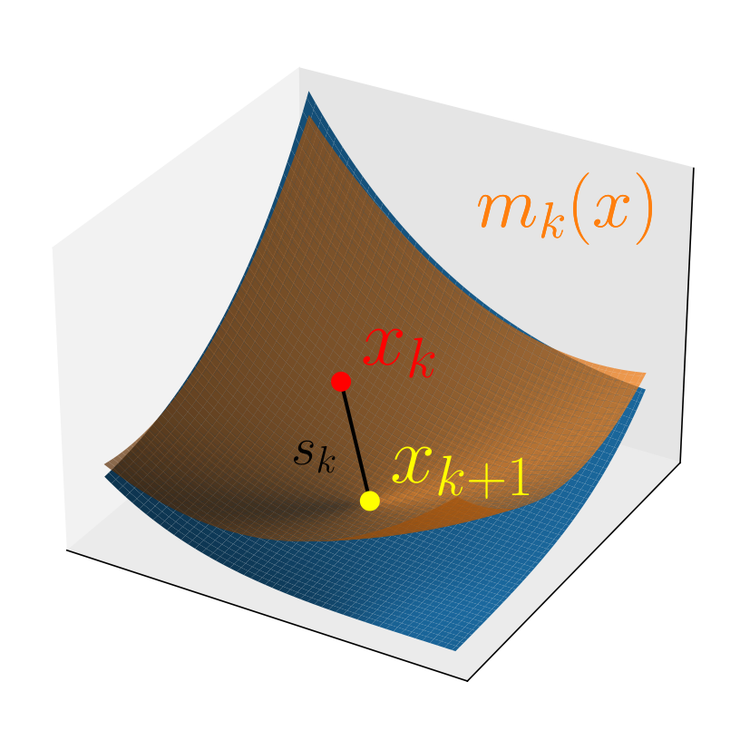
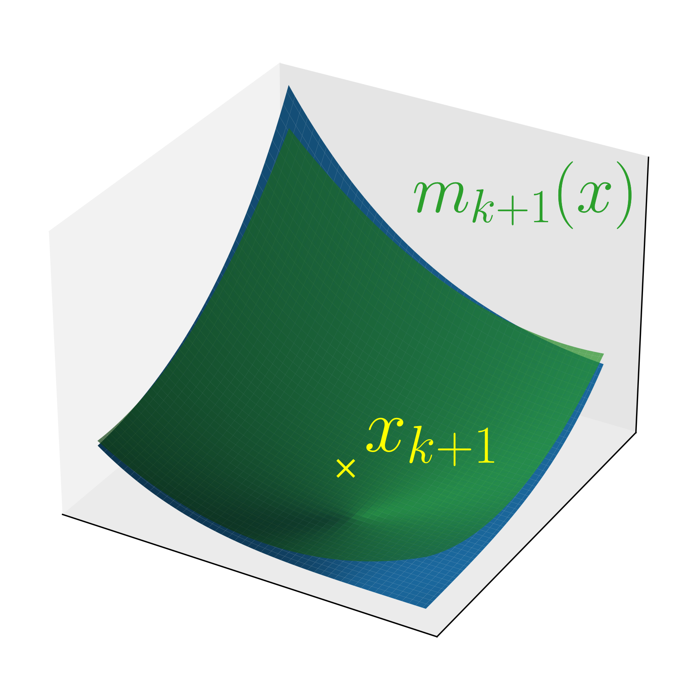
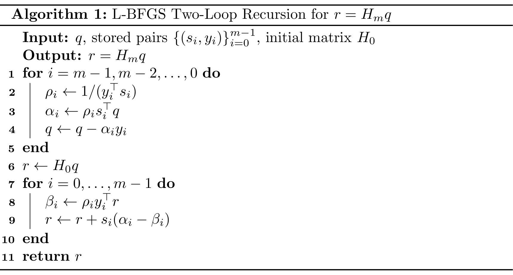

## 準ニュートン法


(Fig. 6 ニュートン法、準ニュートン法、勾配降下法の比較)

本節では準ニュートン法について述べる。準ニュートン法はニュートン法に基づくが、その主要な欠点であるヘッセ行列の計算コストの大きさを低減することを目的とする。具体的には真のヘッセ行列 $\nabla^2 f(x_k)$ の代わりに近似行列 $B_k$ を用い、高速な収束性を保ちつつ計算コストを抑える。

\Cref{fig:newton_vs_qs_vs_gd} はニュートン法、準ニュートン法、勾配降下法の比較を示す。勾配降下法は勾配の反対方向に単純に更新する方法である。1反復あたりの計算コストは最小だが収束は遅い。ニュートン法は反復回数が最も少ない一方で、1ステップあたりの計算コストが最も高い。準ニュートン法はその中間に位置し、両者のバランスを取る。特に反復回数ではなく計算時間で比較すると、準ニュートン法が最良の性能を示すことが多い。

線形探索に基づく準ニュートン法は、最適解 $x^*$ に収束する列 $\lbrace x_k \rbrace_{k=0}^{\infty}$ を次のように生成する。

```math
\begin{equation*}
x_{k+1} = x_k - \alpha_k B_k^{-1} \nabla f(x_k)
= x_k - \alpha_k H_k \nabla f(x_k)
\end{equation*}
```

ここで $\alpha_k > 0$ は線形探索で定めるステップサイズであり、$B_k$ は点 $x_k$ におけるヘッセ行列 $\nabla^2 f(x_k)$ の近似である。$H_k \mathrel{\vcenter{:}}= B_k^{-1}$ はその逆行列を表す。



(Fig. 7 準ニュートン法の概念図。 (1) 目的関数 $f$ (青い曲面) と現在点 $x_k$ (赤点)。 (2) 現在のヘッセ近似によって得られる二次モデル (橙色の曲面) とその最小点 $x_{k+1}$ (黄色のバツ印)。 (3) 新しい点 $x_{k+1}$ に基づく更新後の二次モデル (緑色の曲面)。)

準ニュートン法の核心は、各反復で $B_k$ (またはその逆行列 $H_k$) をどのように更新してヘッセ行列 $\nabla^2 f(x_k)$ に近づけるかにある。\Cref{fig:quasi_newton_overview} はこの概念を示す。まず現在点 $x_k$ の周りで、$B_k$ を用いて目的関数 $f$ の二次近似モデルを構成する。次にこの二次モデルを最小化して次の点 $x_{k+1}$ を得る。$x_{k+1}$ を得た後、$x_k$ と $x_{k+1}$ における勾配情報を用いて近似行列 $B_k$ を $B_{k+1}$ に更新する。この手続きを収束まで繰り返すことが準ニュートン法である。

以下では、近似ヘッセ行列 $B_k$ が満たすべきセカント条件を導入し、$B_k$ と $H_k$ に対する代表的な更新公式を示す。

### セカント条件

この節でも $f\colon \mathbb{R}^n \to \mathbb{R}$ を $C^2$ 級とする。
対称行列 $B_k$ が点 $x_k$ におけるヘッセ行列 $\nabla^2 f(x_k)$ の近似として与えられているとする。
次の点 $x_{k+1}$ における近似ヘッセ行列 $B_{k+1}$ を定める。
このような行列の候補は無数に存在するが、真のヘッセ行列が対称であることから $B_{k+1}$ にも対称性を課すのが自然である。
ステップと勾配差を次で定義する。

```math
\begin{equation*}
s_k = x_{k+1} - x_k, \qquad   y_k = \nabla f(x_{k+1}) - \nabla f(x_k),
\end{equation*}
```

ここで $y_k^\top s_k \neq 0$ かつ $s_k \neq 0$ を仮定する。なお $s_k$ の $s$ は step を意味する。
$\nabla f(x_k)$ のテイラー展開を用いると次が成り立つ。

```math
\begin{align*}
\nabla f(x_k) & = \nabla f(x_{k+1}) + \nabla^2 f(x_{k+1})(x_k - x_{k+1}) + \mathcal{O}(\lVert x_k - x_{k+1} \rVert^2) \\
& \approx \nabla f(x_{k+1}) + \nabla^2 f(x_{k+1})(x_k - x_{k+1})                                        \\
& \approx \nabla f(x_{k+1}) + B_{k+1}(x_k - x_{k+1})
\end{align*}
```

上の近似を等式として要求すると次を得る。

```math
\begin{equation*}
B_{k+1}(x_{k+1} - x_k) = \nabla f(x_{k+1}) - \nabla f(x_k),
\end{equation*}
```

あるいは同値に

```math
\begin{equation*}
B_{k+1} s_k = y_k.
\end{equation*}
```

この関係はセカント条件、または準ニュートン方程式と呼ばれる。

### 代表的な準ニュートン更新公式

$B_k$, $s_k$, $y_k$ が与えられたとき、セカント条件を満たす $B_{k+1}$ を与える更新公式は多数存在する。ここでは代表的なものをその導出とともに示す~\citep{dennisjr.QuasiNewtonMethodsMotivation1977a}。
本小節に限り、簡潔さのため $B_k$, $B_{k+1}$, $s_k$, $y_k$ をそれぞれ $B$, $\bar{B}$, $s$, $y$ と略記する。

#### Broyden の更新

[Broydenの更新](https://en.wikipedia.org/wiki/Broyden%27s_method)は最も基本的な準ニュートン更新公式の一つだが、対称性を保たないため実用上はあまり用いられない。
更新公式は次で与えられる。

```math
\begin{align*}
\bar{B}_{\mathrm{Broyden}} & = B + \frac{(y - Bs)s^\top}{s^\top s},   \\
\bar{H}_{\mathrm{Broyden}} & = H + \frac{s - Hy}{s^\top Hy} s^\top H.
\end{align*}
```

##### 導出

単純な構造的仮定からこの公式を導出する~\citep[Section 4]{dennisjr.QuasiNewtonMethodsMotivation1977a}。

**Proposition 5**

$\bar{B}$ がセカント条件

```math
\begin{equation*}
\bar{B}s = y,
\end{equation*}
```

と作用制約

```math
\begin{equation*}
\bar{B}z = Bz
\quad\text{for all } z\in\mathbb{R}^n \text{ such that } z^\top s = 0.
\end{equation*}
```

を満たすと仮定する。このとき $\bar{B}$ は一意に定まり、$\bar{B}_{\mathrm{Broyden}}$ に一致する。

<details>
<summary>Proof</summary>

ベクトル $s$ と $s$ の直交補空間の基底は $\mathbb{R}^n$ の基底を成す。
$\bar{B}$ の条件はこの基底に対する $\bar{B}$ の作用を完全に決定するため、$\bar{B}$ は一意に定まる。
ここで $\bar{B}_{\mathrm{Broyden}}$ が $\bar{B}$ に課された条件を満たすことを示す。
$z^\top s = 0$ を満たす任意のベクトル $z$ を取る。このとき

```math
\begin{align*}
\bar{B}_{\mathrm{Broyden}} s
& = \left(B + \frac{(y - Bs)s^\top}{s^\top s}\right) s
= Bs + (y - Bs)
= y,                                                    \\
\bar{B}_{\mathrm{Broyden}} z
& = \left(B + \frac{(y - Bs)s^\top}{s^\top s}\right) z
= Bz + (z^\top s) \frac{y - Bs}{s^\top s}
= Bz.
\end{align*}
```

したがって $\bar{B}_{\mathrm{Broyden}}$ は $\bar{B}$ に課された条件を満たす。
ゆえに一意性より $\bar{B} = \bar{B}_{\mathrm{Broyden}}$ を得る。
\myQED

</details>

Broyden の更新はフロベニウスノルムにおける最小変化更新としても特徴づけられる。

**Proposition 6** (\citep{dennisjr.QuasiNewtonMethodsMotivation1977a}, Theorem~4.1)

$B\in\mathbb{R}^{n\times n}$, $y\in\mathbb{R}^n$, $s\in\mathbb{R}^n\setminus\lbrace 0 \rbrace$ を与える。このとき行列 $\bar{B}_{\mathrm{Broyden}}$ は

```math
\begin{align*}
\underset{\tilde{B} \in \mathbb{R}^{n \times n}}{\mathrm{minimize}} & \quad \lVert \tilde{B} - B \rVert_F \\
\mathrm{subject to}                                                 & \quad \tilde{B} s = y
\end{align*}
```

の一意解である。

<details>
<summary>Proof</summary>

関数 $\tilde{B}\mapsto\lVert \tilde{B}-B \rVert_F$ は $\mathbb{R}^{n\times n}$ 上で厳密凸である。
制約集合

```math
\begin{equation*}
\lbrace\tilde{B}\in\mathbb{R}^{n\times n}:\tilde{B}s=y\rbrace
\end{equation*}
```

はアフィンであり凸である。
よってこの最適化問題は高々一つの最小解しか持たない。
$\bar{B}_{\mathrm{Broyden}}$ が実際に最小解であることを示す。制約 $\tilde{B}s=y$ を満たす任意の $\tilde{B}$ に対して

```math
\begin{equation*}
\lVert \bar{B}_{\mathrm{Broyden}} - B \rVert_F^2
= \lVert \frac{(y-Bs)s^\top}{s^\top s} \rVert_F^2
= \lVert (\tilde{B}-B) \frac{s s^\top}{s^\top s} \rVert_F^2
\leq \lVert \tilde{B}-B \rVert_F^2,
\end{equation*}
```

最後の不等式ではフロベニウスノルムの劣乗法性と $\lVert ss^\top/(s^\top s) \rVert_F=1$ を用いた。
したがって $\tilde{B}=\bar{B}_{\mathrm{Broyden}}$ である。
\myQED

</details>

Broyden の更新は、セカント条件を満たし、$s$ に直交するベクトルへの作用を保存するという二つの性質で特徴づけられる。さらに、セカント制約の下でフロベニウスノルムの最小変化更新として一意である。

#### SR1 更新

[対称ランク1 (SR1) 更新](https://en.wikipedia.org/wiki/Symmetric_rank-one)~\citep{nocedal1999numerical} は更新過程で対称性を維持する基本的な準ニュートン法である。更新公式は次で与えられる。

```math
\begin{align*}
\bar{B}_{\mathrm{SR1}} & = B + \frac{(y - B s)(y - B s)^\top}{(y - B s)^\top s}, \\
\bar{H}_{\mathrm{SR1}} & = H + \frac{(s - H y)(s - H y)^\top}{(s - H y)^\top y}.
\end{align*}
```

##### 導出

SR1 更新を導出するため、更新行列 $\bar{B}$ をランク1更新として構成する。すなわち、あるベクトル $z \in \mathbb{R}^n$ に対して

```math
\begin{equation*}
\bar{B}_{\mathrm{SR1}} = B + z z^\top.
\end{equation*}
```

セカント条件 $\bar{B}_{\mathrm{SR1}} s = y$ を満たすために、$z^\top s \neq 0$ のとき次が必要となる。

```math
\begin{equation*}
B s + z z^\top s = y,
\end{equation*}
```

これより

```math
\begin{equation*}
z = \frac{y - B s}{z^\top s}.
\end{equation*}
```

$z^\top s$ を決めるために $s$ との内積を取る。

```math
\begin{equation*}
z^\top s = \frac{(y - B s)^\top s}{z^\top s}.
\end{equation*}
```

この式を整理すると次の関係を得る。

```math
\begin{equation*}
(z^\top s)^2 = (y - B s)^\top s.
\end{equation*}
```

したがって

```math
\begin{equation*}
\bar{B}_{\mathrm{SR1}}
= B + z z^\top
= B + \frac{(y - B s)(y - B s)^\top}{(z^\top s)^2}
= B + \frac{(y - B s)(y - B s)^\top}{(y - B s)^\top s},
\end{equation*}
```

が得られ、SR1 更新公式が再現される。

##### 補足

SR1 更新は $(y - Bs)^\top s \neq 0$ であることを前提とする。$(y - Bs)^\top s = 0$ のとき分母が零となり、実用上は更新をスキップすることが多い。この状況は対称ランク1更新ではセカント条件を満たせない場合に起こり得て、より洗練された更新戦略が必要であることを示す。

#### Powell 対称 Broyden (PSB) 更新

Powell 対称 Broyden (PSB) 更新~\cite{haeltermanAnalyticalStudyLeast2009} は最も重要な準ニュートン更新公式の一つである。更新公式は次で与えられる。

```math
\begin{align*}
\bar{B}_{\mathrm{PSB}} & = B + \frac{(y - B s) s^\top + s (y - B s)^\top}{s^\top s} - \frac{s^\top (y - B s)}{(s^\top s)^2} s s^\top, \\
\bar{H}_{\mathrm{PSB}} & = H + \frac{(s - H y) y^\top + y (s - H y)^\top}{y^\top y} - \frac{y^\top (s - H y)}{(y^\top y)^2} y y^\top.
\end{align*}
```

##### 導出

この公式の動機を理解するために、SR1 更新ではランク1更新が $\bar{B}_{\mathrm{SR1}} = B + z z^\top$ のように対称的に定式化されていたことに注意する。
更新過程で常に対称性を維持する要件を緩め、代わりに $z c^\top$ という非対称ランク1更新を考え、最後に対称化する。

$c^\top s \neq 0$ を満たすベクトル $c \in \mathbb{R}^n$ を与え、次で定義する。

```math
\begin{equation*}
z = \frac{y - B s}{c^\top s}
\end{equation*}
```

そして次の非対称更新を行う。

```math
\begin{equation*}
C_1 \mathrel{\vcenter{:}}= B + \frac{(y - B s)c^\top}{c^\top s}.
\end{equation*}
```

$C_1$ は一般に対称でないため、次で対称化する。

```math
\begin{equation*}
C_2 = \frac{C_1 + C_1^\top}{2}.
\end{equation*}
```

しかし、対称化された行列 $C_2$ はセカント条件 $C_2 s = y$ を満たさない場合がある。そこでこの過程を反復する。

```math
\begin{equation*}
\begin{cases}
C_0 = B                                                                               \\
C_{2t+1} = C_{2t} + \frac{(y - C_{2t}s)c^\top}{c^\top s} & \text{(asymmetric update)} \\
C_{2t+2} = \frac{C_{2t+1} + C_{2t+1}^\top}{2}            & \text{(symmetrization)}
\end{cases}
\end{equation*}
```

重要な結果として、列 $\lbrace C_{2t} \rbrace_{t=0}^{\infty}$ はセカント条件を満たす対称行列に収束する。次の命題でそれを定式化する。

**Proposition 7** (\citep{dennisjr.QuasiNewtonMethodsMotivation1977a}, Lemma~7.2)

行列の列 $\lbrace C_{t} \rbrace_{t=0}^{\infty}$ は収束し、その極限は次で与えられる:

```math
\begin{equation*}
\lim_{t \to \infty} C_{t}
=
C_{\infty}
\mathrel{\vcenter{:}}=
B + \frac{(y - Bs)c^\top + c(y - Bs)^\top}{c^\top s} - \frac{(y - Bs)^\top s}{(c^\top s)^2} c c^\top.
\end{equation*}
```

<details>
<summary>Proof</summary>

まず偶数部分列を解析する。
次で定義する。

```math
\begin{equation*}
G_t \mathrel{\vcenter{:}}= C_{2t}
\end{equation*}
```

ここで $t=0,1,2,\dots$ である。
構成より各 $G_t$ は対称である。
定義から次を得る。

```math
\begin{equation*}
G_{t+1} = G_t +\frac{1}{2c^\top s}\left((y-G_t s)c^\top+c(y-G_t s)^\top\right).
\end{equation*}
```

誤差ベクトルを次で導入する。

```math
\begin{equation*}
w_t \mathrel{\vcenter{:}}= y-G_t s.
\end{equation*}
```

このとき

```math
\begin{equation*}
G_{t+1} = G_t+\frac{1}{2c^\top s}(w_t c^\top+cw_t^\top).
\end{equation*}
```

上式を $w_t$ の定義に代入すると

```math
\begin{align*}
w_{t+1} & = y-\left(G_t+\frac{1}{2c^\top s}(w_t c^\top+cw_t^\top)\right)s \\
& =
w_t-\frac12w_t-\frac{w_t^\top s}{2c^\top s}c                              \\
& =
\frac{1}{2}\left(w_t-\frac{w_t^\top s}{c^\top s}c\right).
\end{align*}
```

よって

```math
\begin{equation*}
w_{t+1}=Pw_t,
\qquad
P \mathrel{\vcenter{:}}= \frac{1}{2}\left(I-\frac{cs^\top}{c^\top s}\right).
\end{equation*}
```

行列 $cs^\top/c^\top s$ はランク1で固有値は $1,0,\dots,0$ である。
よって $P$ は固有値 $0$ を一つ持ち、残りはすべて $1/2$ である。
とくにスペクトル半径は $1/2<1$ となる。
したがってノイマン級数が収束し、次が成り立つ。

```math
\begin{align*}
\sum_{t=0}^{\infty}w_t & =        \sum_{t=0}^{\infty}P^t(y-Bs)                         &  & (w_0=y-Bs)                \\
& =  (I-P)^{-1}(y-Bs)                                                                          \\
& = 2\left(I-\frac{1}{2}\frac{cs^\top}{c^\top s}\right) (y-Bs). &  & (\text{definition of } P)
\end{align*}
```

最後の式は次から従う。

```math
\begin{equation*}
2(I-P) \left(I-\frac{1}{2}\frac{cs^\top}{c^\top s}\right) = \left(I + \frac{cs^\top}{c^\top s}\right) \left(I-\frac{1}{2}\frac{cs^\top}{c^\top s}\right) = I.
\end{equation*}
```

特に $t\to\infty$ で $\lVert w_t \rVert\to0$ となる。
よって

```math
\begin{align*}
\lim_{t\to\infty}G_t
& =
B+\frac{1}{2c^\top s}
\sum_{t=0}^{\infty}(w_t c^\top+c w_t^\top)                                                                                                                                        \\
& = B+ \left(\sum_{t=0}^{\infty}w_t\right) \frac{c^\top}{2c^\top s} + \frac{c}{2c^\top s} \left(\sum_{t=0}^{\infty}w_t\right)^\top                                               \\
& = B+ 2\left(I-\frac{1}{2}\frac{cs^\top}{c^\top s}\right) (y-Bs) \frac{c^\top}{2c^\top s} + \frac{c}{2c^\top s} 2(y-Bs)^\top \left(I-\frac{1}{2}\frac{sc^\top}{c^\top s}\right) \\
& = B + \frac{(y - Bs)c^\top + c(y - Bs)^\top}{c^\top s} - \frac{(y - Bs)^\top s}{(c^\top s)^2} c c^\top                                                                         \\
& = C_{\infty}.
\end{align*}
```

次に奇数部分列について

```math
\begin{equation*}
C_{2t+1}
=
G_t+\frac{w_t c^\top}{c^\top s}.
\end{equation*}
```

$G_t\to C_{\infty}$ かつ $\lVert w_t \rVert\to0$ なので

```math
\begin{equation*}
C_{2t+1} \to C_{\infty}.
\end{equation*}
```

したがって部分列 $\lbrace C_{2t} \rbrace$ と $\lbrace C_{2t+1} \rbrace$ はどちらも $C_{\infty}$ に収束し、証明を完了する。
\myQED

</details>

$c = s$ のとき、$C_{\infty}$ の一般式は標準的な PSB 更新公式に簡約される。

```math
\begin{equation*}
\bar{B}_{\mathrm{PSB}} = B + \frac{(y - Bs)s^\top + s(y - Bs)^\top}{s^\top s} - \frac{(y - Bs)^\top s}{(s^\top s)^2} ss^\top.
\end{equation*}
```

##### 補足

$c = s$ の選択は更新結果の正定値性を確保する動機に基づく。PSB 更新は、非対称ランク1更新に対する反復的対称化過程の極限として解釈できる。

#### DFP 更新

[Davidon--Fletcher--Powell (DFP) 更新](https://en.wikipedia.org/wiki/Davidon%E2%80%93Fletcher%E2%80%93Powell_formula)~\cite{nocedal1999numerical} は古典的な準ニュートン更新公式である。更新公式は次で与えられる。

```math
\begin{align*}
\bar{B}_{\mathrm{DFP}} & = (I - \frac{y s^\top}{y^\top s}) B (I - \frac{s y^\top}{y^\top s}) + \frac{y y^\top}{y^\top s}, \\
\bar{H}_{\mathrm{DFP}} & = H - \frac{H y y^\top H}{y^\top H y} + \frac{s s^\top}{y^\top s}.
\end{align*}
```

##### 導出

先に述べた PSB 更新では $c=s$ としたが、別の $c$ を選ぶこともできる。具体的には $B_{k+1}$ が正定値になるように $c$ を選ぶことを考える。$c=y$ を代入すると次の別形式が得られる。

```math
\begin{equation*}
\bar{B}_{\mathrm{DFP}} = B + \frac{(y - Bs)y^\top + y(y - Bs)^\top}{y^\top s} - \frac{(y - Bs)^\top s}{(y^\top s)^2} yy^\top.
\end{equation*}
```

DFP更新を導出する他の方法もいくつか存在し、それらの一部は、次のBFGS更新における導出の双対版として理解できる。

#### BFGS更新

[Broyden--Fletcher--Goldfarb--Shanno (BFGS) 更新](https://en.wikipedia.org/wiki/Broyden%E2%80%93Fletcher%E2%80%93Goldfarb%E2%80%93Shanno_algorithm)は最も広く使われる準ニュートン法の一つである。更新公式は次で与えられる。

```math
\begin{align*}
\bar{B}_{\mathrm{BFGS}} & = B - \frac{B s s^\top B}{s^\top B s} + \frac{y y^\top}{y^\top s},                                                     \\
\bar{H}_{\mathrm{BFGS}} & = \left(I - \frac{s y^\top}{y^\top s}\right) H \left(I - \frac{y s^\top}{y^\top s}\right) + \frac{s s^\top}{y^\top s}.
\end{align*}
```

##### 双対による導出

この更新はDFP更新の双対を考えることで導出できる。
$B$ に対する BFGS 更新は $H$ に対する DFP 更新と同じであることに注意する。

##### KL ダイバージェンス最小化による導出

KLダイバージェンスとは、行列間の近さを測る一種の非対称な尺度であり、正定値行列 $P,Q \in \mathbb{R}^{n \times n}$ に対して次で定義される:

```math
\begin{equation*}
\mathrm{KL}(P,Q) \mathrel{\vcenter{:}}= \mathrm{tr}(P Q^{-1}) - \log\det(P Q^{-1}) - n.
\end{equation*}
```

行列 $T \in \mathbb{R}^{n \times n}$ を任意の正則行列とする。
一般に、$\mathrm{tr}$ は2つの行列の積に対して可換性を持つため、KLダイバージェンスは次の不変性を持つ。

```math
\begin{align*}
\mathrm{KL}(T P T^\top, T Q T^\top) & = \mathrm{tr}(T P T^\top (T Q T^\top)^{-1}) - \log\det(T P T^\top (T Q T^\top)^{-1}) - n \\
& = \mathrm{tr}(P Q^{-1} T^{-1} T) - \log (\det(T) \det(P Q^{-1}) \det(T^{-1})) - n        \\
& = \mathrm{tr}(P Q^{-1}) - \log\det(P Q^{-1}) - n                                         \\
& = \mathrm{KL}(P, Q).
\end{align*}
```

BFGS 更新はKLダイバージェンスを用いた次の最適化問題の解としても得られる。

```math
\begin{align*}
\underset{\bar{B} \succ 0}{\text{minimize}} & \quad \mathrm{KL}(\bar{B}, B) \\
\text{subject to}                           & \quad \bar{B} s = y
\end{align*}
```

ここではそれを証明する。

**Proposition 8** ({\citep[Section 7.2.4]{kanamori2016continuous}})

$B \succ 0$ を正定値対称行列とする。
上記の最適化問題の解は BFGS 更新公式で与えられる。

<details>
<summary>Proof</summary>

$B$ が正定値対称行列であることに注意して、

```math
\begin{equation*}
s' \mathrel{\vcenter{:}}= B^{\frac{1}{2}} s, \quad y' \mathrel{\vcenter{:}}= B^{-\frac{1}{2}} y, \quad B' \mathrel{\vcenter{:}}= B^{-\frac{1}{2}} \bar{B} B^{-\frac{1}{2}}
\end{equation*}
```

と置くと、最適化問題は次のように書き直せる:

```math
\begin{align*}
\underset{B' \succ 0}{\text{minimize}} & \quad \mathrm{KL}(B', I) \\
\text{subject to}                      & \quad B' s' = y'.
\end{align*}
```

ただし、KLダイバージェンスの不変性より、$\mathrm{KL}(\bar{B}, B) = \mathrm{KL}(B^{-\frac{1}{2}} \bar{B} B^{-\frac{1}{2}}, B^{-\frac{1}{2}} B B^{-\frac{1}{2}}) = \mathrm{KL}(\bar{B}, I)$ であることを用いた。
なお、本最適化問題において$B' \succ 0$という制約は自動的に対称性を含むため、$B' = B'^\top$ を制約として陽に課しても解は変わらない。
この問題の解を、ラグランジュの未定乗数法を用いて求める。
ラグランジュ乗数 $\lambda\in\mathbb{R}^n$ および行列乗数 $\Lambda\in\mathbb{R}^{n\times n}$ を用いて、ラグランジアンを

```math
\begin{equation*}
\mathcal{L}(B',\lambda,\Lambda) = \mathrm{tr}(B') -\log\det(B') -n +2\lambda^\top(B's'-y') +\mathrm{tr}\left(\Lambda(B'-B'^\top)\right)
\end{equation*}
```

と定義する。
KKT条件のうち停留性に関する条件は、行列微分の公式 ($X \succ 0$ に対して、$\log\det(X)$ の微分が $X^{-\top}$ かつ、 $\mathrm{tr}(AX)$ の微分が $A^\top$) を用いて $B'$ で微分し、$B'=B'^\top$ を用いることで次のように書ける:

```math
\begin{equation*}
I-B'^{-1}
+2\lambda s'^\top
+\Lambda^\top-\Lambda
=0.
\end{equation*}
```

この式とその転置を加えて2で割り、再び $B' = B'^\top$ を用いると次を得る:

```math
\begin{equation*}
B'^{-1} = I+\lambda s'^\top+s'\lambda^\top.
\end{equation*}
```

制約条件 $B's'=y'$ より $B'^{-1}y'=s'$ であるから、
上式に右から $y'$ を掛けた式と、さらに左から $y'^\top$ を掛けた式はそれぞれ

```math
\begin{align*}
s'         & = y' +(s'^\top y')\lambda +(\lambda^\top y')s'                               \\
y'^\top s' & = y'^\top y' + (s'^\top y')(y'^\top \lambda) + (\lambda^\top y')(y'^\top s')
\end{align*}
```

となる。
第2式より、

```math
\begin{equation*}
\lambda^\top y'
=
\frac{y'^\top s'-y'^\top y'}{2(s'^\top y')}
\end{equation*}
```

であるので、これを第1式に代入すると、

```math
\begin{equation*}
\lambda
= \frac{s'-y'}{s'^\top y'} - \frac{\lambda^\top y'}{s'^\top y'}s'
=
\frac{s'^\top y'+y'^\top y'}{2(s'^\top y')^2}s'
-\frac{1}{s'^\top y'}y'
\end{equation*}
```

が得られる。
この $\lambda$ を $B'^{-1}$ の表式に代入して整理すると，

```math
\begin{align*}
B'^{-1} & = I + 2\frac{s'^\top y'+y'^\top y'}{2(s'^\top y')^2}(s' s'^\top)
-\frac{1}{s'^\top y'}(y' s'^\top + s' y'^\top)                                                                                        \\
& = \left( I-\frac{s'y'^\top}{s'^\top y'} \right) \left( I-\frac{y's'^\top}{s'^\top y'} \right) +\frac{s's'^\top}{s'^\top y'}
\end{align*}
```

を得る。
最後に $B' = B^{-\frac{1}{2}} \bar{B} B^{-\frac{1}{2}}$ より、$\bar{B} = B^{\frac{1}{2}} B' B^{\frac{1}{2}}$ であるため、$\bar{B}^{-1}$ を計算すると、

```math
\begin{align*}
\bar{B}^{-1} & = B^{-\frac{1}{2}} B'^{-1} B^{-\frac{1}{2}}                                                                                                                                                                          \\
& = B^{-\frac{1}{2}} \left( I-\frac{s'y'^\top}{s'^\top y'} \right) \left( I-\frac{y's'^\top}{s'^\top y'} \right) B^{-\frac{1}{2}} + \frac{(B^{-\frac{1}{2}}s')(B^{-\frac{1}{2}}s')^\top}{s'^\top y'}                   \\
& = B^{-\frac{1}{2}} \left( I-\frac{B^{\frac{1}{2}}s y^\top B^{-\frac{1}{2}}}{s^\top y} \right) \left( I-\frac{B^{-\frac{1}{2}}y s^\top B^{\frac{1}{2}}}{s^\top y} \right) B^{-\frac{1}{2}} + \frac{ss^\top}{s^\top y} \\
& = \left( I - \frac{s y^\top}{y^\top s} \right) B^{-1} \left( I - \frac{y s^\top}{y^\top s} \right) + \frac{s s^\top}{y^\top s}.
\end{align*}
```

となり、確かに $\bar{B}^{-1} = \bar{H}_{\mathrm{BFGS}}$ が得られる。
後述の通り、$\bar{H}_{\mathrm{BFGS}}$ の逆行列は $\bar{B}_{\mathrm{BFGS}}$ であるため、命題が示された。
\myQED

</details>

これらの定式化の証明は文献を参照されたい~\citep{kanamoriBregmanExtensionQuasiNewton2010,kanamoriBregmanExtensionQuasiNewton2010a}。
[こちらのスライド](http://matsuzoe.web.nitech.ac.jp/infogeo/OCAMI2010/kanamori.pdf)も参照されたい。

### BFGS 法

本小節では BFGS 更新に注目し、その公式の詳細な導出を示す。
BFGS 更新は実用上もっとも成功した準ニュートン更新公式の一つとして知られている。
BFGS 更新公式は次で与えられる。

```math
\begin{equation*}
B_{k+1}   = B_k - \frac{B_k s_k s_k^\top B_k}{s_k^\top B_k s_k} + \frac{y_k y_k^\top}{y_k^\top s_k}.
\end{equation*}
```

#### 逆更新の公式

BFGS 更新の逆行列 $H_k \mathrel{\vcenter{:}}= B_k^{-1}$ は次式で与えられる。

```math
\begin{equation*}
H_{k+1} = \left(I - \frac{s_k y_k^\top}{y_k^\top s_k}\right) H_k \left(I - \frac{y_k s_k^\top}{y_k^\top s_k}\right) + \frac{s_k s_k^\top}{y_k^\top s_k}.
\end{equation*}
```

この式が確かに BFGS 更新の逆行列を与えることを示す。

**Proposition 9**

行列 $H_{k+1}$ は $B_{k+1}$ の逆行列である。

<details>
<summary>Proof</summary>

BFGS 更新は次の簡潔なランク2の形に書き直せる。

```math
\begin{equation*}
B_{k+1} = B_k + UCV^\top
\end{equation*}
```

ここで

```math
\begin{equation*}
U = \begin{bmatrix}B_k s_k & y_k\end{bmatrix},\qquad
C = \begin{pmatrix}-\frac{1}{s_k^\top B_k s_k} & 0 \\ 0 & \frac{1}{y_k^\top s_k}\end{pmatrix},\qquad
V = \begin{bmatrix}B_k s_k & y_k\end{bmatrix}
\end{equation*}
```

である。実際

```math
\begin{equation*}
U C V^\top   = \begin{bmatrix} -\frac{B_k s_k}{s_k^\top B_k s_k}&    \frac{y_k}{y_k^\top s_k} \end{bmatrix} \begin{bmatrix} s_k^\top B_k  \\  y_k^\top \end{bmatrix}
= -\frac{B_k s_k s_k^\top B_k}{s_k^\top B_k s_k} + \frac{y_k y_k^\top}{y_k^\top s_k}.
\end{equation*}
```

Sherman--Morrison--Woodbury の恒等式より

```math
\begin{align*}
H_{k+1} & = (B_k + U C V^\top)^{-1}                                                                                                                                                                                                                                                                                                                                                                                                                                                                                                                                                                                                                                                                      \\
& = B_k^{-1}- B_k^{-1}U\left(C^{-1}+V^\top B_k^{-1}U\right)^{-1}V^\top B_k^{-1}                                                                                                                                                                                                                                                                                                                                                                                                                                                                                                                                                                                                                  \\
& = H_k- \begin{bmatrix}s_k & H_k y_k\end{bmatrix} \left(\begin{pmatrix}- s_k^\top B_k s_k & 0                                                                                                                                                                                                                                            \\0    & y_k^\top s_k\end{pmatrix}+\begin{pmatrix}s_k^\top B_k s_k   & s_k^\top y_k      \\y_k^\top s_k & y_k^\top H_k y_k\end{pmatrix}\right)^{-1}\begin{bmatrix}s_k^\top \\ y_k^\top H_k\end{bmatrix}                                                                                                                                                \\
& = H_k- \begin{bmatrix}s_k                                                                                                                             & H_k y_k\end{bmatrix}\begin{pmatrix}0                                                               & y_k^\top s_k                                                                                                                                                                                                                                          \\y_k^\top s_k       & y_k^\top H_k y_k + y_k^\top s_k\end{pmatrix}^{-1}\begin{bmatrix}s_k^\top                         \\     y_k^\top H_k\end{bmatrix}                    \\
& = H_k- \begin{bmatrix}s_k                                                                                                                             & H_k y_k\end{bmatrix}\left(-\frac{1}{(y_k^\top s_k)^2}\begin{pmatrix}y_k^\top H_k y_k + y_k^\top s_k & -y_k^\top s_k                                                                                                                                                                                                                                         \\-y_k^\top s_k                 & 0    \end{pmatrix}\right) \begin{bmatrix} s_k^\top                                                      \\     y_k^\top H_k\end{bmatrix} \\
& = H_k+\frac{1}{(y_k^\top s_k)^2}\begin{bmatrix}s_k                                                                                                    & H_k y_k\end{bmatrix} \begin{pmatrix}y_k^\top H_k y_k + y_k^\top s_k                                & -y_k^\top s_k                                                                                                                                                                                                                                         \\-y_k^\top s_k                 & 0\end{pmatrix} \begin{bmatrix}s_k^\top                                                             \\    y_k^\top H_k\end{bmatrix}        \\
& = H_k+\frac{1}{(y_k^\top s_k)^2} \left((y_k^\top H_k y_k + y_k^\top s_k) s_k s_k^\top - (y_k^\top s_k)(s_k y_k^\top H_k + H_k y_k s_k^\top) \right)                                                                                                                                                                                                                                                                                                                                                                                                                                                                                                                                            \\
& = \left(I - \frac{s_k y_k^\top}{y_k^\top s_k}\right) H_k \left(I - \frac{y_k s_k^\top}{y_k^\top s_k}\right) + \frac{s_k s_k^\top}{y_k^\top s_k}.
\end{align*}
```

を得る。これで証明が完了する。
\myQED

</details>

#### BFGS 更新の正定値性

BFGS 更新の重要な性質として、現在の近似 $B_k$ が正定値で曲率条件 $y_k^\top s_k > 0$ が成り立つなら、更新後の近似 $B_{k+1}$ も正定値であることが保証される。

**Proposition 10**

$B_k$ が正定値で $y_k^\top s_k > 0$ が成り立つなら、$B_{k+1}$ も正定値である。

<details>
<summary>Proof</summary>

仮定より $B_k$ とその逆行列 $H_k$ は正定値である。
任意の非零ベクトル $v \in \mathbb{R}^n$ に対して

```math
\begin{equation*}
v^\top H_{k+1} v
= v^\top \left(I - \frac{s_k y_k^\top}{y_k^\top s_k}\right) H_k \left(I - \frac{y_k s_k^\top}{y_k^\top s_k}\right) v + v^\top \frac{s_k s_k^\top}{y_k^\top s_k} v
\geq 0 + \frac{(s_k^\top v)^2}{y_k^\top s_k} > 0,
\end{equation*}
```

ここで第1項は $H_k$ が正定値であるため非負であり、第2項は曲率条件 $y_k^\top s_k > 0$ により正である。
よって $H_{k+1}$ は正定値であり、その逆行列 $B_{k+1} = H_{k+1}^{-1}$ も正定値である。
\myQED

</details>

#### BFGS 更新のトレースと行列式の公式

更新行列の固有値挙動の解析に有用な、BFGS 更新のトレースと行列式の公式も示す。
エルミート行列ではこれらはそれぞれ固有値の総和と積に対応する。したがってトレースと行列式が適切に有界なら、固有値自体も有界に保たれると期待できる(例えばすべての固有値が正である場合)。
これは $\mu$-強凸性や $L$-平滑性など、目的関数のヘッセ行列固有値に関する仮定と密接に関係する。

##### トレースの公式

BFGS 更新後の行列のトレースには明示式がある。

**Proposition 11** ({\citep[(6.44)]{nocedal1999numerical}})

$B_{+} = B - \frac{Bss^\top B}{s^\top Bs} + \frac{yy^\top}{y^\top s}$ を BFGS 更新とする。このとき

```math
\begin{equation*}
\mathrm{tr}(B_{+}) = \mathrm{tr}(B) - \frac{\lVert B s \rVert^2}{s^\top Bs} + \frac{\lVert y \rVert^2}{y^\top s}
\end{equation*}
```

が成り立つ。

<details>
<summary>Proof</summary>

BFGS 更新公式にトレースを適用すると

```math
\begin{equation*}
\mathrm{tr}(B_{+}) = \mathrm{tr}(B) - \mathrm{tr}\left(\frac{Bss^\top B}{s^\top Bs}\right) + \mathrm{tr}\left(\frac{yy^\top}{y^\top s}\right).
\end{equation*}
```

第2項について

```math
\begin{equation*}
\mathrm{tr}\left(\frac{Bss^\top B}{s^\top Bs}\right) = \frac{1}{s^\top Bs}\mathrm{tr}((Bs)(Bs)^\top) = \frac{\lVert B s \rVert^2}{s^\top Bs}.
\end{equation*}
```

第3項について

```math
\begin{equation*}
\mathrm{tr}\left(\frac{yy^\top}{y^\top s}\right) = \frac{1}{y^\top s}\mathrm{tr}(yy^\top) = \frac{\lVert y \rVert^2}{y^\top s}.
\end{equation*}
```

以上より所望の式が得られる。
\myQED

</details>

##### 行列式の公式

BFGS 更新後の行列式も閉形式で与えられる。

**Proposition 12** ({\citep[(6.45)]{nocedal1999numerical}})

$B_{+} = B - \frac{Bss^\top B}{s^\top Bs} + \frac{yy^\top}{y^\top s}$ を BFGS 更新とし、$B$ が正則であるとする。このとき

```math
\begin{equation*}
\det(B_{+}) = \det(B) \frac{y^\top s}{s^\top Bs}
\end{equation*}
```

が成り立つ。

<details>
<summary>Proof</summary>

BFGS 更新のランク2表現を思い出す。
[行列式補題](https://en.wikipedia.org/wiki/Matrix_determinant_lemma)より、$U, C, V$ は次を満たす。

```math
\begin{equation*}
\det(B_{k+1}) =\det(B_k + U C V^\top)=\det(B_k)\det(C) \det \left(C^{-1} + V^\top B_k^{-1} U\right),
\end{equation*}
```

ここで $I_2$ は $2\times 2$ の単位行列である。
$U=V=\begin{bmatrix}B_k s_k & y_k\end{bmatrix}$ なので

```math
\begin{equation*}
V^\top B_k^{-1} U = \begin{bmatrix} s_k^\top B_k s_k & s_k^\top y_k \\ y_k^\top s_k     & y_k^\top B_k^{-1} y_k \end{bmatrix}
\end{equation*}
```

よって

```math
\begin{equation*}
C^{-1} + V^\top B_k^{-1} U
=
\begin{bmatrix}-s_k^\top B_k s_k & 0 \\ 0 & y_k^\top s_k\end{bmatrix} +
\begin{bmatrix} s_k^\top B_k s_k & s_k^\top y_k \\ y_k^\top s_k     & y_k^\top B_k^{-1} y_k \end{bmatrix}
=
\begin{bmatrix}0 & s_k^\top y_k \\ y_k^\top s_k & y_k^\top B_k^{-1} y_k \end{bmatrix}.
\end{equation*}
```

以上を合わせると

```math
\begin{equation*}
\det(B_{k+1})
= \det(B_k) \left(-\frac{1}{s_k^\top B_k s_k} \cdot \frac{1}{y_k^\top s_k}\right) \left(- (s_k^\top y_k)(y_k^\top s_k)\right)
= \det(B_k) \frac{y_k^\top s_k}{s_k^\top B_k s_k},
\end{equation*}
```

を得る。これで証明が完了する。
\myQED

</details>

### BFGS と DFP の比較

BFGS と DFP は構造的にはかなり対称的であるにもかかわらず、実際の最適化問題に適用すると実用上の効率は大きく異なる。Powell の解析~\citep{powellHowBadAre1986} は、単純な2次元二次関数に対する両手法の挙動を調べてこの非対称性を検討した。漸近収束理論では両者は同程度に振る舞うと示唆されることが多いが、Powell は実用上の効率が大きく異なること、とくに近似ヘッセ行列が真のヘッセ行列から遠い場合に差が顕著であることを示した。

#### 問題設定

Powell の枠組みに従い、次の二次関数を考える。

```math
\begin{equation*}
f(x, y) = \frac{1}{2}(x^2 + y^2),
\end{equation*}
```

そして BFGS と DFP のどちらも各反復で固定ステップサイズ $\alpha_k = 1$ を用いる。二次関数ではこの単位ステップが標準的な線形探索条件を満たすことが多く、実用的な選択である。

初期のヘッセ近似 $B_0$ は固有値 1 と $\lambda_1$ を持つように選ぶ。ここで $\lambda_1$ は初期近似の誤差の程度を表す。
初期点 $x_0$ は次で選ぶ。

```math
\begin{equation*}
\theta = \arctan(\sqrt{\lambda_1}), \quad x_0 = \begin{bmatrix}\cos(\theta) \\ \sin(\theta)\end{bmatrix},
\end{equation*}
```

これは Powell の元の解析に一致する。
この選択の詳細は~\citep{powellHowBadAre1986} を参照されたい。

反復は現在点のノルムが初期ノルムに対する許容値を下回るまで続ける。各 $\lambda_1$ に対して収束に要する反復回数を記録する。

#### 数値結果

数値結果を Table 1 に示す。これは Powell の原表の内容を一部再現したものである。収束挙動は初期固有値 $\lambda_1$ に強く依存する。

| $\lambda_1$ | BFGS  |  DFP  |
| :---------: | :---: | :---: |
|    0.001    |   4   |   3   |
|    0.01     |   5   |   3   |
|     0.1     |   6   |   4   |
|      1      |   1   |   1   |
|     10      |   8   |  16   |
|     100     |  10   |  107  |
|    1000     |  12   | 1006  |
|    10000    |  15   | 9987  |

(Table 1 \ifEn Convergence comparison between BFGS and DFP methods for different initial eigenvalues $\lambda_1$ \else 初期固有値 $\lambda_1$ に対する BFGS と DFP の収束比較)

\Cref{fig:bfgs_dfp_100} と Fig. 9 は特定の $\lambda_1$ に対する反復軌跡を示す。これらの図は、同一の初期点から最小点(原点)へ向かう二つの手法の進み方を可視化し、収束速度と経路の違いを明確に示す。


(Fig. 8 $\lambda_1 = 100$ における BFGS と DFP の反復軌跡。BFGS は 10 回で収束する一方、DFP は 107 回を要し、固有値誤差が大きい場合に BFGS が優位であることを示す。)


(Fig. 9 $\lambda_1 = 0.1$ における BFGS と DFP の反復軌跡。どちらも素早く収束し、DFP が BFGS よりわずかに速い。固有値が過小評価された場合の対称的な振る舞いを示している。)

#### 解析と議論

数値結果は BFGS と DFP の間に顕著な非対称性があることを示す。
$\lambda_1 > 1$ のとき、すなわち初期ヘッセ近似が真の曲率を過大評価する場合、BFGS は大幅に高い効率を示す。
逆に $\lambda_1 < 1$ のとき、すなわち初期ヘッセ近似が真の曲率を過小評価する場合、DFP は BFGS よりわずかに良いが、その差は小さい。
この傾向の逆転は理論的な対称性から予測されるが、差の大きさは注目に値する。

##### ヘッセ補正の非対称性

性能の非対称性は、両手法が誤った固有値を補正する仕方の根本的な違いに起因する。
核心的な洞察は、過大な固有値の補正が過小な固有値の補正より重要であるという点である。

ヘッセ固有値が過大評価されると、アルゴリズムは過度に保守的なステップを取り、最小点への進みが遅くなる。この誤差を補正するには、更新公式が大きな固有値を 1 へ縮小する必要がある。
BFGS 更新はこの作業に非常に効果的である。

一方、ヘッセ固有値が過小評価される場合、アルゴリズムはやや攻撃的なステップを取るが、誤差は自己修正的である。
その後の勾配計算が近似の改善に役立つ情報を提供する。
そのため過小評価の補正は本質的に容易で、必要な反復回数も少ない。

DFP 更新は大きな固有値の補正が苦手である。
最悪の場合、1反復で大きな固有値をわずかしか減らせず、固有値の大きさに匹敵する回数の反復が必要になることがある。
このことが $\lambda_1$ が 1 を超えて増加するにつれて DFP の性能が急激に悪化する理由である。

##### 実用上の含意

これらの知見は、実務で BFGS が DFP より広く選好されることに強い経験的根拠を与える。
Powell の単純な二次問題の解析は、計算量の大半が費やされる解から遠い領域での準ニュートン法の挙動に深い洞察を与える。
誤ったヘッセ近似の補正における BFGS の優位性は、ロバストで効率的な無制約最適化のための第一選択としての地位を支えている。

### 限定記憶 BFGS (L-BFGS)

限定記憶準ニュートン法は、古典的な準ニュートン法を大規模最適化問題へ拡張する手法である。
標準的な準ニュートン法では近似ヘッセ行列またはその逆行列を密行列として保存し更新するため、$n$ 変数に対して $\mathcal{O}(n^2)$ のメモリを要する。

BFGS 更新に基づく L-BFGS 法~\citep{liuLimitedMemoryBFGS1989a} は、行列全体を明示的に保存しない。
代わりに最新の $m$ 組のベクトル対 $\lbrace(s_i,y_i)\rbrace$ のみを保持する。
これにより記憶量は $\mathcal{O}(nm)$ に減少し、$m$ が小さな定数(通常 $m\le 10$) のとき大幅な改善となる。

本小節では次の有限列の行列を扱う。

```math
\begin{equation*}
H_0, H_1, \dots, H_m,
\end{equation*}
```

ここで $H_\ell$ は初期行列 $H_0$ に対して $\ell$ 回の BFGS 更新を適用して得られる逆ヘッセ近似を表す。
これは最適化アルゴリズムの反復点とは異なる点に注意する。本小節では BFGS 更新の構造のみに注目する。

#### 逆 BFGS 更新のコンパクト表現

保存された補正対 $\lbrace(s_i,y_i)\rbrace_{i=0}^{m-1}$ を用い、次を定義する。

```math
\begin{equation*}
\rho_i = \frac{1}{y_i^\top s_i}, \qquad
V_i = I - \rho_i y_i s_i^\top.
\end{equation*}
```

逆 BFGS 更新は次のように表される。

```math
\begin{equation*}
H_{i+1} = V_i^\top H_i V_i + \rho_i s_i s_i^\top,
\end{equation*}
```

ここで $i = 0,\dots,m-1$ である。
この関係を再帰的に展開すると次のコンパクト表現が得られる。

```math
\begin{equation*}
H_m
=
V_{m-1}^\top \cdots V_0^\top H_0 V_0 \cdots V_{m-1}
+
\sum_{j=0}^{m-1}
(V_{m-1}^\top \cdots V_{j+1}^\top)
\rho_j s_j s_j^\top
(V_{j+1} \cdots V_{m-1}),
\end{equation*}
```

ここで $H_0$ は選ばれた初期逆ヘッセ近似であり、通常はスケールされた単位行列である。

#### 二重ループ再帰

上のコンパクト表現は、$H_m$ を明示的に形成せずに任意のベクトル $q$ に適用できる。
$r = H_m q$ とおく。
行列積の結合性を利用すると、この計算は長さ $m$ の短いループを二回回すだけで実行でき、よく知られた L-BFGS の二重ループ再帰につながる~\citep[Algorithm 7.4]{nocedal1999numerical}。
このアルゴリズムは $\mathcal{O}(md)$ の演算量と $\mathcal{O}(md)$ の記憶量を要する。ここで $d$ は問題次元である。



次に、この二重ループ再帰の出力が確かに $r = H_m q$ を計算していることを確認する。

**Proposition 13**

二重ループ再帰アルゴリズムの出力は $r = H_m q$ を満たす。

<details>
<summary>Proof</summary>

逆方向の再帰では、$i = m-1, m-2, \dots, 0$ に対して入力ベクトル $q^{(m)} \mathrel{\vcenter{:}}= q$ から次を計算する。

```math
\begin{equation*}
\alpha_i   = \rho_i s_i^\top q^{(i+1)}, \qquad
q^{(i)} \mathrel{\vcenter{:}}= q^{(i+1)} - \alpha_i y_i.
\end{equation*}
```

$\alpha_i$ の定義を代入し $V_i$ の定義を用いると

```math
\begin{equation*}
q^{(i)} = q^{(i+1)} - \rho_i \left(s_i^\top q^{(i+1)}\right) y_i = \left(I - \rho_i y_i s_i^\top\right) q^{(i+1)} = V_i q^{(i+1)}.
\end{equation*}
```

よってすべての $i = 0, 1, \dots, m-1$ に対して

```math
\begin{equation*}
q^{(i)} = V_i V_{i+1} \cdots V_{m-1} q.
\end{equation*}
```

次にアルゴリズムは初期逆ヘッセ近似を適用する。

```math
\begin{equation*}
r^{(0)} = H_0 q^{(0)} = H_0 V_0 V_1 \cdots V_{m-1} q.
\end{equation*}
```

次に $i = 0, 1, \dots, m-1$ に対して前方向の再帰は次を計算する。

```math
\begin{equation*}
\beta_i     = \rho_i y_i^\top r^{(i)}, \qquad
r^{(i+1)}   = r^{(i)} + s_i \left(\alpha_i - \beta_i\right).
\end{equation*}
```

$\alpha_i$, $\beta_i$, $q^{(i+1)}$ の定義を代入すると

```math
\begin{align*}
r^{(i+1)}
& =
r^{(i)} + \rho_i s_i s_i^\top \left(V_{i+1} V_{i+2} \cdots V_{m-1}\right) q - \rho_i s_i y_i^\top r^{(i)}            \\
& = \left(I- \rho_i y_i s_i^\top\right) r^{(i)} + \rho_i s_i s_i^\top \left(V_{i+1} V_{i+2} \cdots V_{m-1}\right) q \\
& =
V_i^\top r^{(i)}
+
\rho_i s_i s_i^\top
\left(V_{i+1} V_{i+2} \cdots V_{m-1}\right) q.
\end{align*}
```

初期値 $r^{(0)} = H_0 q^{(0)}$ からこの関係を再帰的に展開すると

```math
\begin{equation*}
r^{(m)}
=
V_{m-1}^\top \cdots V_0^\top H_0 V_0 \cdots V_{m-1} q
+
\sum_{j=0}^{m-1}
(V_{m-1}^\top \cdots V_{j+1}^\top)
\rho_j s_j s_j^\top
(V_{j+1} \cdots V_{m-1}) q,
\end{equation*}
```

となり、$H_m$ のコンパクト表現を $q$ に適用した式と一致する。これで証明が完了する。
\myQED

</details>

したがって二重ループ再帰は、行列を明示的に構成せずに $H_m$ の作用を正確に評価し、数学的厳密さと計算効率の両方を実現する。

#### 初期スケーリング

L-BFGS 法の重要な要素は初期行列 $H_0$ の選択である。
広く使われ、十分に正当化された選択はスケールされた単位行列である。

```math
\begin{equation*}
H_0 = \gamma I,
\end{equation*}
```

ここでスケーリング係数は次で選ぶ。

```math
\begin{equation*}
\gamma = \frac{s_{m-1}^\top y_{m-1}}{y_{m-1}^\top y_{m-1}}.
\end{equation*}
```

この選択は近似逆ヘッセ行列と目的関数の局所曲率の関係に基づく~\citep{liuLimitedMemoryBFGS1989a,shannoMatrixConditioningNonlinear1978}。
このスケーリングを正当化するため、目的関数 $f$ が二回連続微分可能であると仮定し、最新のステップに沿った平均ヘッセ行列を考える。

```math
\begin{equation*}
\bar{G} = \int_0^1 \nabla^2 f(x + \tau s_{m-1}) \mathrm{d}\tau,
\end{equation*}
```

ここで $s_{m-1}$ は最新の変位を表す。
平均値の定理より

```math
\begin{equation*}
y_{m-1}
=
\nabla f(x+s_{m-1}) - \nabla f(x)
=
\bar{G} s_{m-1}.
\end{equation*}
```

この関係を用いるとスケーリング係数は次のように書ける。

```math
\begin{equation*}
\frac{s_{m-1}^\top y_{m-1}}{y_{m-1}^\top y_{m-1}}
=
\frac{(\bar{G}^{1/2} s_{m-1})^\top (\bar{G}^{1/2} s_{m-1})}
{(\bar{G}^{1/2} s_{m-1})^\top \bar{G} (\bar{G}^{1/2} s_{m-1})},
\end{equation*}
```

これは Rayleigh 商である。
もし $\bar{G}^{1/2} s_{m-1}$ が $\bar{G}$ の固有ベクトルであれば、この量の逆数は対応する固有値に等しい。

さらに $\gamma$ の選択は Barzilai--Borwein 法の短ステップサイズ~\citep{barzilaiTwoPointStepSize1988} と一致し、L-BFGS の初期化と古典的なステップ長選択戦略の密接な関係を示している。
この観察は、実用におけるスケール単位行列初期化の有効性をさらに支持する。

