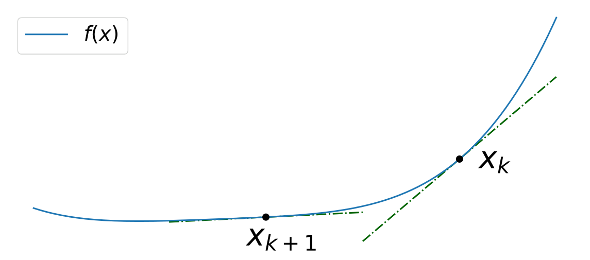
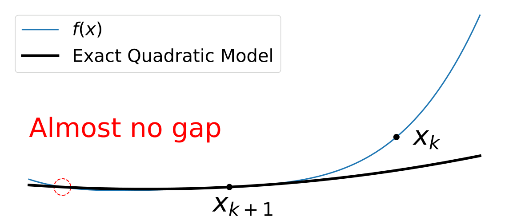
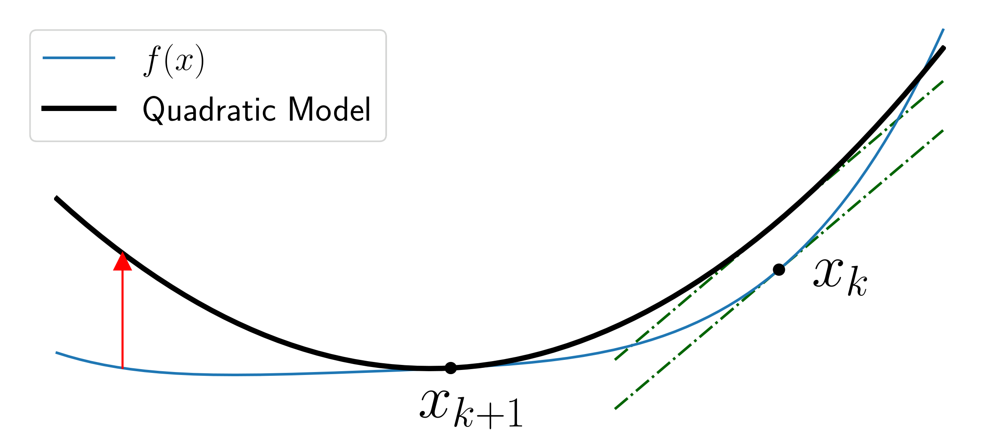
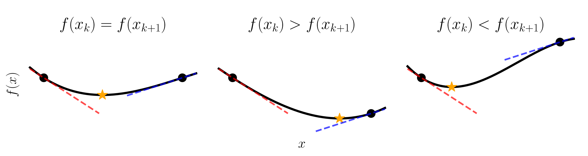
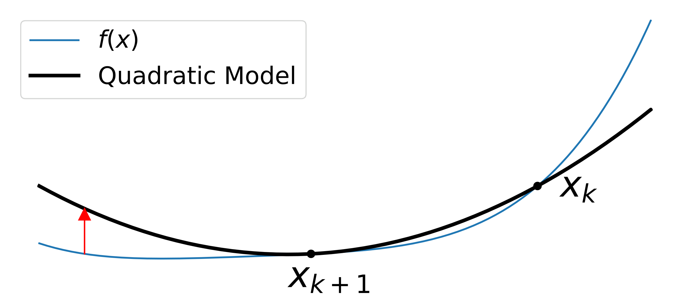
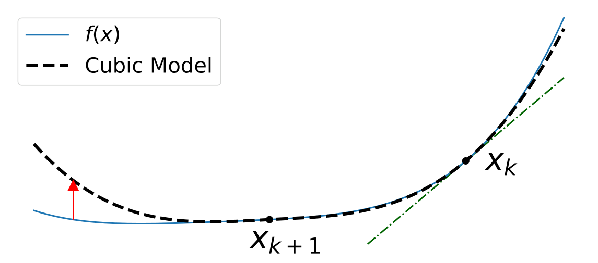
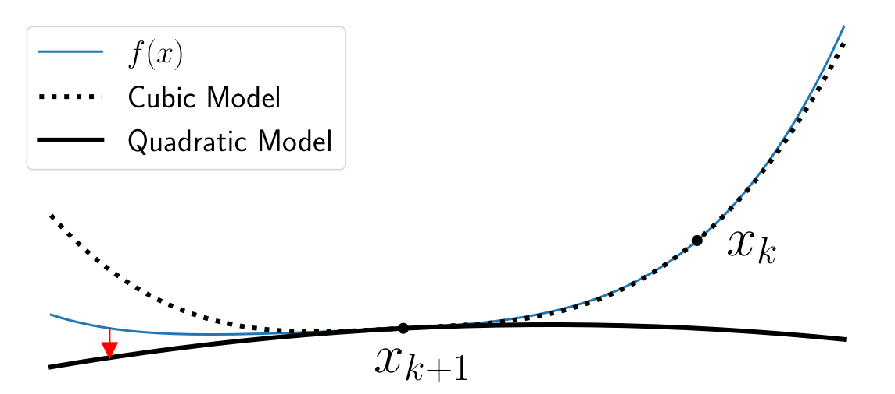

## 修正セカント条件

このセクションでは、準ニュートン法で使用される標準的なセカント条件の修正版である修正セカント条件について説明します。
修正セカント条件は勾配情報に加えて関数値情報を取り込み、より正確なヘッセ行列の近似を実現します。

### 標準的なセカント条件

まず、準ニュートン法で使用される標準的なセカント条件を復習します。
$x_k$ と $x_{k+1}$ を最適化アルゴリズムにより生成された連続する2つの反復とします。
次の反復を計算するには、近似ヘッセ行列 $B_k$ を $B_{k+1}$ に更新する必要があります。
ステップと勾配差を以下のように定義します。

```math
\begin{equation*}
s_k = x_{k+1} - x_k, \qquad
y_k = \nabla f(x_{k+1}) - \nabla f(x_k).
\end{equation*}
```

The standard approach is to update $B_k$ to satisfy the secant condition:

```math
\begin{equation*}
B_{k+1} s_k = y_k.
\end{equation*}
```

To justify this condition, consider a quadratic approximation model around $x_{k+1}$:

```math
\begin{equation*}
m_{k+1}(x) = f(x_{k+1}) + \nabla f(x_{k+1})^\top (x - x_{k+1}) + \frac{1}{2} (x - x_{k+1})^\top B_{k+1} (x - x_{k+1}).
\end{equation*}
```

By construction, this model satisfies

```math
\begin{equation*}
\begin{cases}
m_{k+1}(x_{k+1}) = f(x_{k+1}) \\
\nabla m_{k+1}(x_{k+1}) = \nabla f(x_{k+1})
\end{cases}
\end{equation*}
```

regardless of the choice of $B_{k+1}$.
Additionally, the secant condition ensures that the model satisfies

```math
\begin{align*}
\nabla m_{k+1}(x_k) & = \nabla f(x_{k+1}) - B_{k+1} (x_{k+1} - x_k)             &  & (\text{definition of model}) \\
& = \nabla f(x_{k+1}) - (\nabla f(x_{k+1}) - \nabla f(x_k)) &  & \text{(secant condition)}    \\
& = \nabla f(x_k)
\end{align*}
```

これは前の反復からの勾配情報と一致します。
したがって、セカント条件を使用することにより、二次モデル $m_{k+1}(x)$ が前の関数値 $f(x_k)$ を除いて、$x_{k+1}$ と $x_k$ の両方での勾配情報を正確に反映することが保証されます。

### 修正セカント条件

セカント条件は広く使用されていますが、勾配情報のみを照合するため、目的関数の曲率を正確に捕捉できない場合があります。
この制限を Fig. 10 で説明します。

Fig. 10 では、対応する関数値と勾配を持つ2つの点 $x_k$ と $x_{k+1}$ があります。
Fig. 10 では、正確なヘッセ行列から構築された理想的な二次モデルが新しい点 $x_{k+1}$ の周りでよくフィットし、より良い収束性能をもたらすことが見られます。
しかし、Fig. 10 では、標準的なセカント更新はこれらの点での勾配のみを照合し、$x_k$ での関数値を無視します。曲率を大きく誤推定する可能性があり、真の目的関数の近似が悪くなります。



(Fig. 10 修正セカント方程式の動機。関数値と勾配を組み合わせることにより、理想的なニュートン法モデル (b) に近似することを目指しており、標準的なセカント更新 (c) は $f(x_k)$ を省略して曲率を誤推定する可能性があります。)

関数値を利用することでこの制限を克服できます。
基本的な考え方は Fig. 11 に示されています。
2 点 $x_k$ と $x_{k+1}$ で勾配が同じであっても、関数値の自然な内挿は関数値 $f(x_k)$ と $f(x_{k+1})$ に応じて異なります。
この観察は、関数値情報を取り込んでヘッセ行列の近似を改善する修正セカント条件の動機となります。



(Fig. 11 $x_k$ と $x_{k+1}$ で同一の勾配を持つが異なる関数値による内挿。これは異なる内挿関数を生じさせ、ヘッセ行列の近似に関数値情報を組み込むことの重要性を強調しています。)

以下では、2つの既知の修正セカント条件を提示します。

#### 関数値ベースの修正セカント条件

最初の修正は、前の点での関数値を二次モデルに組み込みます~\citep{yuanModifiedBFGSAlgorithm1991,weiNewQuasiNewtonMethods2006, babaie-kafakiModifiedBFGSAlgorithm2011}。
異なる近似ヘッセ行列 $B^{\mathrm{F}}_{k+1}$ を持つ別のモデルを考えましょう:

```math
\begin{equation*}
m_{k+1}^{\mathrm{F}}(x) = f(x_{k+1}) + \nabla f(x_{k+1})^\top (x - x_{k+1}) + \frac{1}{2} (x - x_{k+1})^\top B^{\mathrm{F}}_{k+1} (x - x_{k+1}).
\end{equation*}
```

このモデルが以下を満たすことを要求します:

```math
\begin{equation*}
m^{\mathrm{F}}_{k+1}(x_k) = f(x_k),
\end{equation*}
```

これは前の点での関数値が正しくモデル化されることを保証します。
これが関数値ベースの修正セカント条件の背後にある主要な考え方です。

対応する修正セカント条件を $B^{\mathrm{F}}_{k+1}$ に対して導出しましょう。
$m^{\mathrm{F}}_{k+1}$ の定義を代入し、$s_k = x_{k+1} - x_k$ を使用することで、条件は以下になります

```math
\begin{align*}
f(x_k) & = f(x_{k+1}) + \nabla f(x_{k+1})^\top (x_k - x_{k+1}) + \frac{1}{2} (x_k - x_{k+1})^\top B^{\mathrm{F}}_{k+1} (x_k - x_{k+1}) \\
& = f(x_{k+1}) - \nabla f(x_{k+1})^\top s_k + \frac{1}{2} s_k^\top B^{\mathrm{F}}_{k+1} s_k.
\end{align*}
```

次に、更新された行列が以下の形を持つと仮定します

```math
\begin{equation*}
B^{\mathrm{F}}_{k+1} s_k = y_k - \sigma^\mathrm{F}_k s_k,
\end{equation*}
```

ここで、$\sigma^\mathrm{F}_k \in \mathbb{R}$ は決定する必要があるスカラーです。

Substituting this equation and using $s_k^\top B^{\mathrm{F}}_{k+1} s_k = s_k^\top y_k - \sigma^\mathrm{F}_k \lVert s_k \rVert^2$ gives

```math
\begin{equation*}
f(x_k) = f(x_{k+1}) - \nabla f(x_{k+1})^\top s_k + \frac{1}{2} s_k^\top y_k - \frac{\sigma^\mathrm{F}_k}{2} \lVert s_k \rVert^2.
\end{equation*}
```

$\sigma^\mathrm{F}_k$ について解き、$y_k = \nabla f(x_{k+1}) - \nabla f(x_k)$ を使用することで、以下を得ます

```math
\begin{align*}
\sigma^\mathrm{F}_k & = \frac{2(f(x_{k+1}) - f(x_k)) - (2\nabla f(x_{k+1}) - y_k)^\top s_k}{\lVert s_k \rVert^2}           \\
& = \frac{2(f(x_{k+1}) - f(x_k)) - (\nabla f(x_{k+1}) + \nabla f(x_k))^\top s_k}{\lVert s_k \rVert^2}.
\end{align*}
```

したがって、修正セカント条件は以下になります

```math
\begin{equation*}
B^{\mathrm{F}}_{k+1} s_k = y_k + \frac{2(f(x_k) - f(x_{k+1})) + (\nabla f(x_{k+1}) + \nabla f(x_k))^\top s_k}{\lVert s_k \rVert^2} s_k.
\end{equation*}
```

$s_k^\top y_k > 0$ の場合に BFGS 型更新の下で正定性を保つ可能性を保存するために、分子でゼロとの最大値を取ることでこの公式を修正できます。

```math
\begin{equation*}
B^{\mathrm{F}'}_{k+1} s_k = y_k + \frac{\max(0, 2(f(x_k) - f(x_{k+1})) + (\nabla f(x_{k+1}) + \nabla f(x_k))^\top s_k)}{\lVert s_k \rVert^2} s_k.
\end{equation*}
```

これが関数値ベースの修正セカント条件です。
標準的なセカント条件とは異なり、この定式化は二次モデルが前の点での関数値だけでなく、両方の点での勾配と一致することを保証します。
説明については Fig. 12 を参照してください。



(Fig. 12 関数値ベースの修正セカント方程式。修正セカント方程式 $B^\mathrm{F}_k s_k = y_k + \sigma^\mathrm{F}_k s_k$ は、前の点での関数値条件 $m^{\mathrm{F}}_k(x_{k-1}) = f(x_{k-1})$ を満たす二次モデルを構築します。これは勾配のみを照合し、関数値を照合しない標準的なセカント方程式とは異なります。)

#### 3次項付き修正セカント条件

2 番目の修正はモデルに 3 次項を導入し、前の点での関数値と勾配の両方の一致を同時に満たすことを可能にします~\citep{zhangNewQuasiNewtonEquation1999, zhangPropertiesNumericalPerformance2001,yabeLocalSuperlinearConvergence2007}。

$T_{k+1} \in \mathbb{R}^{n \times n \times n}$ を $x_{k+1}$ での $f$ の3階微分テンソルとし、以下を満たすものとします

```math
\begin{equation*}
s_k^\top (T_{k+1} s_k) s_k = \sum_{i,j,l=1}^n \partial_{x_i x_j x_l} f(x_{k+1}) s_k^{(i)} s_k^{(j)} s_k^{(l)},
\end{equation*}
```

ここで、$\partial_{x_i x_j x_l} f$ は $f$ の $x_i$、$x_j$、および $x_l$ に対する3階微分を表し、$s_k^{(i)}$ はベクトル $s_k$ の第 $i$ 成分です。
このテンソルは分析目的でのみ導入され、最終公式から除去されます。

このテンソル項を組み込むことにより、以下の3次拡張モデルを定義できます:

```math
\begin{align*}
m^\mathrm{C}_{k+1}(x) ={} & f(x_{k+1}) + \nabla f(x_{k+1})^\top (x - x_{k+1}) + \frac{1}{2} (x - x_{k+1})^\top B_{k+1}^{\mathrm{C}} (x - x_{k+1}) \\
& + \frac{1}{6}(x - x_{k+1})^\top (T_{k+1} (x - x_{k+1})) (x - x_{k+1}).
\end{align*}
```

このモデルを使用して、前の点 $x_k$ での関数値と勾配の両方の一致を強制できます。
具体的には、以下を要求します:

```math
\begin{equation*}
\begin{cases}
m^\mathrm{C}_{k+1}(x_k) = f(x_k) \\
\nabla m^\mathrm{C}_{k+1}(x_k) = \nabla f(x_k)
\end{cases}
\end{equation*}
```

$m^\mathrm{C}_{k+1}$ の定義を代入し、$s_k = x_{k+1} - x_k$ を使用することで、これらの条件を以下のように書き直せます

```math
\begin{align*}
f(x_k)        & = f(x_{k+1}) - s_k^\top \nabla f(x_{k+1}) + \frac{1}{2} s_k^\top B^\mathrm{C}_{k+1} s_k - \frac{1}{6} s_k^\top (T_{k+1} s_k) s_k, \\
\nabla f(x_k) & = \nabla f(x_{k+1}) - B^\mathrm{C}_{k+1} s_k + \frac{1}{2} (T_{k+1} s_k) s_k.
\end{align*}
```

第1の方程式の両辺に3を乗じて整理し、第2の方程式については $s_k$ との内積をとることで、以下が得られます

```math
\begin{align*}
3(f(x_k) - f(x_{k+1})) +3 s_k^\top \nabla f(x_{k+1}) & = \frac{3}{2} s_k^\top B^{\mathrm{C}}_{k+1} s_k - \frac{1}{2} s_k^\top (T_{k+1} s_k) s_k, \\
-s_k^\top y_k                                        & = -s_k^\top B^{\mathrm{C}}_{k+1} s_k + \frac{1}{2} s_k^\top (T_{k+1} s_k) s_k.
\end{align*}
```

合計し、$y_k = \nabla f(x_{k+1}) - \nabla f(x_k)$ を使用することで、テンソル項を除去し、以下のスカラー恒等式を得ます

```math
\begin{equation*}
3(f(x_k) - f(x_{k+1}))
+ \frac{3}{2} s_k^\top (\nabla f(x_{k+1}) + \nabla f(x_k)) + \frac{1}{2} s_k^\top y_k
= \frac{1}{2} s_k^\top B^{\mathrm{C}}_{k+1} s_k.
\end{equation*}
```

$B^{\mathrm{C}}_{k+1} s_k$ が $y_k$ と $s_k$ の線形結合であると仮定します。つまり、スカラー $\sigma^\mathrm{C}_k$ に対して $B^{\mathrm{C}}_{k+1} s_k = y_k + \sigma^\mathrm{C}_k s_k$ です。
そうすると、前の方程式は以下を与えます

```math
\begin{equation*}
\sigma^\mathrm{C}_k = \frac{6(f(x_k) - f(x_{k+1})) + 3 s_k^\top (\nabla f(x_k) + \nabla f(x_{k+1}))}{\lVert s_k \rVert^2}.
\end{equation*}
```

したがって、修正セカント条件は以下になります

```math
\begin{equation*}
B^{\mathrm{C}}_{k+1} s_k = y_k + \frac{6(f(x_k) - f(x_{k+1})) + 3 s_k^\top (\nabla f(x_k) + \nabla f(x_{k+1}))}{\lVert s_k \rVert^2} s_k.
\end{equation*}
```

これが3次拡張修正セカント条件です。関数値ベースの二次修正とは異なり、この定式化はテンソル項の導入を通じて前の点での関数値条件と勾配条件の両方を同時に満たすことを可能にします。
説明については Fig. 13 を参照してください。



(Fig. 13 3次拡張修正セカント方程式。Fig. 13 では、3次項 $\eta \lVert x - x_k \rVert^3$ をモデルに組み込むことにより、修正セカント方程式 $B^\mathrm{C}_k s_k = y_k + \sigma^\mathrm{C}_k s_k$ は前の点での両方の条件を同時に満たすことを可能にします。Fig. 13 では、3次モデルは関数値と勾配の条件の両方を満たしていますが、その基礎となる二次成分は不定値または負定値である可能性があります。)

### その他の曲率保存方法

曲率情報を保存するために、いくつかのトピックがあります。
Agg-BFGS~\citep{berahasLimitedmemoryBFGSDisplacement2022} は、最も古い情報を破棄して最新のものを追加するのではなく、データを集約することにより曲率情報を管理する別のアプローチです。

Multi-Secant~\citep{leeAdvancingMultiSecantQuasiNewton2025} は、複数のステップと勾配差ベクトルのペアを維持することにより、セカント条件フレームワークを拡張します。標準的な定式化では、以下を定義します

```math
\begin{equation*}
s_i = x_{i+1} - x_i, \quad y_i = \nabla f(x_{i+1}) - \nabla f(x_i). \quad (i = k-m, \ldots, k)
\end{equation*}
```

別の固定点型定式化は、すべてのベクトルを最新の反復で中心化します:

```math
\begin{equation*}
s_i = x_{k+1} - x_i, \quad y_i = \nabla f(x_{k+1}) - \nabla f(x_i). \quad (i = k-m, \ldots, k)
\end{equation*}
```

この固定点型アプローチは、改善されたヘッセ行列の近似のための履歴情報の利用に関する異なる観点を提供します。

