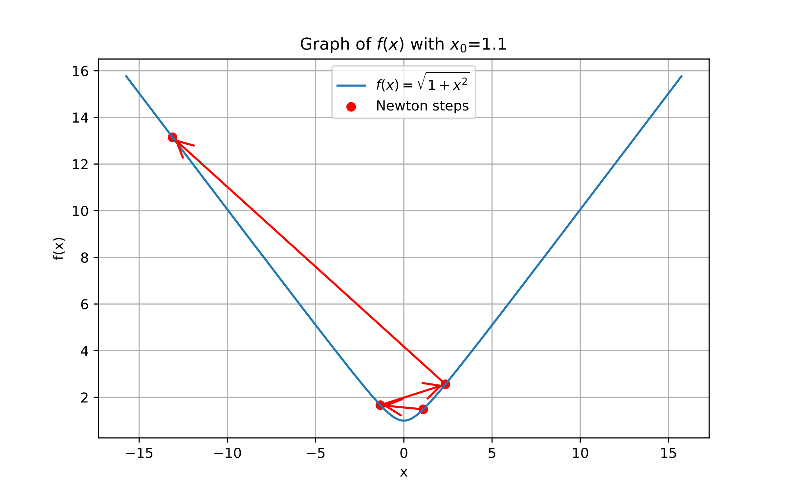
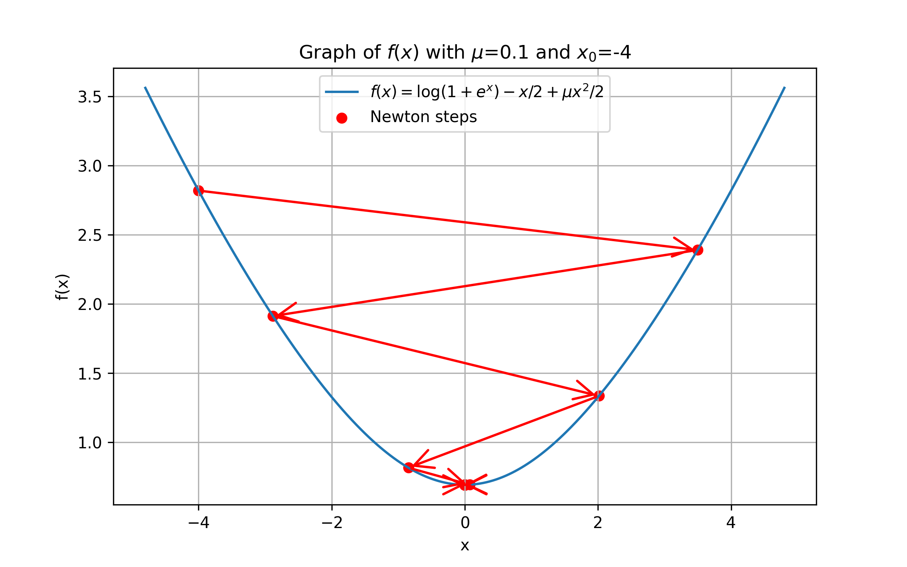
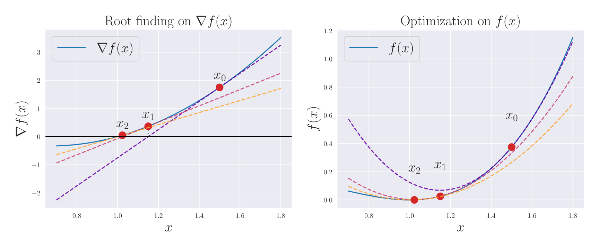
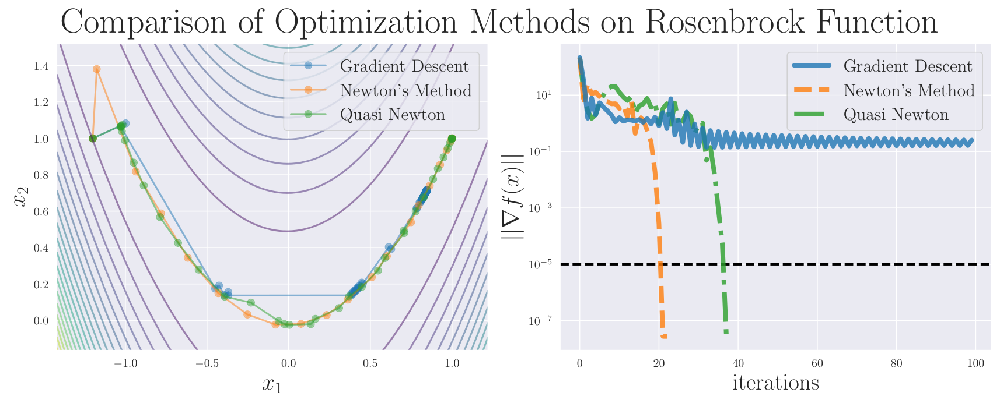
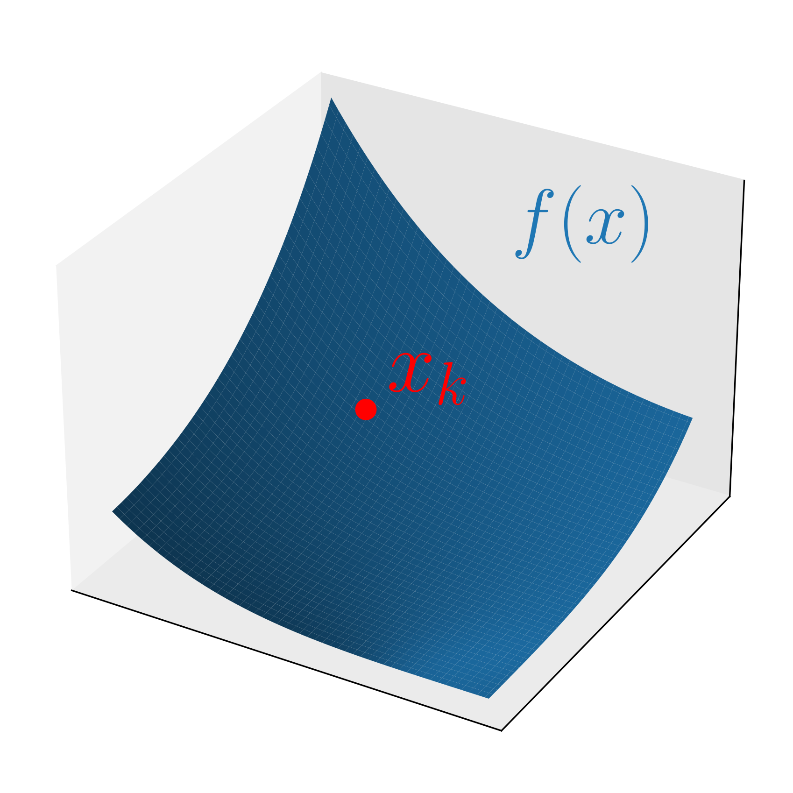
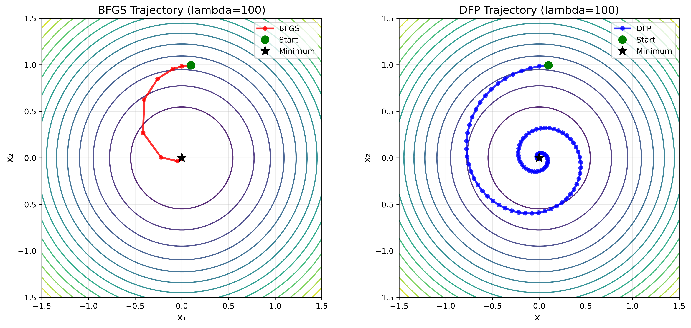
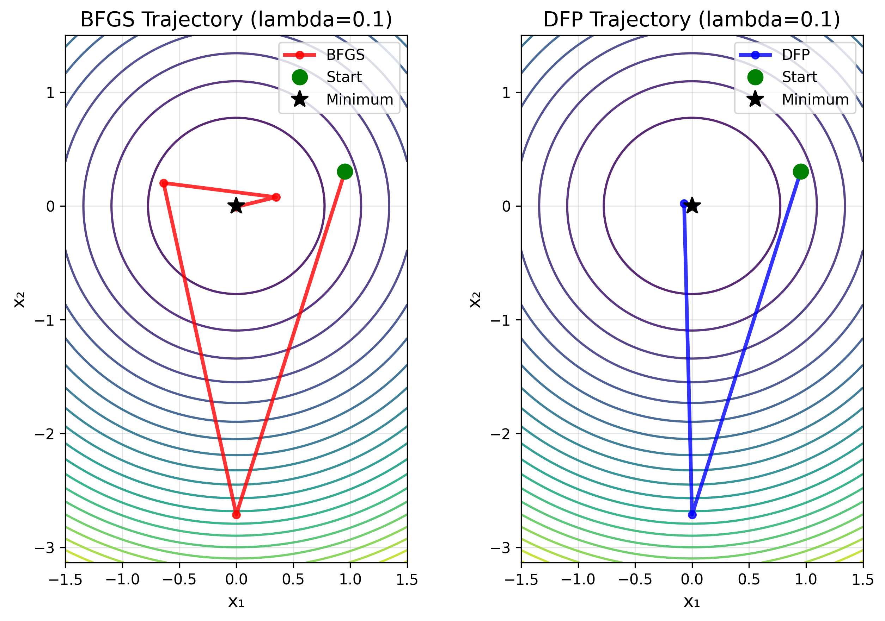

# Study of Quasi-Newton Methods

<!-- From 1_basic_en.tex -->

## Basic Concepts

One of the central goals of numerical optimization is to determine decision variables that optimize a given quantitative performance measure.
Examples include design performance, control stability, operational efficiency, and prediction error, each quantifying the quality of various phenomena or systems.
These performance measures are typically modeled by an objective function that maps decision variables to real numbers.

In this chapter, we define $f \colon \mathbb{R}^n \to \mathbb{R}$ as an objective function of class $C^2$, where $n$ denotes the dimension of the decision variables.
We consider the following unconstrained optimization problem:

$$
\begin{equation}
\underset{x \in \mathbb{R}^n}{\text{minimize}} \quad f(x).
\end{equation}
$$

In this section, we provide fundamental definitions and properties related to \cref{eq:unconstrained-optimization}.

### Convexity and Strong Convexity

The notions of convexity and strong convexity are fundamental in optimization theory.
Convexity and strong convexity of a function $f$ can be characterized by the following inequalities:

$$
\begin{align}
\text{(convex)} \quad
f(y) & \ge f(x)+\nabla f(x)^\top (y-x),                                    \\
\text{($\mu$-strongly convex)} \quad
f(y) & \ge f(x)+\nabla f(x)^\top (y-x)+\frac{\mu}{2}\norm{y-x}^2,
\end{align}
$$

for any $x,y \in \mathbb{R}^n$, where $\mu>0$ is a constant.
Strong convexity indicates that, in addition to convexity, the objective function has uniformly positive curvature.
Examples of convex and strongly convex functions are shown in Fig. 1.

(Fig. 1
Comparison of convex and strongly convex functions.
The dashed line shows the quadratic approximation at $x=0$.
The upper two functions are convex but not strongly convex, and no constant $\mu>0$ satisfies \cref{eq:strongly-convex-def}.
The lower two functions are strongly convex, and there exists $\mu>0$ that satisfies \cref{eq:strongly-convex-def}.
)

### Positive Definiteness of the Hessian

Next, we show how convexity and strong convexity relate to the definiteness of the Hessian matrix $\nabla^2 f(x)$.
Let $A$ be a symmetric matrix in $\mathbb{R}^{n \times n}$. A matrix $A$ is called positive or negative definite (or semi-definite) based on the following conditions:

$$
\begin{align*}
\text{(positive definite)} \quad      & v^\top A v > 0 \quad \forall v \in \mathbb{R}^n \setminus \{0\}, \\
\text{(positive semi-definite)} \quad & v^\top A v \ge 0 \quad \forall v \in \mathbb{R}^n,               \\
\text{(negative definite)} \quad      & v^\top A v < 0 \quad \forall v \in \mathbb{R}^n \setminus \{0\}, \\
\text{(negative semi-definite)} \quad & v^\top A v \le 0 \quad \forall v \in \mathbb{R}^n.
\end{align*}
$$

A matrix is indefinite if it is neither positive nor negative definite.
For matrices $A,B \in \mathbb{R}^{n \times n}$, the notation $A \succeq B$ indicates that $A-B$ is positive semi-definite.
For $\mu > 0$, the condition $A \succeq \mu I$ is equivalent to $v^\top A v \ge \mu \norm{v}^2$ for all $v \in \mathbb{R}^n$.
It directly implies that all eigenvalues of $A$ are at least $\mu$, which in turn implies that the operator norm $\norm{A}$ is at least $\mu$, i.e., $\norm{A} \geq \mu$.
In particular, if $B$ is a zero matrix, we simply write $A \succeq 0$.
We similarly define $\preceq$ for negative semi-definiteness.

We can relate convexity and strong convexity to the definiteness of the Hessian as follows.

**Proposition 1**

Let $f \colon \mathbb{R}^n \to \mathbb{R}$ be of class $C^2$. Then
\item $f$ is convex if and only if $\nabla^2 f(x)\succeq0$ holds for all $x \in \mathbb{R}^n$.
\item $f$ is $\mu$-strongly convex if and only if $\nabla^2 f(x)\succeq\mu I$ holds for all $x \in \mathbb{R}^n$.

Proof

First, let $\mu>0$ and assume $\nabla^2 f(x)\succeq \mu I$ for all $x \in \mathbb{R}^n$.
By the fundamental theorem of calculus, for any $x,y \in \mathbb{R}^n$, we have

$$
\begin{equation}
f(y)
= f(x)+\nabla f(x)^\top (y-x)
+\frac{1}{2} \int_0^1 (y-x)^\top \nabla^2 f(x+t(y-x))(y-x) \dd{t}.
\end{equation}
$$

Then, we obtain

$$
\begin{equation}
\int_0^1 (y-x)^\top \nabla^2 f(x+t(y-x))(y-x) \dd{t}
\ge \int_0^1 \mu\norm{y-x}^2 \dd{t}
= \mu\norm{y-x}^2.
\end{equation}
$$

Thus, substituting \cref{eq:hessian-strongly-convex} into \cref{eq:y_x_nabla_hess} yields \cref{eq:strongly-convex-def}, the definition of $\mu$-strong convexity.
Conversely, if $f$ is $\mu$-strongly convex, for any $x \in \mathbb{R}^n$, $v \in \mathbb{R}^n$ and $t > 0$, letting $y=x \pm tv$ gives

$$
\begin{equation}
\begin{dcases}
f(x + tv)\ge f(x) + t\nabla f(x)^\top v+\frac{\mu}{2}t^2\norm{v}^2, \\
f(x - tv)\ge f(x) - t\nabla f(x)^\top v+\frac{\mu}{2}t^2\norm{v}^2.
\end{dcases}
\end{equation}
$$

By Taylor's theorem, there exists $s_\pm \in (0,1)$ such that

$$
\begin{equation}
\begin{dcases}
f(x + tv) = f(x) + t\nabla f(x)^\top v + \frac{1}{2} t^2 v^\top \nabla^2 f(x + s_+ t v) v, \\
f(x - tv) = f(x) - t\nabla f(x)^\top v + \frac{1}{2} t^2 v^\top \nabla^2 f(x - s_- t v) v.
\end{dcases}
\end{equation}
$$

Substituting \cref{eq:strongly-convex-finite-diff} into \cref{eq:strongly-convex-taylor} and rearranging yields

$$
\begin{equation}
v^\top \frac{\nabla^2 f(x+ s_+ t v) + \nabla^2 f(x - s_- t v)}{2} v \ge \mu \norm{v}^2.
\end{equation}
$$

Letting $t \to 0$ in \cref{eq:strongly-convex-hessian-bound} and using the continuity of $\nabla^2 f$ from the $C^2$ assumption gives

$$
\begin{equation*}
v^\top \nabla^2 f(x) v \ge \mu \norm{v}^2.
\end{equation*}
$$

Because $v \in \mathbb{R}^n$ is arbitrary, we obtain $\nabla^2 f(x)\succeq \mu I$.
Setting $\mu=0$ in the above shows the convex case corresponding to \cref{eq:convex-def} in the same way.

Quadratic functions whose Hessians are positive definite, indefinite, and negative definite are illustrated in Fig. 2. One can visually confirm the correspondence between positive definiteness and convexity.

(Fig. 2 Quadratic model
$f(x)=\frac{1}{2}(x - x_k)^\top H (x - x_k) + \nabla f(x_k)^\top (x - x_k) + f(x_k)$ in 2-dimensional space with Hessians $H$ which is  (left) positive definite, (center) indefinite, (right) negative definite.)

### $L$-smoothness

Finally, we introduce $L$-smoothness of functions.
A function $f$ is $L$-smooth if

$$
\begin{equation}
\norm{\nabla f(x)-\nabla f(y)} \le L\norm{x-y}
\end{equation}
$$

holds for all $x,y$.

The next proposition shows that $L$-smoothness can be characterized by the upper bound of the Hessian.

**Proposition 2**

Let $f \colon \mathbb{R}^n \to \mathbb{R}$ be of class $C^2$. Then $f$ is $L$-smooth if and only if $\nabla^2 f(x)\preceq L I$ holds for all $x \in \mathbb{R}^n$.

Proof

Since $f$ is of class $C^2$, by the fundamental theorem of calculus, for any $x,y \in \mathbb{R}^n$, we have

$$
\begin{equation}
\nabla f(y) - \nabla f(x)
= \int_0^1 \nabla^2 f(x+t(y-x))(y-x) \dd{t}.
\end{equation}
$$

Assume $\nabla^2 f(x)\preceq L I$ for all $x \in \mathbb{R}^n$.
It implies that the operator norm of $\nabla^2 f(x)$ satisfies $\norm{\nabla^2 f(x)} \le L$, and thus

$$
\begin{align*}
\norm{\nabla f(y) - \nabla f(x)}
& = \norm{\int_0^1 \nabla^2 f(x+t(y-x))(y-x) \dd{t}}   &  & (\text{by \cref{eq:fundamental-theorem-calculus}}) \\
& \le \int_0^1 \norm{\nabla^2 f(x+t(y-x))(y-x)} \dd{t} &  & (\text{triangle inequality})                       \\
& \le \int_0^1 L\norm{y-x} \dd{t}                      &  & (\text{by assumption})                             \\
& = L\norm{y-x},
\end{align*}
$$

which shows \cref{eq:def_LSmooth}.
Conversely, if $f$ is $L$-smooth, then for any $x \in \mathbb{R}^n$ and $v \in \mathbb{R}^n$, we have

$$
\begin{equation}
\norm{\nabla f(x+tv)-\nabla f(x)} \le L\norm{tv} = Lt\norm{v}
\end{equation}
$$

By Taylor's theorem, we also have

$$
\begin{equation*}
\nabla f(x+tv)-\nabla f(x) = t \nabla^2 f(x) v + r(t),
\end{equation*}
$$

where $r(t)$ satisfies $\norm{r(t)}/t \to 0$ as $t \to 0$, and we can rewrite it as

$$
\begin{equation}
\nabla^2 f(x) v = \lim_{t \to 0} \frac{\nabla f(x+tv)-\nabla f(x) -r(t)}{t} = \lim_{t \to 0} \frac{\nabla f(x+tv)-\nabla f(x)}{t}.
\end{equation}
$$

Taking the inner product  with $v$ gives

$$
\begin{align*}
v^\top \nabla^2 f(x) v & = \lim_{t \to 0} \qty(\frac{\nabla f(x+tv)-\nabla f(x)}{t})^\top v                                                   \\
& \leq \lim_{t \to 0} \frac{\norm{\nabla f(x+tv)-\nabla f(x)}}{t} \norm{v} &  & (\text{Cauchy--Schwarz inequality})    \\
& \leq L\norm{v}^2.                                                        &  & (\text{by \cref{eq:smoothness-bound}})
\end{align*}
$$

Because $v \in \mathbb{R}^n$ is arbitrary, we obtain $\nabla^2 f(x)\preceq L I$.

#### Baillon--Haddad Theorem

One of the useful properties of $L$-smooth functions is given by the following Baillon--Haddad theorem.
Note that only $C^1$ differentiability is required here.

**Proposition 3** (Baillon--Haddad theorem)

Let $f \colon \mathbb{R}^n \to \mathbb{R}$ be of class $C^1$. If $f$ is $L$-smooth and convex, then for all $x,y \in \mathbb{R}^n$, $\nabla f$ is $1/L$-cocoercive, i.e.,
(\nabla f(x)-\nabla f(y))^\top (x-y) \ge \frac{1}{L} \norm{\nabla f(x)-\nabla f(y)}^2
for all $x,y \in \mathbb{R}^n$.

We refer to other literature for the proof \citep{bauschkeBaillonHaddadTheoremRevisited2009} \citep[Proposition 12.60]{rockafellarVariationalAnalysis1998}.
One consequence of this theorem is that, for the sequences $\{x_k\}$ generated by an optimization algorithm, defining

$$
\begin{equation*}
s_k \coloneqq x_{k+1}-x_k, \quad y_k \coloneqq \nabla f(x_{k+1}) - \nabla f(x_k)
\end{equation*}
$$

and applying Proposition 3 with $x=x_{k+1}$ and $y=x_k$ yields

$$
\begin{equation*}
s_k^\top y_k \ge \frac{1}{L} \norm{y_k}^2.
\end{equation*}
$$

This inequality is sometimes used in the analysis of update formulas in methods such as BFGS and L-BFGS, and we will also use it in a later chapter.

#### Bound on Hessian Eigenvalues

The $L$-smoothness combined with $\mu$-strong convexity also provides bounds on the eigenvalues of the Hessian.

**Proposition 4**

Let $f \colon \mathbb{R}^n \to \mathbb{R}$ be of class $C^2$.
If $f$ is $L$-smooth and $\mu$-strongly convex, then the eigenvalues of the Hessian $\nabla^2 f(x)$ are contained in the interval $[\mu, L]$ for all $x \in \mathbb{R}^n$.

Proof

By \cref{prop:convexity-hessian,prop:smoothness-hessian}, we have

$$
\begin{equation*}
\mu I \preceq \nabla^2 f(x) \preceq L I,
\end{equation*}
$$

which directly implies that the eigenvalues of $\nabla^2 f(x)$ are contained in the interval $[\mu, L]$.

As shown in Proposition 4,  the $L$-smoothness and $\mu$-strong convexity impose upper and lower bounds on the eigenvalues of the Hessian, respectively.

<!-- From 2_newton_en.tex -->

## Newton's Method

### Algorithm of Newton's Method

In this subsection, we outline Newton's method, which is a fundamental optimization algorithm for an unconstrained optimization problem.
Newton's method is a representative iterative algorithm that starts from an initial point $x_0$, successively updates the current point, and generates a sequence $\{x_k\}_{k=0}^\infty$.

We assume that $f$ is of class $C^2$ and strongly convex, so that the Hessian matrix $\nabla^2 f(x)$ is positive definite for all $x \in \mathbb{R}^n$, and thus invertible.
Using the gradient $g_k \coloneqq \nabla f(x_k)$ and Hessian $\nabla^2 f(x_k)$ at the $k$-th iterate $x_k$, the base procedure of Newton's method is to iteratively update

$$
\begin{equation*}
x_{k+1} \gets x_k - \alpha_k \nabla^2 f(x_k)^{-1} g_k
\end{equation*}
$$

with a step size $\alpha_k > 0$ determined by line search.
The derivation of this update rule is as follows.
The quadratic Taylor approximation of $f$ around $x_k$ is given by

$$
\begin{equation}
m^*_{k}(x) \coloneqq f(x_k) + g_k^\top (x - x_k) + \frac{1}{2} (x - x_k)^\top \nabla^2 f(x_k) (x - x_k).
\end{equation}
$$

The gradient of this model is

$$
\begin{equation}
\nabla m^*_k(x) = g_k + \nabla^2 f(x_k)(x - x_k).
\end{equation}
$$

Since the quadratic model \cref{eq:newton-model} is strongly convex by assumption, $x^* \in \mathbb{R}^n$ is the minimizer of $m^*_k$ if and only if $\nabla m^*_k(x) = 0$, so solving $\nabla^2 f(x_k)(x - x_k) = -g_k$ yields

$$
\begin{equation*}
\mathrm{arg\,min}_{x\in\mathbb{R}^n} m^*_{k}(x) = x_k -\nabla^2 f(x_k)^{-1} g_k.
\end{equation*}
$$

Although this choice appears natural, it does not in general guarantee global convergence, as we will see in \cref{sec:newton-fullstep}.
Thus, we introduce a step size $\alpha_k > 0$ determined by line search to ensure a sufficient decrease in the function value.
This is the basic procedure of Newton's method.

The update direction $d_k \coloneqq -\nabla^2 f(x_k)^{-1} g_k$ is known as the Newton direction, which is a descent direction when the Hessian is positive definite, since

$$
\begin{equation*}
g_k^\top d_k = -g_k^\top \nabla^2 f(x_k)^{-1} g_k < 0.
\end{equation*}
$$

If $f$ is nonconvex and the Hessian $\nabla^2 f(x_k)$ is negative definite or indefinite, function values are not guaranteed to decrease, and Newton's method may fail to converge.
Therefore, checking the positive definiteness of the Hessian is important when applying Newton's method.
The modified Newton method \citep[Sec. 3.4]{nocedal1999numerical} is one remedy for handling such cases.

### Properties Related to Convergence

We next present a standard convergence theorem for Newton's method.

#### Global Convergence

We first state a general global convergence result

$$
\begin{equation*}
\lim_{k \to \infty} \norm{g_k} = 0
\end{equation*}
$$

for methods with line search, and then explain its application to Newton's method.
We consider a general iterative method of the form

$$
\begin{equation*}
x_{k+1} \gets x_k + \alpha_k d_k,
\end{equation*}
$$

where $d_k$ is a descent direction satisfying $g_k^\top d_k < 0$ and $\alpha_k > 0$ is the step size determined by line search.
We employ the Wolfe conditions \citep[Sec. 3.1]{nocedal1999numerical} to determine the step size $\alpha_k$ as follows:

$$
\begin{align}
f(x_k + \alpha_k d_k) & \leq f(x_k) + c_1 \alpha_k g_k^\top d_k,  \\
g_{k+1}^\top d_k      & \geq c_2 g_k^\top d_k,
\end{align}
$$

where $0 < c_1 < c_2 < 1$ are constants.
We also define the angle between the direction $d_k$ and the negative gradient $-g_k$ as

$$
\begin{equation}
\cos \theta_k \coloneqq \frac{-g_k^\top d_k}{\norm{g_k}\norm{d_k}}.
\end{equation}
$$

The following theorem is a simplified version of the classical result.

**Theorem 1** ({\cite[Theorem 3.2)

Suppose that $f$ is of class $C^1$ and bounded below in $\mathbb{R}^n$, and $L$-smooth.
Consider the iterative method defined by
x_{k+1} \gets x_k + \alpha_k d_k,
starting from an initial point $x_0 \in \mathbb{R}^n$, and the step size $\alpha_k$ is determined by the Wolfe conditions \cref{eq:wolfe-1,eq:wolfe-2}.
For the angle $\theta_k$ defined in \cref{eq:angle-definition}, if there exists a positive constant $\delta$ such that
$\cos \theta_k \geq \delta > 0$ for all $k$,
then, the method generates a sequence $\{x_k\}$ satisfying
\lim_{k \to \infty} \norm{g_k} = 0.

Proof

From the Wolfe condition \eqref{eq:wolfe-2}, we have

$$
\begin{equation*}
(g_{k+1} - g_k)^\top d_k
= g_{k+1}^\top d_k - g_k^\top d_k
\geq (c_2 - 1) g_k^\top d_k,
\end{equation*}
$$

and

$$
\begin{align*}
(g_{k+1} - g_k)^\top d_k        & \leq
\norm{g_{k+1} - g_k} \norm{d_k} &                                        & \text{(Cauchy--Schwarz inequality)}                           \\
& \leq L \norm{x_{k+1} - x_k} \norm{d_k} &                                     & \text{($L$-smoothness)} \\
& = \alpha_k L \norm{d_k}^2.
\end{align*}
$$

By combining these two relations, we obtain

$$
\begin{equation}
\alpha_k \geq \frac{c_2 - 1}{L} \frac{g_k^\top d_k}{\norm{d_k}^2}.
\end{equation}
$$

and thus

$$
\begin{align*}
f(x_{k+1}) & \leq f(x_k) + c_1 \alpha_k g_k^\top d_k                                   &  & \text{(Wolfe condition \eqref{eq:wolfe-1})}           \\
& \leq f(x_k) - c_1 \frac{1 - c_2}{L} \frac{(g_k^\top d_k)^2}{\norm{d_k}^2} &  & \text{(by \eqref{eq:step-size-lower-bound-in-Wolfe})} \\
& = f(x_k) - c_1 \frac{1 - c_2}{L} \cos^2 \theta_k \norm{g_k}^2.            &  & \text{(definition in \eqref{eq:angle-definition})}
\end{align*}
$$

By summing this expression over all indices less than or equal to $k$, we obtain

$$
\begin{equation}
f(x_{k+1}) \leq f(x_0) - c_1 \frac{1 - c_2}{L} \sum_{j=0}^k \cos^2 \theta_j \norm{g_j}^2.
\end{equation}
$$

Since $f$ is bounded below, we have that $f(x_0) - f(x_{k+1})$ is less than some positive constant for all $k$.
Hence, by taking limits in \eqref{eq:telescoping-sum-Wolfe}, we obtain the Zoutendijk condition:

$$
\begin{equation}
\sum_{k=0}^\infty \cos^2 \theta_k \norm{g_k}^2 < \infty.
\end{equation}
$$

This condition implies that

$$
\begin{equation*}
\cos^2 \theta_k \norm{g_k}^2 \to 0.
\end{equation*}
$$

Combined with the assumption that $\cos \theta_k \geq \delta > 0$ for all $k$, it follows immediately that

$$
\begin{equation*}
\lim_{k \to \infty} \norm{g_k} = 0,
\end{equation*}
$$

which completes the proof.

Since Newton's method is a special case of the setting in Theorem 1 with $d_k = -\nabla^2 f(x_k)^{-1} g_k$, we can apply this result under appropriate conditions of $f$.
In particular, if $f$ is $L$-smooth and $\mu$-strongly convex, then for any $k$, we have

$$
\begin{equation*}
\cos \theta_k
= \frac{g_k^\top \nabla^2 f(x_k)^{-1} g_k}{\norm{g_k}\norm{\nabla^2 f(x_k)^{-1} g_k}}
\geq \frac{\norm{g_k}^2 \lambda_{\min}(\nabla^2 f(x_k)^{-1})}{\norm{g_k}^2 \lambda_{\max}(\nabla^2 f(x_k)^{-1})}
\geq \frac{\mu}{L},
\end{equation*}
$$

where $\lambda_{\min}(\cdot)$ and $\lambda_{\max}(\cdot)$ denote the minimum and maximum eigenvalues, respectively.
Thus, by setting $\delta = \mu / L$ in Theorem 1, we obtain the global convergence of Newton's method for strongly convex and smooth functions under line search satisfying the Wolfe conditions.

#### Local Quadratic Convergence

We next present a classical result on the local convergence rate of Newton's method.
We again provide a simplified version for brevity as follows.

**Theorem 2** ({\cite[Theorem 3.5)

Suppose that the Hessian matrix $\nabla^2 f(x)$ is Lipschitz continuous in a neighborhood of the solution $x^*$, and that sufficient second-order optimality conditions hold (i.e., $\nabla f(x^*)=0$ and $\nabla^2 f(x^*)$ is positive definite).
If $\alpha_k=1$ for all $k$ and the initial point $x_0$ is sufficiently close to $x^*$,
then the sequence of gradient norms $\{\norm{\nabla f(x_k)}\}$ converges quadratically.

Proof

From the definition of the Newton step and the optimality condition $\nabla f(x^*)=0$, we obtain

$$
\begin{align*}
x_{k+1} - x^*
& = x_k - x^* - \qty(\nabla^2 f(x_k))^{-1}\nabla f(x_k)                                          \\
& = \qty(\nabla^2 f(x_k))^{-1} \qty(\nabla^2 f(x_k)(x_k-x^*)-\qty(\nabla f(x_k)-\nabla f(x^*))).
\end{align*}
$$

By Taylor's theorem and the triangle inequality, we have

$$
\begin{align*}
& \norm{\nabla^2 f(x_k)(x_k-x^*)-\qty(\nabla f(x_k)-\nabla f(x^*))}                     \\
=   {}  & \norm{\nabla^2 f(x_k)(x_k-x^*)-\int_0^1 \nabla^2 f(x_k+t(x^*-x_k)) (x_k - x^*)\dd{t}} \\
\leq {} & \int_0^1 \norm{\nabla^2 f(x_k)-\nabla^2 f(x_k+t(x^*-x_k))}\norm{x_k-x^*}\dd t.
\end{align*}
$$

If $\nabla^2 f$ is Lipschitz continuous with constant $L^{\mathrm{H}}$, then the integrand is bounded by $L^{\mathrm{H}}t\norm{x_k-x^*}$, and integrating yields

$$
\begin{equation*}
\norm{\nabla^2 f(x_k)(x_k-x^*)-\qty(\nabla f(x_k)-\nabla f(x^*))}
\le \frac{1}{2}L^{\mathrm{H}}\norm{x_k-x^*}^2.
\end{equation*}
$$

Since $\nabla^2 f(x^*)$ is non-singular, there exists a radius $r>0$ such that for all $x_k$ satisfying $\norm{x_k-x^*}\le r$,
\[
\norm{\qty(\nabla^2 f(x_k))^{-1}}\le 2\norm{\qty(\nabla^2 f(x^*))^{-1}}
\]
holds.
Combining these results, we obtain

$$
\begin{equation*}
\norm{x_{k+1} - x^*}
\le L^{\mathrm{H}}\norm{\qty(\nabla^2 f(x^*))^{-1}} \norm{x_k-x^*}^2.
\end{equation*}
$$

Let $\widetilde L  \coloneqq  L^{\mathrm{H}}\norm{\qty(\nabla^2 f(x^*))^{-1}}$.
If the initial point is chosen such that $\norm{x_0-x^*}\le \min\{r,1/(2\widetilde L)\}$, then by induction $\{x_k\}$ remains within the neighborhood and converges to $x^*$.
The above error bound implies quadratic convergence of $\{x_k\}$.
To show quadratic convergence of the gradient norm, we use $x_{k+1}-x_k=-\qty(\nabla^2 f(x_k))^{-1}\nabla f(x_k)$ and
$\nabla f(x_k)+\nabla^2 f(x_k)\qty(x_{k+1}-x_k)=0$, yielding

$$
\begin{align*}
\norm{\nabla f(x_{k+1})}
& = \norm{\nabla f(x_{k+1})-\nabla f(x_k)-\nabla^2 f(x_k)\qty(x_{k+1}-x_k)}                  \\
& \le \int_0^1 \norm{\nabla^2 f(x_k+t (x_{k+1}-x_k))-\nabla^2 f(x_k)}\norm{x_{k+1}-x_k}\dd t \\
& \le \frac{1}{2}L^{\mathrm{H}}\norm{x_{k+1}-x_k}^2                                          \\
& \le \frac{1}{2}L^{\mathrm{H}}\norm{\qty(\nabla^2 f(x_k))^{-1}}^2\norm{\nabla f(x_k)}^2     \\
& \le 2 L^{\mathrm{H}} \norm{\qty(\nabla^2 f(x^*))^{-1}}^2\norm{\nabla f(x_k)}^2.
\end{align*}
$$

Therefore, $\norm{\nabla f(x_k)}$ converges quadratically to zero.

These propositions \cref{thm:line-search-global-convergence,thm:newton-quadratic} indicate that Newton's method equipped with line search has both global convergence and local quadratic convergence properties under appropriate conditions.
This rapid convergence is a significant advantage of Newton's method compared to first-order methods such as gradient descent, which typically exhibit only linear convergence.
However, computing the Hessian $\nabla^2 f(x_k) \in \mathbb{R}^{n \times n}$ and solving the linear system $\nabla^2 f(x_k) d_k = -\nabla f(x_k)$ require $\order{n^3}$ time, which is prohibitively expensive for large-scale problems.
Other optimization methods, such as quasi-Newton methods, are also used for such methods, as we will discuss later.

### Elements for Global Convergence

As mentioned earlier, the positive definiteness of the Hessian matrix and the selection of the step size via line search play important roles in Newton's method.
In this subsection, we explain why these elements are required.

#### Positive Definiteness of the Hessian Matrix

We have assumed that $f$ is strongly convex so far, meaning that the Hessian matrix $\nabla^2 f(x_k)$ is positive definite at each iteration.
This assumption is crucial for Newton's method to converge locally to an optimal solution.
When the Hessian matrix is positive definite, Newton's method provides a descent direction toward the optimal solution, since

$$
\begin{equation*}
\nabla f(x_k)^\top d_k
= -\nabla f(x_k)^\top \qty(\nabla^2 f(x_k))^{-1} \nabla f(x_k)
< 0.
\end{equation*}
$$

In contrast, when the Hessian matrix is negative definite or indefinite, a decrease in the function value is not guaranteed, and Newton's method may point in a direction that moves away from the optimal solution.
In the indefinite case, the function value may decrease, but the risk of converging to a saddle point is also increased.
Therefore, verifying the positive definiteness of the Hessian matrix is an important consideration when applying Newton's method.

#### Issues with Full Steps

In Newton's method, adopting a step size $\alpha_k=1$ at every iteration may lead to difficulties.
Here, we present examples illustrating this issue and discuss the necessity of line search as a remedy.

##### An Example Where Newton's Method Diverges

Consider the following function:

$$
\begin{align*}
f(x)   & = \sqrt{1 + x^2},            \\
f'(x)  & = \frac{x}{\sqrt{1 + x^2}},  \\
f''(x) & = \frac{1}{(1 + x^2)^{3/2}}.
\end{align*}
$$

When the absolute value of the initial point exceeds 1, Newton's method diverges, as shown in Fig. 3.

(Fig. 3 An example where Newton's method diverges with initial point $x_0=1.1$)

##### Oscillation of Newton's Method for Strongly Convex Functions

In the previous example, the objective function was not strongly convex and did not necessarily possess favorable properties.
However, even for functions with the strong convexity property, there exist examples where Newton's method fails to converge \citep[Example 1.4.3]{Doikov2021SecondOrderTensor}.

In this example, for $\mu>0$, consider the function

$$
\begin{align*}
f(x)     & = \log(1 + e^x) - \frac{x}{2} + \frac{\mu x^2}{2}, \\
f'(x)    & = \frac{e^x}{1+e^x} - \frac{1}{2} + \mu x,         \\
f''(x)   & = \frac{e^x}{(1+e^x)^2} + \mu,                     \\
f'''(x)  & = \frac{e^x(1 - e^x)}{(1+e^x)^3},                  \\
f''''(x) & = \frac{e^x(1 - 4e^x + e^{2x})}{(1+e^x)^4}.
\end{align*}
$$

This function has the following properties:
1. It is $\mu$-strongly convex.
2. $\max_x |f''(x)| = \frac{1}{4} + \mu$ (attained at $e^x=1$). Hence, $\nabla f$ is $L$-smooth with $L=\frac{1}{4}+\mu$.
3. $\max_x |f'''(x)| = \frac{1}{6\sqrt{3}}$ (attained at $e^x=2-\sqrt{3}$). Hence, $\nabla^2 f$ is $M$-Lipschitz with $M=\frac{1}{6\sqrt{3}}$.

Nevertheless, when the initial point $x_0$ is sufficiently large relative to $\mu$, Newton's method exhibits oscillatory behavior, as shown in Fig. 4.

(Fig. 4 (Left) Newton's method converges for $x_0=-4, \ \mu=0.1$; (Right) Newton's method oscillates for $x_0=-4, \ \mu=0.01$)

##### Necessity of Line Search

To avoid the issues described above, it is common practice to select the step size $\alpha_k$ appropriately using a line search.
Newton's method equipped with line search is often referred to as the modified Newton method and is known to possess global convergence properties.

### Comparison with Newton's Method as a Root-Finding Algorithm

As a conceptual supplement, we briefly clarify the relationship between ``Newton's method as a root-finding algorithm'' and ``Newton's method in optimization.''
These two formulations are closely related, but they have different perspectives and applications.

#### Newton's Method as a Root-Finding Algorithm

When referring simply to Newton's method (or the Newton--Raphson method), one often means a root-finding algorithm for a differentiable scalar function $g\colon \mathbb{R} \to \mathbb{R}$ that solves $g(x) = 0$.
Although this is not the main topic of this section, it is arguably more fundamental and widely known.

Starting from an initial value $x_0$, the iteration is given by

$$
\begin{equation*}
x_{k+1} = x_k - \frac{g(x_k)}{g'(x_k)}.
\end{equation*}
$$

Geometrically, this corresponds to approximating the graph of $g$ near $x_k$ by its tangent line and selecting the intersection of this tangent with the $x$-axis as the next approximate solution.

#### Newton's Method in Optimization

In the context of optimization, Newton's method typically refers to an algorithm for finding a local minimizer of a twice-differentiable function $f\colon \mathbb R^{n} \to\mathbb{R}$, or equivalently, a stationary point satisfying $\nabla f(x) = 0$ as a necessary condition.
This is the primary focus of the present section.

Recall the assumption that the Hessian matrix $\nabla^2 f(x)$ is positive definite at each iteration.
Newton's method in optimization applies the framework of the root-finding algorithm to the gradient $\nabla f(x)$:

$$
\begin{equation*}
x_{k+1} = x_k - \nabla^2 f(x_k)^{-1} \nabla f(x_k).
\end{equation*}
$$

In the scalar case, this reduces to $x_{k+1}=x_k - f'(x_k) / f''(x_k)$.

#### Relationship Between the Two Formulations

(Fig. 5 Root-finding for the gradient $\nabla f(x)=3 x^2 - 4 x + 1$ and optimization of the function $f(x)=x^3 - 2 x^2 + x$)

Let us examine the equivalence of the two formulations through a concrete example.
\Cref{fig:newton_raphson} illustrates the relationship between these formulations using a simple cubic function $f(x)$.
The left panel shows root-finding applied to $g(x) = \nabla f(x)$, while the right panel shows optimization applied to $f(x)$.

In the root-finding formulation, $\nabla f(x) = 3x^2 - 4x + 1$ is approximated by its tangent line, namely

$$
\begin{equation*}
\nabla m^*_k(x) = \nabla f(x_k) + \nabla^2 f(x_k)(x - x_k),
\end{equation*}
$$

and the root of this linear model is chosen as $x_{k+1}$.

In contrast, in the optimization formulation, $f(x) = x^3 - 2x^2 + x$ is approximated by its second-order Taylor expansion

$$
\begin{equation*}
m^*_k(x) = f(x_k) + \nabla f(x_k)(x - x_k) + \frac{1}{2}\nabla^2 f(x_k)(x - x_k)^2,
\end{equation*}
$$

and the minimizer of this quadratic model is taken as $x_{k+1}$.

Thus, under the assumption of positive definiteness, it is clear from the properties of local solutions that both formulations perform essentially equivalent operations, and their correspondence can be explicitly verified.

In what follows, we consider only the optimization formulation.

<!-- From 3_quasi_newton_en.tex -->

## Quasi-Newton Methods

(Fig. 6 Comparison of Newton's method, quasi-Newton methods, and gradient descent)

In this section, we discuss quasi-Newton methods. Quasi-Newton methods are based on Newton's method, but aim to reduce its primary drawback, namely, the high computational cost of evaluating the Hessian matrix. Specifically, instead of using the true Hessian matrix $\nabla^2 f(x_k)$, an approximation matrix $B_k$ is employed, thereby achieving fast convergence while keeping the computational cost low.

\Cref{fig:newton_vs_qs_vs_gd} shows a comparison of Newton's method, quasi-Newton methods, and gradient descent. Gradient descent is a method that simply updates in the direction opposite to the gradient. Although its per-iteration computational cost is the lowest, its convergence is slow. Newton's method converges in the fewest iterations, but has the highest computational cost per step. Quasi-Newton methods lie between these two extremes, striking a balance between them. In particular, when comparing methods in terms of computation time rather than the number of iterations, quasi-Newton methods often exhibit the best performance.

Line-search-based quasi-Newton methods generate a sequence $\{ x_k \}_{k=0}^{\infty}$ converging to the optimal solution $x^*$ as follows:

$$
\begin{equation*}
x_{k+1} = x_k - \alpha_k B_k^{-1} \nabla f(x_k)
= x_k - \alpha_k H_k \nabla f(x_k)
\end{equation*}
$$

Here, $\alpha_k > 0$ is the step size determined by line search, $B_k$ is an approximation of the Hessian matrix $\nabla^2 f(x_k)$ at the point $x_k$, and $H_k \coloneqq B_k^{-1}$ denotes its inverse.

(Fig. 7
Conceptual illustration of quasi-Newton methods.
(1) The objective function $f$ (blue surface) and the current point $x_k$ (red dot).
(2) The quadratic model induced by the current Hessian approximation (orange surface) and its minimizer $x_{k+1}$ (yellow cross).
(3) The updated quadratic model based on the new point $x_{k+1}$ (green surface).
)

The core of quasi-Newton methods lies in how to update $B_k$ (or its inverse $H_k$) at each iteration so that it approaches the Hessian matrix $\nabla^2 f(x_k)$. \Cref{fig:quasi_newton_overview} illustrates this concept. First, around the current point $x_k$, a quadratic approximation model of the objective function $f$ is constructed using $B_k$. Next, this quadratic model is minimized to obtain the next point $x_{k+1}$. After obtaining $x_{k+1}$, the approximation matrix $B_k$ is updated to $B_{k+1}$ using the gradient information at $x_k$ and $x_{k+1}$. This procedure is repeated until convergence, which constitutes the quasi-Newton method.

In what follows, we introduce the secant condition that the approximate Hessian matrix $B_k$ is required to satisfy, and present several representative update formulas for such $B_k$ and $H_k$.

### Secant Condition

In this section as well, let $f\colon \mathbb{R}^n \to \mathbb{R}$ be of class $C^2$.
Suppose that a symmetric matrix $B_k$ is given as an approximation of the Hessian matrix $\nabla^2 f(x_k)$.
We determine an approximation Hessian $B_{k+1}$ at the next point $x_{k+1}$.
Although there are infinitely many possible candidates for such a matrix, it is natural to impose symmetry on $B_{k+1}$ as well, given that the true Hessian matrix is symmetric.
Define the step and gradient difference as

$$
\begin{equation*}
s_k = x_{k+1} - x_k, \qquad   y_k = \nabla f(x_{k+1}) - \nabla f(x_k),
\end{equation*}
$$

where we assume that $y_k^\top s_k \neq 0$ and $s_k \neq 0$. Here, the $s$ in $s_k$ stands for step.
Using the Taylor expansion of $\nabla f(x_k)$, we have

$$
\begin{align*}
\nabla f(x_k) & = \nabla f(x_{k+1}) + \nabla^2 f(x_{k+1})(x_k - x_{k+1}) + \order{\norm{x_k - x_{k+1}}^2} \\
& \approx \nabla f(x_{k+1}) + \nabla^2 f(x_{k+1})(x_k - x_{k+1})                            \\
& \approx \nabla f(x_{k+1}) + B_{k+1}(x_k - x_{k+1})
\end{align*}
$$

Requiring the above approximation to hold as an equality yields

$$
\begin{equation*}
B_{k+1}(x_{k+1} - x_k) = \nabla f(x_{k+1}) - \nabla f(x_k),
\end{equation*}
$$

or equivalently,

$$
\begin{equation}
B_{k+1} s_k = y_k.
\end{equation}
$$

The relation in \cref{eq:secant-condition} is called the secant condition, or the quasi-Newton equation.

### Representative Quasi-Newton Update Rules

Given $B_k$, $s_k$, and $y_k$, there exist many update rules that produce $B_{k+1}$ satisfying the secant condition. We introduce several representative ones with their derivations \citep{dennisjr.QuasiNewtonMethodsMotivation1977a}.
In this subsection only, for brevity, we abbreviate $B_k$, $B_{k+1}$, $s_k$, and $y_k$ as $B$, $\bar{B}$, $s$, and $y$, respectively.

#### Broyden's Update

Broyden's update is one of the most fundamental quasi-Newton update formulas, but it is not popular in practice due to its lack of symmetry preservation.
The update formulas are given by

$$
\begin{align}
\bar{B}_{\mathrm{Broyden}} & = B + \frac{(y - Bs)s^\top}{s^\top s},            \\
\bar{H}_{\mathrm{Broyden}} & = H + \frac{s - Hy}{s^\top Hy} s^\top H.
\end{align}
$$

##### Derivation

We derive this formula from simple structural assumptions \citep[Section 4]{dennisjr.QuasiNewtonMethodsMotivation1977a}.

**Proposition 5**

Assume that $\bar{B}$ satisfies the secant condition
\bar{B}s = y,
and the action constraint
\bar{B}z = Bz
\quad\text{for all } z\in\mathbb{R}^n \text{ such that } z^\top s = 0.
Then $\bar{B}$ is uniquely determined and it is $\bar{B}_{\mathrm{Broyden}}$ defined by \cref{eq:broyden-update}.

Proof

A basis for $\mathbb{R}^n$ can be constructed from $s$ and a basis for the orthogonal complement of $s$. Since \cref{eq:secant-broyden,eq:action-constraint} completely determine the action of $\bar{B}$ with respect to this basis, $\bar{B}$ is uniquely determined.
We now show that $\bar{B}_{\mathrm{Broyden}}$ defined by \cref{eq:broyden-update} satisfies \cref{eq:secant-broyden,eq:action-constraint}. Let $z$ be any vector satisfying $z^\top s = 0$. Then

$$
\begin{align*}
\bar{B}_{\mathrm{Broyden}} s
& = \qty(B + \frac{(y - Bs)s^\top}{s^\top s}) s
= Bs + (y - Bs)
= y,                                             \\
\bar{B}_{\mathrm{Broyden}} z
& = \qty(B + \frac{(y - Bs)s^\top}{s^\top s}) z
= Bz + (z^\top s) \frac{y - Bs}{s^\top s}
= Bz.
\end{align*}
$$

Hence $\bar{B}_{\mathrm{Broyden}}$ indeed satisfies \cref{eq:secant-broyden,eq:action-constraint}. Therefore, by uniqueness, we have $\bar{B} = \bar{B}_{\mathrm{Broyden}}$.

Broyden's update can also be characterized as a minimal-change update in the Frobenius norm.

**Proposition 6** (\citep{dennisjr.QuasiNewtonMethodsMotivation1977a}, Theorem~4.1)

Let $B\in\mathbb{R}^{n\times n}$, $y\in\mathbb{R}^n$, and $s\in\mathbb{R}^n\setminus\{0\}$ be given.
Then the matrix $\bar{B}$ defined by \cref{eq:broyden-update} is the unique solution of
{\tilde{B} \in \mathbb{R}^{n \times n}}
{\norm{\tilde{B} - B}_F}
{}
{}
\addConstraint{\tilde{B} s}{= y.}

Proof

The function $\tilde{B}\mapsto\norm{\tilde{B}-B}_F$ is strictly convex on $\mathbb{R}^{n\times n}$.
The constraint set

$$
\begin{equation}
\{\tilde{B}\in\mathbb{R}^{n\times n}:\tilde{B}s=y\}
\end{equation}
$$

is affine and hence convex.
Therefore, the optimization problem admits at most one minimizer.
To show that $\bar{B}=\bar{B}_{\mathrm{Broyden}}$ defined by \cref{eq:broyden-update} is indeed the minimizer, we compute:

$$
\begin{equation*}
\norm{\bar{B}_{\mathrm{Broyden}} - B}_F^2
= \norm{\frac{(y-Bs)s^\top}{s^\top s}}_F^2
= \norm{(\tilde{B}-B) \frac{s s^\top}{s^\top s}}_F^2
\leq \norm{\tilde{B}-B}_F^2,
\end{equation*}
$$

where we used the sub-multiplicativity of Frobenius norm and the fact that $\norm{ss^\top/(s^\top s)}_F=1$ in the last inequality.
Thus, $\tilde{B}=\bar{B}_{\mathrm{Broyden}}$.

Broyden's update is characterized by two properties: it satisfies the secant condition and preserves the action on vectors orthogonal to $s$. Additionally, it is the unique minimal-change update in the Frobenius norm subject to the secant constraint.

#### SR1 Update

The Symmetric Rank-One (SR1) update \citep{nocedal1999numerical} is a fundamental quasi-Newton method that maintains symmetry throughout the update process. The update formulas are given by

$$
\begin{align}
\bar{B}_{\mathrm{SR1}} & = B + \frac{(y - B s)(y - B s)^\top}{(y - B s)^\top s},  \\
\bar{H}_{\mathrm{SR1}} & = H + \frac{(s - H y)(s - H y)^\top}{(s - H y)^\top y}.
\end{align}
$$

##### Derivation

To derive \cref{eq:sr1-b-update}, we construct the updated matrix $\bar{B}$ as a rank-one update. That is, we assume that for some vector $z \in \mathbb{R}^n$,

$$
\begin{equation}
\bar{B}_{\mathrm{SR1}} = B + z z^\top.
\end{equation}
$$

For this update to satisfy the secant condition $\bar{B}_{\mathrm{SR1}} s = y$, assuming $z^\top s \neq 0$, we require

$$
\begin{equation}
B s + z z^\top s = y,
\end{equation}
$$

which yields

$$
\begin{equation}
z = \frac{y - B s}{z^\top s}.
\end{equation}
$$

To determine $z^\top s$, we take the inner product of both sides of \cref{eq:sr1-z-formula} with $s$:

$$
\begin{equation}
z^\top s = \frac{(y - B s)^\top s}{z^\top s}.
\end{equation}
$$

Rearranging \cref{eq:sr1-self-consistency} yields the key relation

$$
\begin{equation}
(z^\top s)^2 = (y - B s)^\top s.
\end{equation}
$$

Substituting \cref{eq:sr1-zs-squared} into \cref{eq:sr1-z-formula} and using \cref{eq:sr1-symmetric-form}, we obtain

$$
\begin{align}
\bar{B}_{\mathrm{SR1}}
& = B + z z^\top                                          \\
& = B + \frac{(y - B s)(y - B s)^\top}{(z^\top s)^2}      \\
& = B + \frac{(y - B s)(y - B s)^\top}{(y - B s)^\top s},
\end{align}
$$

which is the SR1 update formula stated in \cref{eq:sr1-b-update}.

##### Remarks

The SR1 update requires $(y - Bs)^\top s \neq 0$ to be well-defined. When $(y - Bs)^\top s = 0$, the denominator in \cref{eq:sr1-b-update} vanishes, and the update is typically skipped in practice. This situation can occur when the secant condition cannot be satisfied by a symmetric rank-one update, indicating that more sophisticated update strategies are needed.

#### Powell Symmetric Broyden (PSB) Update

The Powell Symmetric Broyden (PSB) update \cite{haeltermanAnalyticalStudyLeast2009} is one of the most important quasi-Newton update rules. The update formulas are given by

$$
\begin{align}
\bar{B}_{\mathrm{PSB}} & = B + \frac{(y - B s) s^\top + s (y - B s)^\top}{s^\top s} - \frac{s^\top (y - B s)}{(s^\top s)^2} s s^\top,  \\
\bar{H}_{\mathrm{PSB}} & = H + \frac{(s - H y) y^\top + y (s - H y)^\top}{y^\top y} - \frac{y^\top (s - H y)}{(y^\top y)^2} y y^\top.
\end{align}
$$

##### Derivation

To understand the motivation behind this formula, we note that in the SR1 update, the rank-one update was formulated symmetrically as $\bar{B}_{\mathrm{SR1}} = B + z z^\top$.
We may relax the requirement of maintaining symmetry throughout the update process. Instead, we can consider an asymmetric rank-one update of the form $z c^\top$, where the final result is symmetrized afterward.

For a given vector $c \in \mathbb{R}^n$ with $c^\top s \neq 0$, we define

$$
\begin{equation}
z = \frac{y - B s}{c^\top s}
\end{equation}
$$

and perform the asymmetric update

$$
\begin{equation}
C_1 \coloneqq B + \frac{(y - B s)c^\top}{c^\top s}.
\end{equation}
$$

Since $C_1$ is generally not symmetric, we symmetrize it via

$$
\begin{equation}
C_2 = \frac{C_1 + C_1^\top}{2}.
\end{equation}
$$

However, the symmetrized matrix $C_2$ may not satisfy the secant condition $C_2 s = y$. Therefore, we iterate this process:

$$
\begin{equation}
\begin{dcases}
C_0 = B                                                                               \\
C_{2t+1} = C_{2t} + \frac{(y - C_{2t}s)c^\top}{c^\top s} & \text{(asymmetric update)} \\
C_{2t+2} = \frac{C_{2t+1} + C_{2t+1}^\top}{2}            & \text{(symmetrization)}
\end{dcases}
\end{equation}
$$

The key result is that the sequence $\{ C_{2t} \}_{t=0}^{\infty}$ converges to a symmetric matrix satisfying the secant condition, as formalized in the following proposition.

**Proposition 7** (\citep{dennisjr.QuasiNewtonMethodsMotivation1977a}, Lemma~7.2)

The sequence $\{ C_{2t} \}_{t=0}^{\infty}$ defined by \cref{eq:psb-iteration} converges, and the limit is given by
\lim_{t \to \infty} C_{2t}
= B + \frac{(y - Bs)c^\top + c(y - Bs)^\top}{c^\top s} - \frac{(y - Bs)^\top s}{(c^\top s)^2} c c^\top.

Proof

We first analyze the even subsequence.
Define

$$
\begin{equation*}
G_k \coloneqq C_{2k}
\end{equation*}
$$

for $k=0,1,2,\dots$.
By construction, each $G_k$ is symmetric.
From \cref{eq:psb-iteration} and the definition, we have

$$
\begin{equation*}
G_{k+1} = G_k +\frac{1}{2c^\top s}\qty((y-G_k s)c^\top+c(y-G_k s)^\top).
\end{equation*}
$$

Let us introduce the error vector

$$
\begin{equation}
w_k \coloneqq y-G_k s
\end{equation}
$$

and then we have

$$
\begin{equation}
G_{k+1} = G_k+\frac{1}{2c^\top s}(w_k c^\top+cw_k^\top).
\end{equation}
$$

Substituting \cref{eq:Gupdate} into \cref{eq:wk-definition} yields

$$
\begin{align}
w_{k+1} & = y-\qty(G_k+\frac{1}{2c^\top s}(w_k c^\top+cw_k^\top))s \\
& =
w_k-\frac12w_k-\frac{w_k^\top s}{2c^\top s}c                       \\
& =
\frac{1}{2}\qty(w_k-\frac{w_k^\top s}{c^\top s}c).
\end{align}
$$

Hence

$$
\begin{equation}
w_{k+1}=Pw_k,
\qquad
P \coloneqq \frac{1}{2}\left(I-\frac{cs^\top}{c^\top s}\right).
\end{equation}
$$

The matrix $cs^\top/c^\top s$ has rank one and eigenvalues $1,0,\dots,0$.
Therefore, $P$ has one eigenvalue $0$ and all remaining eigenvalues equal to $1/2$.
In particular, its spectral radius is $1/2<1$.
Thus, the Neumann series converges and

$$
\begin{align}
\sum_{k=0}^{\infty}w_k & =        \sum_{k=0}^{\infty}P^k(y-Bs)                  &  & (\text{from } w_0=y-Bs)                               \\
& =  (I-P)^{-1}(y-Bs)                                                                                               \\
& = 2\qty(I-\frac{1}{2}\frac{cs^\top}{c^\top s}) (y-Bs). &  & (\text{from the definition of } P)
\end{align}
$$

Note that the last equation follows from

$$
\begin{equation*}
2(I-P) \qty(I-\frac{1}{2}\frac{cs^\top}{c^\top s}) = \qty(I + \frac{cs^\top}{c^\top s}) \qty(I-\frac{1}{2}\frac{cs^\top}{c^\top s}) = I.
\end{equation*}
$$

In particular, $\norm{w_k}\to0$ as $k\to\infty$.
Hence, from \cref{eq:Gupdate}, we have

$$
\begin{align}
\lim_{k\to\infty}G_k
& =
B+\frac{1}{2c^\top s}
\sum_{k=0}^{\infty}(w_k c^\top+c w_k^\top)                                                                                     \\
& = B+ \qty(\sum_{k=0}^{\infty}w_k) \frac{c^\top}{2c^\top s} + \frac{c}{2c^\top s} \qty(\sum_{k=0}^{\infty}w_k)^\top          \\
& = B + \frac{(y - Bs)c^\top + c(y - Bs)^\top}{c^\top s} - \frac{(y - Bs)^\top s}{(c^\top s)^2} c c^\top.
\end{align}
$$

Thus $G_k\to\bar B$.
Finally,

$$
\begin{equation}
C_{2k+1}
=
G_k+\frac{w_k c^\top}{c^\top s}.
\end{equation}
$$

Since $G_k\to\bar B$ and $\norm{w_k}\to0$, we obtain

$$
\begin{equation}
C_{2k+1}-G_k\to0.
\end{equation}
$$

Therefore both subsequences $\{C_{2k}\}$ and $\{C_{2k+1}\}$ converge to $\bar B$,
and hence

$$
\begin{equation}
C_k\to\bar B.
\end{equation}
$$

This completes the proof.

\noindent When $c = s$, the general formula in Proposition 7 simplifies to the standard PSB update formula:

$$
\begin{equation}
\bar{B}_{\mathrm{PSB}} = B + \frac{(y - Bs)s^\top + s(y - Bs)^\top}{s^\top s} - \frac{(y - Bs)^\top s}{(s^\top s)^2} ss^\top,
\end{equation}
$$

which matches \cref{eq:psb-b-update}.

##### Remarks

The choice of $c = s$ is motivated by ensuring positive definiteness of the resulting update. The PSB update can be viewed as the limit of an iterative symmetrization process applied to asymmetric rank-one updates.

#### DFP Update

The Davidon--Fletcher--Powell (DFP) update \cite{nocedal1999numerical} is a classical quasi-Newton update formula. The update formulas are given by

$$
\begin{align}
\bar{B}_{\mathrm{DFP}} & = (I - \frac{y s^\top}{y^\top s}) B (I - \frac{s y^\top}{y^\top s}) + \frac{y y^\top}{y^\top s},  \\
\bar{H}_{\mathrm{DFP}} & = H - \frac{H y y^\top H}{y^\top H y} + \frac{s s^\top}{y^\top s}.
\end{align}
$$

##### Derivation

In the PSB update rule discussed earlier, we substituted $c=s$, but we can consider taking a different $c$. Specifically, we consider choosing $c$ such that $B_{k+1}$ becomes positive definite. Substituting $c=y$ yields the alternative form:

$$
\begin{equation}
\bar{B}_{\mathrm{DFP}} = B + \frac{(y - Bs)y^\top + y(y - Bs)^\top}{y^\top s} - \frac{(y - Bs)^\top s}{(y^\top s)^2} yy^\top.
\end{equation}
$$

#### BFGS Update

The Broyden--Fletcher--Goldfarb--Shanno (BFGS) update is one of the most widely used quasi-Newton methods. The update formulas are given by

$$
\begin{align}
\bar{B}_{\mathrm{BFGS}} & = B - \frac{B s s^\top B}{s^\top B s} + \frac{y y^\top}{y^\top s},                                        \\
\bar{H}_{\mathrm{BFGS}} & = \qty(I - \frac{s y^\top}{y^\top s}) H \qty(I - \frac{y s^\top}{y^\top s}) + \frac{s s^\top}{y^\top s}.
\end{align}
$$

##### Derivation

This update can be derived by considering the dual of the DFP update. Specifically, we seek an update that minimizes the change in the inverse Hessian approximation $H$ while satisfying the secant condition. Further details are provided in the following subsection.

### BFGS Method

In this subsection, we focus on the BFGS update and provide a detailed derivation of its formula.
BFGS update is known as one of the most successful quasi-Newton update rules in practice.
Recall that the BFGS update formula is given by

$$
\begin{equation}
B_{k+1}   = B_k - \frac{B_k s_k s_k^\top B_k}{s_k^\top B_k s_k} + \frac{y_k y_k^\top}{y_k^\top s_k}.
\end{equation}
$$

#### Formula for \texorpdfstring{$H_k${Hk}}

The inverse of the BFGS update $H_k \coloneqq B_k^{-1}$ is given by

$$
\begin{equation}
H_{k+1} = \qty(I - \frac{s_k y_k^\top}{y_k^\top s_k}) H_k \qty(I - \frac{y_k s_k^\top}{y_k^\top s_k}) + \frac{s_k s_k^\top}{y_k^\top s_k}.
\end{equation}
$$

We now prove that \cref{eq:Hk_rank} indeed gives the inverse of the BFGS update.

**Proposition 8**

\Cref{eq:Hk_rank} gives the exact inverse of the BFGS update, i.e., $H_{k+1} = B_{k+1}^{-1}$.

Proof

The BFGS update can be rewritten in a compact rank-two form

$$
\begin{equation}
B_{k+1} = B_k + UCV^\top
\end{equation}
$$

where

$$
\begin{equation*}
U = \mqty[B_k s_k & y_k],\qquad
C = \mqty(-\frac{1}{s_k^\top B_k s_k} & 0 \\ 0 & \frac{1}{y_k^\top s_k}),\qquad
V = \mqty[B_k s_k & y_k]
\end{equation*}
$$

since

$$
\begin{equation}
U C V^\top   = \mqty[ -\frac{B_k s_k}{s_k^\top B_k s_k}&    \frac{y_k}{y_k^\top s_k} ] \mqty[ s_k^\top B_k  \\  y_k^\top ]
= -\frac{B_k s_k s_k^\top B_k}{s_k^\top B_k s_k} + \frac{y_k y_k^\top}{y_k^\top s_k}.
\end{equation}
$$

By the Sherman--Morrison--Woodbury identity, we have

$$
\begin{align*}
H_{k+1} & = (B_k + U C V^\top)^{-1}                                                                                                                                                                                                                    \\
& = B_k^{-1}- B_k^{-1}U\qty(C^{-1}+V^\top B_k^{-1}U)^{-1}V^\top B_k^{-1}                                                                                                                                                                       \\
& = H_k- \mqty[s_k                                                                                                                             & H_k y_k]\qty(\mqty(- s_k^\top B_k s_k                                         & 0             \\0    & y_k^\top s_k)+\mqty(s_k^\top B_k s_k   & s_k^\top y_k      \\y_k^\top s_k & y_k^\top H_k y_k))^{-1}\mqty[s_k^\top   \\ y_k^\top H_k] \\
& = H_k- \mqty[s_k                                                                                                                             & H_k y_k]\mqty(0                                                               & y_k^\top s_k  \\y_k^\top s_k       & y_k^\top H_k y_k + y_k^\top s_k)^{-1}\mqty[s_k^\top                         \\     y_k^\top H_k]                 \\
& = H_k- \mqty[s_k                                                                                                                             & H_k y_k]\qty(-\frac{1}{(y_k^\top s_k)^2}\mqty(y_k^\top H_k y_k + y_k^\top s_k & -y_k^\top s_k \\-y_k^\top s_k                 & 0    )) \mqty[ s_k^\top                                                      \\     y_k^\top H_k]  \\
& = H_k+\frac{1}{(y_k^\top s_k)^2}\mqty[s_k                                                                                                    & H_k y_k] \mqty(y_k^\top H_k y_k + y_k^\top s_k                                & -y_k^\top s_k \\-y_k^\top s_k                 & 0) \mqty[s_k^\top                                                             \\    y_k^\top H_k]\\
& = H_k+\frac{1}{(y_k^\top s_k)^2} \qty((y_k^\top H_k y_k + y_k^\top s_k) s_k s_k^\top - (y_k^\top s_k)(s_k y_k^\top H_k + H_k y_k s_k^\top) )                                                                                                 \\
& = \qty(I - \frac{s_k y_k^\top}{y_k^\top s_k}) H_k \qty(I - \frac{y_k s_k^\top}{y_k^\top s_k}) + \frac{s_k s_k^\top}{y_k^\top s_k}.
\end{align*}
$$

which completes the proof.

#### Positive Definiteness of \texorpdfstring{$B_{k+1$}{Bk+1}}

An important property of the BFGS update is that if the current approximation $B_k$ is positive definite and the curvature condition $y_k^\top s_k > 0$ holds, then the updated approximation $B_{k+1}$ is also guaranteed to be positive definite.

**Proposition 9**

If $B_k$ is positive definite and $y_k^\top s_k > 0$, then $B_{k+1}$ defined by \cref{eq:Bk_rank} is also positive definite.

Proof

By assumption, $B_k$ and its inverse $H_k$ are positive definite.
For any nonzero vector $v \in \mathbb{R}^n$, we have

$$
\begin{align*}
v^\top H_{k+1} v
& = v^\top \qty(I - \frac{s_k y_k^\top}{y_k^\top s_k}) H_k \qty(I - \frac{y_k s_k^\top}{y_k^\top s_k}) v + v^\top \frac{s_k s_k^\top}{y_k^\top s_k} v \\
& \geq 0 + \frac{(s_k^\top v)^2}{y_k^\top s_k} > 0,
\end{align*}
$$

where the first term is nonnegative since $H_k$ is positive definite, and the second term is positive due to the curvature condition $y_k^\top s_k > 0$.
Thus, $H_{k+1}$ is positive definite, and consequently, $B_{k+1} = H_{k+1}^{-1}$ is also positive definite.

#### KL

We next present a variational characterization of the BFGS update via the Kullback--Leibler (KL) divergence.
For zero-mean multivariate Gaussians $\mathcal{N}(0,A^{-1})$ and $\mathcal{N}(0,B^{-1})$, the expression

$$
\begin{equation*}
\psi(A) = \operatorname{tr}(A) - \log \det(A)
\end{equation*}
$$

coincides with the KL divergence up to the additive constant $-n$, so minimizing $\psi$ is equivalent to minimizing the KL distance.
Then, the BFGS update is given by the solution to the optimization problem
\begin{mini*}
{B \in \mathrm{PD}(n)}
{\psi(B_k^{-1/2} B B_k^{-1/2})}
{}{}
\addConstraint{Bs_k}{= y_k}
\end{mini*}
The constraint $B s_k = y_k$ in the optimization problem is precisely the secant condition discussed earlier, ensuring that the updated matrix interpolates the latest curvature pair.

See literature for proof of these formulations \citep{kanamoriBregmanExtensionQuasiNewton2010,kanamoriBregmanExtensionQuasiNewton2010a}

#### Trace and Determinant Formulas for the BFGS Update

We also present trace and determinant formulas for the BFGS update, which are useful in analyzing the eigenvalue behavior of the updated matrix.
For Hermitian matrices, these quantities correspond to the sum and product of eigenvalues, respectively. Hence, if both the trace and the determinant are appropriately bounded, one may expect the eigenvalues themselves to remain bounded (provided all eigenvalues are positive, for instance).
This is closely related to assumptions on the Hessian eigenvalues of the objective function, such as $\mu$-strong convexity and $L$-smoothness.

##### Trace Formula

The trace of the BFGS-updated matrix has an explicit formula.

**Proposition 10** ({\citep[(6.44))

Let $B_{+} = B - \frac{Bss^\top B}{s^\top Bs} + \frac{yy^\top}{y^\top s}$ be the BFGS update. Then
\tr(B_{+}) = \tr(B) - \frac{\norm{B s}^2}{s^\top Bs} + \frac{\norm{y}^2}{y^\top s}.

Proof

Applying the trace to the BFGS update formula, we have

$$
\begin{equation}
\tr(B_{+}) = \tr(B) - \tr\qty(\frac{Bss^\top B}{s^\top Bs}) + \tr\qty(\frac{yy^\top}{y^\top s}).
\end{equation}
$$

For the second term in \cref{eq:trace-bfgs-step1}, note that

$$
\begin{equation}
\tr\qty(\frac{Bss^\top B}{s^\top Bs}) = \frac{1}{s^\top Bs}\tr((Bs)(Bs)^\top) = \frac{\norm{B s}^2}{s^\top Bs}.
\end{equation}
$$

For the third term in \cref{eq:trace-bfgs-step1}, we have

$$
\begin{equation}
\tr\qty(\frac{yy^\top}{y^\top s}) = \frac{1}{y^\top s}\tr(yy^\top) = \frac{\norm{y}^2}{y^\top s}.
\end{equation}
$$

Substituting \cref{eq:trace-middle-term,eq:trace-last-term} into \cref{eq:trace-bfgs-step1} yields Proposition 10.

##### Determinant Formula

The determinant of the BFGS-updated matrix also admits a closed-form expression.

**Proposition 11** ({\citep[(6.45))

Let $B_{+} = B - \frac{Bss^\top B}{s^\top Bs} + \frac{yy^\top}{y^\top s}$ be the BFGS update and assume that $B$ is nonsingular. Then
\det(B_{+}) = \det(B) \frac{y^\top s}{s^\top Bs}.

Proof

Recall the rank-two formulation of the BFGS update defined in \cref{eq:bfgs-ucv}.
By the matrix determinant lemma, the matrices $U, C, V$ in \cref{eq:bfgs-ucv} satisfy

$$
\begin{equation}
\det(B_{k+1}) =\det(B_k + U C V^\top)=\det(B_k)\det(C) \det \qty(C^{-1} + V^\top B_k^{-1} U),
\end{equation}
$$

where $I_2$ is the $2\times 2$ identity matrix.
Since $U=V=\mqty[B_k s_k & y_k]$, we have

$$
\begin{equation*}
V^\top B_k^{-1} U = \mqty[ s_k^\top B_k s_k & s_k^\top y_k \\ y_k^\top s_k     & y_k^\top B_k^{-1} y_k ]
\end{equation*}
$$

and thus

$$
\begin{equation}
C^{-1} + V^\top B_k^{-1} U
=
\mqty[-s_k^\top B_k s_k & 0 \\ 0 & y_k^\top s_k] +
\mqty[ s_k^\top B_k s_k & s_k^\top y_k \\ y_k^\top s_k     & y_k^\top B_k^{-1} y_k ]
=
\mqty[0 & s_k^\top y_k \\ y_k^\top s_k & y_k^\top B_k^{-1} y_k ].
\end{equation}
$$

Thus, combining \cref{eq:bfgs-determinant-lemma,eq:bfgs-det-inner}, we have

$$
\begin{equation*}
\det(B_{k+1})
= \det(B_k) \qty(-\frac{1}{s_k^\top B_k s_k} \cdot \frac{1}{y_k^\top s_k}) \qty(- (s_k^\top y_k)(y_k^\top s_k))
= \det(B_k) \frac{y_k^\top s_k}{s_k^\top B_k s_k},
\end{equation*}
$$

which completes the proof.

### BFGS vs DFP

Although BFGS and DFP are quite symmetric in structure, they exhibit remarkably different practical efficiency when applied to real optimization problems. Powell's analysis \citep{powellHowBadAre1986} investigates this asymmetry by studying the behavior of both methods on a simple two-dimensional quadratic function. While asymptotic convergence theory often suggests that both methods should perform similarly, Powell reveals that their practical efficiency can differ dramatically, especially when the approximate Hessian is far from the true Hessian.

#### Problem Setup

Following Powell's framework, we consider the quadratic function

$$
\begin{equation}
f(x, y) = \frac{1}{2}(x^2 + y^2),
\end{equation}
$$

with both BFGS and DFP methods using a fixed step size of $\alpha_k = 1$ at every iteration. This choice of unit step size is practical for quadratic functions, where it often satisfies standard line search criteria.

The initial Hessian approximation $B_0$ is chosen to have eigenvalues 1 and $\lambda_1$, where $\lambda_1$ represents the degree of error in the initial approximation.
The initial point $x_0$ is selected as

$$
\begin{equation}
\theta = \arctan(\sqrt{\lambda_1}), \quad x_0 = \mqty[\cos(\theta) \\ \sin(\theta)],
\end{equation}
$$

which aligns with Powell's original analysis.
See \citep{powellHowBadAre1986} for details on this choice.

The iteration continues until the norm of the current point falls below a tolerance relative to its initial norm. For each value of $\lambda_1$, we record the number of iterations required for convergence.

#### Experimental Results

The numerical results are presented in Table 1, which partially reproduces the content of Powell's original tables. The convergence behavior depends critically on the initial eigenvalue $\lambda_1$:

\centering
\hline
$\lambda_1$ & BFGS & DFP  \\
\hline
0.001       & 4    & 3    \\
0.01        & 5    & 3    \\
0.1         & 6    & 4    \\
1           & 1    & 1    \\
10          & 8    & 16   \\
100         & 10   & 107  \\
1000        & 12   & 1006 \\
10000       & 15   & 9987 \\
\hline
\caption{Convergence comparison between BFGS and DFP methods for different initial eigenvalues $\lambda_1$}

(Table 1 Convergence comparison between BFGS and DFP methods for different initial eigenvalues $\lambda_1$)

\Cref{fig:bfgs_dfp_100} and Fig. 9 illustrate the iterative trajectories for specific values of $\lambda_1$. These figures visualize how the two methods navigate toward the minimum (at the origin) from the same initial point, clearly showing the difference in convergence speed and path.

(Fig. 8 Iterative trajectories for BFGS and DFP methods when $\lambda_1 = 100$. BFGS converges in 10 iterations while DFP requires 107 iterations, showing BFGS's superior efficiency for large eigenvalue errors.)

(Fig. 9 Iterative trajectories for BFGS and DFP methods when $\lambda_1 = 0.1$. Both methods converge quickly, with DFP slightly faster than BFGS, demonstrating the symmetric behavior when eigenvalues are underestimated.)

#### Analysis and Discussion

The numerical results reveal a striking asymmetry between BFGS and DFP.
When $\lambda_1 > 1$ (i.e., the initial Hessian approximation overestimates the true Hessian curvature), BFGS demonstrates significantly better efficiency.
Conversely, when $\lambda_1 < 1$ (i.e., the initial Hessian approximation underestimates the true curvature), DFP performs slightly better than BFGS, though the difference is modest.
This trend reversal is predicted by the theoretical symmetry between the two methods, but the magnitude of the difference is notable.

##### Asymmetry in Hessian Correction

The asymmetry of the performance arises from a fundamental difference in how these two methods correct erroneous eigenvalues.
The core insight is that correcting erroneously large eigenvalues is more critical than correcting erroneously small ones.

When a Hessian eigenvalue is overestimated, the algorithm takes steps that are too conservative, resulting in slow progress toward the minimum. Correcting such errors requires the update formula to reduce these large eigenvalues toward one.
The BFGS update is highly effective at this task.

In contrast, when a Hessian eigenvalue is underestimated, the algorithm takes steps that are slightly too aggressive, but the error is self-correcting.
Subsequent gradient computations provide information that helps refine the approximation.
Thus, correcting underestimated eigenvalues is inherently easier and requires fewer iterations.

The DFP update struggles with large eigenvalues.
In the worst case, it can reduce a large eigenvalue by only a small amount per iteration, potentially requiring as many iterations as the magnitude of the eigenvalue itself.
This explains why DFP's performance degrades catastrophically as $\lambda_1$ increases beyond one.

##### Practical Implications

These findings provide strong empirical justification for the widespread practical preference for BFGS over DFP.
The analysis of Powell's simple quadratic problem yields deep insights about quasi-Newton methods' behavior far from the solution, where most computational effort is expended.
The superior efficiency of BFGS in correcting erroneous Hessian approximations makes it the algorithm of choice for robust and efficient unconstrained optimization.

### Limited Memory BFGS (L-BFGS)

Limited-memory quasi-Newton methods extend classical quasi-Newton methods to large-scale optimization problems.
In standard quasi-Newton methods, the approximate Hessian or inverse Hessian matrix is stored and updated as a dense matrix, requiring $\order{n^2}$ memory for $n$ variables.

The L-BFGS method \citep{liuLimitedMemoryBFGS1989a}, which is based on the BFGS update, avoids storing the full matrix explicitly.
Instead, it maintains only the most recent $m$ vector pairs $\{(s_i,y_i)\}$.
This reduces the storage requirement to $\order{nm}$, which is a dramatic improvement when $m$ is a small constant (typically $m\le 10$).

Throughout this subsection, we work with a finite sequence of matrices

$$
\begin{equation*}
H_0, H_1, \dots, H_m,
\end{equation*}
$$

where $H_\ell$ denotes the inverse Hessian approximation obtained after $\ell$ BFGS updates applied to a given initial matrix $H_0$.
Note that this is not the same as the iterates in an optimization algorithm. Here, we focus solely on the structure of the BFGS updates.

#### Compact Representation of \texorpdfstring{$H_m${Hm}}

Let $\{(s_i,y_i)\}_{i=0}^{m-1}$ be the stored correction pairs, and define

$$
\begin{equation}
\rho_i = \frac{1}{y_i^\top s_i}, \qquad
V_i = I - \rho_i y_i s_i^\top.
\end{equation}
$$

From \cref{eq:Hk_rank}, the BFGS update for the inverse Hessian can be expressed as

$$
\begin{equation}
H_{i+1} = V_i^\top H_i V_i + \rho_i s_i s_i^\top,
\end{equation}
$$

for $i = 0,\dots,m-1$.
By recursively expanding this relation, we obtain the compact representation

$$
\begin{equation}
H_m
=
V_{m-1}^\top \cdots V_0^\top H_0 V_0 \cdots V_{m-1}
+
\sum_{j=0}^{m-1}
(V_{m-1}^\top \cdots V_{j+1}^\top)
\rho_j s_j s_j^\top
(V_{j+1} \cdots V_{m-1}),
\end{equation}
$$

where $H_0$ denotes the chosen initial inverse Hessian approximation, typically a scaled identity matrix.

#### Two-Loop Recursion

The compact representation above can be applied to any vector $q$ without explicitly forming $H_m$.
Let $r = H_m q$.
Exploiting the associative structure of the matrix products, this operation can be carried out using two short loops of length $m$, leading to the well-known L-BFGS two-loop recursion~\citep[Algorithm 7.4]{nocedal1999numerical}. The pseudocode is provided in \cref{alg:two-loop-recursion}.
This algorithm requires $\order{md}$ arithmetic operations and $\order{md}$ storage, where $d$ denotes the problem dimension.

\DontPrintSemicolon
\begin{algorithm}[t]
\caption{L-BFGS Two-Loop Recursion for $r = H_m q$ \citep[Algorithm 7.4]{nocedal1999numerical}}

\KwIn{$q$, stored pairs $\{(s_i, y_i)\}_{i=0}^{m-1}$, initial matrix $H_0$}
\KwOut{$r = H_m q$}
\For{$i = m-1, m-2, \dots, 0$}{
$\rho_i \gets 1/(y_i^\top s_i)$\;
$\alpha_i \gets \rho_i s_i^\top q$\;
$q \gets q - \alpha_i y_i$\;
}
$r \gets H_0 q$\;
\For{$i = 0, \dots, m-1$}{
$\beta_i \gets \rho_i y_i^\top r$\;
$r \gets r + s_i (\alpha_i - \beta_i)$\;
}
\Return $r$\;
\end{algorithm}

Now, we verify that the output of \cref{alg:two-loop-recursion} indeed computes $r = H_m q$.

**Proposition 12**

The output of the two-loop recursion \cref{alg:two-loop-recursion} satisfies $r = H_m q$.

Proof

In the backward recursion, for $i = m-1, m-2, \dots, 0$, from the input vector $q^{(m)} \coloneqq q$, the algorithm computes

$$
\begin{equation}
\alpha_i   = \rho_i s_i^\top q^{(i+1)}, \qquad
q^{(i)} \coloneqq q^{(i+1)} - \alpha_i y_i.
\end{equation}
$$

% Using the definition of $V_i$ and $\alpha_i$, we have
Substituting the definition of $\alpha_i$ and using \cref{eq:rho-V-def}, we find

$$
\begin{equation*}
q^{(i)} = q^{(i+1)} - \rho_i \qty(s_i^\top q^{(i+1)}) y_i = \qty(I - \rho_i y_i s_i^\top) q^{(i+1)} = V_i q^{(i+1)}.
\end{equation*}
$$

Thus, for all $i = 0, 1, \dots, m-1$, we have

$$
\begin{equation*}
q^{(i)} = V_i V_{i+1} \cdots V_{m-1} q.
\end{equation*}
$$

Then, the algorithm applies the initial inverse Hessian approximation:

$$
\begin{equation*}
r^{(0)} = H_0 q^{(0)} = H_0 V_0 V_1 \cdots V_{m-1} q.
\end{equation*}
$$

Next, for $i = 0, 1, \dots, m-1$, the forward recursion computes

$$
\begin{equation*}
\beta_i     = \rho_i y_i^\top r^{(i)}, \qquad
r^{(i+1)}   = r^{(i)} + s_i \qty(\alpha_i - \beta_i).
\end{equation*}
$$

Substituting the definitions of $\alpha_i$, $\beta_i$, and $q^{(i+1)}$, we have

$$
\begin{align*}
r^{(i+1)}
& =
r^{(i)} + \rho_i s_i s_i^\top \qty(V_{i+1} V_{i+2} \cdots V_{m-1}) q - \rho_i s_i y_i^\top r^{(i)}     \\
& = \qty(I- \rho_i y_i s_i^\top) r^{(i)} + \rho_i s_i s_i^\top \qty(V_{i+1} V_{i+2} \cdots V_{m-1}) q \\
& =
V_i^\top r^{(i)}
+
\rho_i s_i s_i^\top
\qty(V_{i+1} V_{i+2} \cdots V_{m-1}) q.
\end{align*}
$$

By recursively expanding this relation from the initial value $r^{(0)} = H_0 q^{(0)}$, we obtain

$$
\begin{equation}
r^{(m)}
=
V_{m-1}^\top \cdots V_0^\top H_0 V_0 \cdots V_{m-1} q
+
\sum_{j=0}^{m-1}
(V_{m-1}^\top \cdots V_{j+1}^\top)
\rho_j s_j s_j^\top
(V_{j+1} \cdots V_{m-1}) q,
\end{equation}
$$

which matches the compact representation of $H_m$ in \cref{eq:Hm-compact} applied to $q$, completing the proof.

Thus, the two-loop recursion exactly evaluates the action of $H_m$ on a vector while avoiding explicit matrix construction, achieving both mathematical rigor and computational efficiency.

#### Initial Step Size

A crucial component of the L-BFGS method is the choice of the initial matrix $H_0$.
A widely used and well-justified option is a scaled identity,

$$
\begin{equation}
H_0 = \gamma I,
\end{equation}
$$

where the scaling parameter is chosen as

$$
\begin{equation}
\gamma = \frac{s_{m-1}^\top y_{m-1}}{y_{m-1}^\top y_{m-1}}.
\end{equation}
$$

This choice is motivated by the relationship between the approximate inverse Hessian and the local curvature of the objective function \citep{liuLimitedMemoryBFGS1989a,shannoMatrixConditioningNonlinear1978}.
To justify this scaling, assume that the objective function $f$ is twice continuously differentiable and consider the mean Hessian along the most recent step:

$$
\begin{equation}
\bar{G}
=
\int_0^1 \nabla^2 f(x + \tau s_{m-1}) \dd \tau ,
\end{equation}
$$

where $s_{m-1}$ denotes the most recent displacement.
By the mean value theorem,

$$
\begin{equation*}
y_{m-1}
=
\nabla f(x+s_{m-1}) - \nabla f(x)
=
\bar{G} s_{m-1}.
\end{equation*}
$$

Using this relation, the scaling factor can be written as

$$
\begin{equation}
\frac{s_{m-1}^\top y_{m-1}}{y_{m-1}^\top y_{m-1}}
=
\frac{(\bar{G}^{1/2} s_{m-1})^\top (\bar{G}^{1/2} s_{m-1})}
{(\bar{G}^{1/2} s_{m-1})^\top \bar{G} (\bar{G}^{1/2} s_{m-1})},
\end{equation}
$$

which is a Rayleigh quotient.
If $\bar{G}^{1/2} s_{m-1}$ happens to be an eigenvector of $\bar{G}$, then the reciprocal of this quantity equals the corresponding eigenvalue.

Moreover, the choice \eqref{eq:gamma_k_initial} coincides with the short step size of the Barzilai--Borwein method \citep{barzilaiTwoPointStepSize1988}, highlighting a close connection between L-BFGS initialization and classical step-length selection strategies.
This observation further supports the effectiveness of the scaled-identity initialization in practice.

<!-- From 4_modified_secant_en.tex -->

## Modified Secant Condition

This section explains the modified secant condition, a modification of the standard secant condition used in quasi-Newton methods.
The modified secant condition incorporates function value information in addition to gradient information, leading to more accurate Hessian approximations.

### Standard Secant Condition

First, we review the standard secant condition used in quasi-Newton methods.
Let $x_k$ and $x_{k+1}$ be two consecutive iterates generated by an optimization algorithm.
To compute the next iterate, we need to update the approximate Hessian matrix $B_k$ to $B_{k+1}$.
Define the step and the gradient difference as

$$
\begin{equation*}
s_k = x_{k+1} - x_k, \qquad
y_k = \nabla f(x_{k+1}) - \nabla f(x_k).
\end{equation*}
$$

The standard approach is to update $B_k$ to satisfy the secant condition:

$$
\begin{equation}
B_{k+1} s_k = y_k.
\end{equation}
$$

To justify this condition, consider a quadratic approximation model around $x_{k+1}$:

$$
\begin{equation}
m_{k+1}(x) = f(x_{k+1}) + \nabla f(x_{k+1})^\top (x - x_{k+1}) + \frac{1}{2} (x - x_{k+1})^\top B_{k+1} (x - x_{k+1}).
\end{equation}
$$

By construction, this model satisfies

$$
\begin{equation}
\begin{cases}
m_{k+1}(x_{k+1}) = f(x_{k+1}) \\
\nabla m_{k+1}(x_{k+1}) = \nabla f(x_{k+1})
\end{cases}
\end{equation}
$$

regardless of the choice of $B_{k+1}$.
Additionally, the secant condition \cref{eq:secant_condition} ensures that the model satisfies

$$
\begin{align}
\nabla m_{k+1}(x_k) & = \nabla f(x_{k+1}) - B_{k+1} (x_{k+1} - x_k)             &  & (\text{by \cref{eq:def_m_kp1}})                          \\
& = \nabla f(x_{k+1}) - (\nabla f(x_{k+1}) - \nabla f(x_k)) &  & \text{(by secant condition \eqref{eq:secant_condition})} \\
& = \nabla f(x_k)
\end{align}
$$

which matches the gradient information from the previous iteration.
Thus, by using the secant condition, we ensure that the quadratic model $m_{k+1}(x)$ accurately reflects the gradient information at both $x_{k+1}$ and $x_k$, except for the previous function value $f(x_k)$.

### Modified Secant Condition

Although the secant condition is widely used, it can fail to capture the curvature of the objective function accurately because it only matches gradient information.
We illustrate this limitation in Fig. 10.
In Fig. 10, we have two points $x_k$ and $x_{k+1}$ with their corresponding function values and gradients.
In Fig. 10, we see that the ideal quadratic model constructed from the exact Hessian fits well around the new point $x_{k+1}$, leading to a better convergence behavior.
However, in Fig. 10, the standard secant update only matches the gradients at these points, neglecting the function value at $x_k$. It can severely misestimate the curvature, leading to a poor approximation of the true objective function.

(Fig. 10 Motivation for modified secant equations. Combining function values with gradients (a) aims to approximate the ideal Newton model (b), while the standard secant update (c) omits $f(x_k)$ and can misestimate curvature.)

We can overcome this limitation by utilizing the function values.
The basic idea is illustrated in Fig. 11.
Even when the gradients are the same at two points $x_k$ and $x_{k+1}$, natural interpolation of function values differs depending on the function values $f(x_k)$ and $f(x_{k+1})$.
This observation motivates the modified secant condition, which incorporates function value information to improve Hessian approximation.

(Fig. 11 Interpolation with identical gradients at $x_k$ and $x_{k+1}$ but different function values.
This leads to distinct interpolants, highlighting the importance of incorporating function value information in Hessian approximation.)

In the following, we present two well-known modified secant conditions.

#### Function-Value-Based Modified Secant Condition

The first modification incorporates the function value at the previous point into the quadratic model \citep{yuanModifiedBFGSAlgorithm1991,weiNewQuasiNewtonMethods2006, babaie-kafakiModifiedBFGSAlgorithm2011}.
Let us consider an alternate model with a different approximate Hessian $B^{\mathrm{F}}_{k+1}$:

$$
\begin{equation}
m_{k+1}^{\mathrm{F}}(x) = f(x_{k+1}) + \nabla f(x_{k+1})^\top (x - x_{k+1}) + \frac{1}{2} (x - x_{k+1})^\top B^{\mathrm{F}}_{k+1} (x - x_{k+1}).
\end{equation}
$$

In addition to \cref{eq:two_auto_matches}, we require this model to satisfy

$$
\begin{equation}
m^{\mathrm{F}}_{k+1}(x_k) = f(x_k),
\end{equation}
$$

which enforces that the function value at the previous point is correctly modeled.
This is the key idea behind function-value-based modified secant conditions.

Let us derive the corresponding modified secant condition for $B^{\mathrm{F}}_{k+1}$.
Substituting the definition of $m^{\mathrm{F}}_{k+1}$ from \cref{eq:model_Y} and using $s_k = x_{k+1} - x_k$ into \cref{eq:msecY_fxk}, the condition becomes

$$
\begin{align}
f(x_k) & = f(x_{k+1}) + \nabla f(x_{k+1})^\top (x_k - x_{k+1}) + \frac{1}{2} (x_k - x_{k+1})^\top B^{\mathrm{F}}_{k+1} (x_k - x_{k+1}) \notag \\
& = f(x_{k+1}) - \nabla f(x_{k+1})^\top s_k + \frac{1}{2} s_k^\top B^{\mathrm{F}}_{k+1} s_k.
\end{align}
$$

Now, assume that the updated matrix has the form

$$
\begin{equation}
B^{\mathrm{F}}_{k+1} s_k = y_k - \sigma^\mathrm{F}_k s_k,
\end{equation}
$$

where $\sigma^\mathrm{F}_k \in \mathbb{R}$ is a scalar to be determined.
Substituting \cref{eq:yuan_ansatz} into \cref{eq:yuan_rearranged} and using $s_k^\top B^{\mathrm{F}}_{k+1} s_k = s_k^\top y_k - \sigma^\mathrm{F}_k \norm{s_k}^2$ gives

$$
\begin{equation}
f(x_k) = f(x_{k+1}) - \nabla f(x_{k+1})^\top s_k + \frac{1}{2} s_k^\top y_k - \frac{\sigma^\mathrm{F}_k}{2} \norm{s_k}^2.
\end{equation}
$$

Solving for $\sigma^\mathrm{F}_k$ and using $y_k = \nabla f(x_{k+1}) - \nabla f(x_k)$, we obtain

$$
\begin{align}
\sigma^\mathrm{F}_k & = \frac{2(f(x_{k+1}) - f(x_k)) - (2\nabla f(x_{k+1}) - y_k)^\top s_k}{\norm{s_k}^2}           \\
& = \frac{2(f(x_{k+1}) - f(x_k)) - (\nabla f(x_{k+1}) + \nabla f(x_k))^\top s_k}{\norm{s_k}^2}.
\end{align}
$$

Therefore, the modified secant condition \cref{eq:yuan_ansatz} becomes

$$
\begin{equation}
B^{\mathrm{F}}_{k+1} s_k = y_k + \frac{2(f(x_k) - f(x_{k+1})) + (\nabla f(x_{k+1}) + \nabla f(x_k))^\top s_k}{\norm{s_k}^2} s_k.
\end{equation}
$$

To preserve the possibility of maintaining positive definiteness under a BFGS-type update when $s_k^\top y_k > 0$, we can modify the formula by taking the maximum with zero in the numerator.

$$
\begin{equation}
B^{\mathrm{F}'}_{k+1} s_k = y_k + \frac{\max(0, 2(f(x_k) - f(x_{k+1})) + (\nabla f(x_{k+1}) + \nabla f(x_k))^\top s_k)}{\norm{s_k}^2} s_k.
\end{equation}
$$

This is the function-value-based modified secant condition.
Unlike the standard secant condition, this formulation ensures that the quadratic model matches not only the function value at the previous point but also the gradients at both points.
Refer to Fig. 12 for an illustration.

(Fig. 12 Function-value-based modified secant equation. The modified secant equation $B^\mathrm{F}_k s_k = y_k + \sigma^\mathrm{F}_k s_k$ constructs a quadratic model that satisfies the function value condition $m^{\mathrm{F}}_k(x_{k-1}) = f(x_{k-1})$ at the previous point. This differs from the standard secant equation, which only matches gradients but not function values.)

#### Cubic-Augmented Modified Secant Condition

The second modification introduces a cubic term to the model, allowing simultaneous satisfaction of both function value and gradient matching at the previous point \citep{zhangNewQuasiNewtonEquation1999, zhangPropertiesNumericalPerformance2001,yabeLocalSuperlinearConvergence2007}.
Let $T_{k+1} \in \mathbb{R}^{n \times n \times n}$ be the third-order derivative tensor of $f$ at $x_{k+1}$ such that

$$
\begin{equation}
s_k^\top (T_{k+1} s_k) s_k = \sum_{i,j,l=1}^n \partial_{x_i x_j x_l} f(x_{k+1}) s_k^{(i)} s_k^{(j)} s_k^{(l)},
\end{equation}
$$

where $\partial_{x_i x_j x_l} f$ denotes the third derivative of $f$ with respect to $x_i$, $x_j$, and $x_l$, and $s_k^{(i)}$ is the $i$-th component of the vector $s_k$.
We introduced this tensor solely for analysis purposes, and it will be eliminated from the final formula.

By incorporating this tensor term, we can define the following cubic-augmented model:
\begin{multline}
m^\mathrm{C}_{k+1}(x) = f(x_{k+1}) + \nabla f(x_{k+1})^\top (x - x_{k+1}) + \frac{1}{2} (x - x_{k+1})^\top B_{k+1}^{\mathrm{C}} (x - x_{k+1})\\ + \frac{1}{6}(x - x_{k+1})^\top (T_{k+1} (x - x_{k+1})) (x - x_{k+1}).

\end{multline}
With this model, we can enforce both function value and gradient matching at the previous point $x_k$.
Specifically, we require

$$
\begin{equation}
\begin{dcases}
m^\mathrm{C}_{k+1}(x_k) = f(x_k) \\
\nabla m^\mathrm{C}_{k+1}(x_k) = \nabla f(x_k)
\end{dcases}
\end{equation}
$$

By substituting the definition of $m^\mathrm{C}_{k+1}$ from \cref{eq:model_Z} and using $s_k = x_{k+1} - x_k$, we can rewrite these conditions as

$$
\begin{align}
f(x_k)        & = f(x_{k+1}) - s_k^\top \nabla f(x_{k+1}) + \frac{1}{2} s_k^\top B^\mathrm{C}_{k+1} s_k - \frac{1}{6} s_k^\top (T_{k+1} s_k) s_k,   \\
\nabla f(x_k) & = \nabla f(x_{k+1}) - B^\mathrm{C}_{k+1} s_k + \frac{1}{2} (T_{k+1} s_k) s_k.
\end{align}
$$

Rearranging \cref{eq:zhang_func_eq} and projecting \cref{eq:zhang_grad_eq} onto $s_k$ gives

$$
\begin{align}
3(f(x_k) - f(x_{k+1})) +3 s_k^\top \nabla f(x_{k+1}) & = \frac{3}{2} s_k^\top B^{\mathrm{C}}_{k+1} s_k - \frac{1}{2} s_k^\top (T_{k+1} s_k) s_k,  \\
-s_k^\top y_k                                        & = -s_k^\top B^{\mathrm{C}}_{k+1} s_k + \frac{1}{2} s_k^\top (T_{k+1} s_k) s_k.
\end{align}
$$

By summing up \cref{eq:zhang_func_rearranged,eq:zhang_grad_projected} and using $y_k = \nabla f(x_{k+1}) - \nabla f(x_k)$, we eliminate the tensor term and obtain the scalar identity

$$
\begin{equation}
3(f(x_k) - f(x_{k+1}))
+ \frac{3}{2} s_k^\top (\nabla f(x_{k+1}) + \nabla f(x_k)) + \frac{1}{2} s_k^\top y_k
= \frac{1}{2} s_k^\top B^{\mathrm{C}}_{k+1} s_k.
\end{equation}
$$

Assume again that $B^{\mathrm{C}}_{k+1} s_k$ is a linear combination of $y_k$ and $s_k$, i.e., $B^{\mathrm{C}}_{k+1} s_k = y_k + \sigma^\mathrm{C}_k s_k$ for some scalar $\sigma^\mathrm{C}_k$.
Then, \cref{eq:zhang_scalar_identity} yields

$$
\begin{equation}
\sigma^\mathrm{C}_k = \frac{6(f(x_k) - f(x_{k+1})) + 3 s_k^\top (\nabla f(x_k) + \nabla f(x_{k+1}))}{\norm{s_k}^2}.
\end{equation}
$$

Plugging \cref{eq:sigma_scalar} back into the ansatz yields the cubic-augmented modified secant condition:

$$
\begin{equation}
B^{\mathrm{C}}_{k+1} s_k = y_k + \frac{6(f(x_k) - f(x_{k+1})) + 3 s_k^\top (\nabla f(x_k) + \nabla f(x_{k+1}))}{\norm{s_k}^2} s_k.
\end{equation}
$$

This is a cubic-augmented modified secant condition. Unlike the function-value-based quadratic modification, this formulation allows simultaneous satisfaction of both the function value and gradient conditions at the previous point through the introduction of the tensor term.
Refer to Fig. 13 for an illustration.

(Fig. 13 Cubic-augmented modified secant equation.
In Fig. 13, by incorporating a cubic term $\eta \norm{x - x_k}^3$ in the model, the modified secant equation $B^\mathrm{C}_k s_k = y_k + \sigma^\mathrm{C}_k s_k$ enables simultaneous satisfaction of both conditions at the previous point.
In Fig. 13, while the cubic model satisfies both function value and gradient conditions, its underlying quadratic component may be indefinite or negative definite.)

### Other Curvature Storage Methods

For storing the curvature information, there are several topics.
Agg-BFGS \citep{berahasLimitedmemoryBFGSDisplacement2022} is an alternative approach to managing curvature information by aggregating data rather than discarding the oldest information and adding the newest.
Multi-Secant \citep{leeAdvancingMultiSecantQuasiNewton2025} extends the secant condition framework by maintaining multiple pairs of step and gradient difference vectors. In the standard formulation, we define

$$
\begin{equation*}
s_i = x_{i+1} - x_i, \quad y_i = \nabla f(x_{i+1}) - \nabla f(x_i). \quad (i = k-m, \ldots, k)
\end{equation*}
$$

An alternative anchored formulation centers all vectors at the most recent iterate:

$$
\begin{equation*}
s_i = x_{k+1} - x_i, \quad y_i = \nabla f(x_{k+1}) - \nabla f(x_i). \quad (i = k-m, \ldots, k)
\end{equation*}
$$

This anchored approach provides a different perspective on utilizing historical information for improved Hessian approximation.

